# Payment Integration Visual Summary
## PAX Terminal Integration - Architecture & Risk Diagrams

**Document Date:** January 3, 2026  
**Companion to:** PAYMENT_INTEGRATION_FORMAL_REVIEW.md

---

## 1. Current vs Proposed Architecture

### 1.1 Current State (Stripe Only)

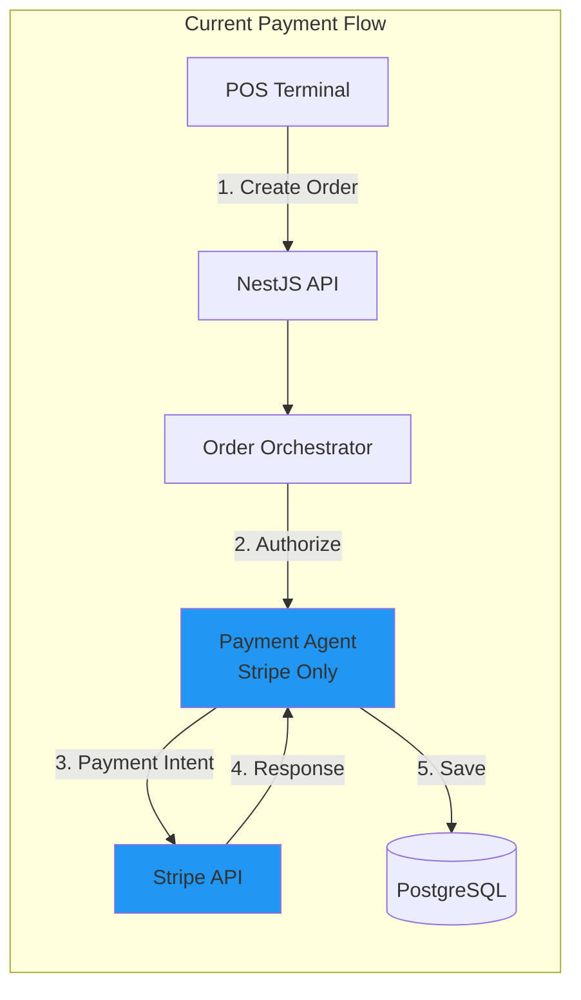

**Limitations:**
- ❌ No physical terminal support
- ❌ No EMV chip card support
- ❌ Higher fees (card-not-present: 2.9% + 30¢)
- ❌ No contactless (NFC/tap-to-pay)

### 1.2 Proposed State (PAX + Stripe)

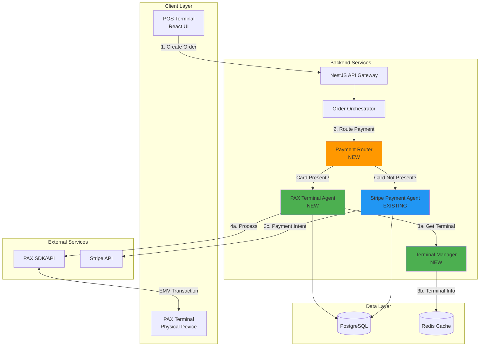

**Benefits:**
- ✅ Physical terminal support (EMV, NFC)
- ✅ Lower fees (card-present: 1.5% + 10¢)
- ✅ Automatic fallback (PAX → Stripe)
- ✅ Stripe unchanged (zero regression risk)

---

## 2. Payment Routing Decision Flow

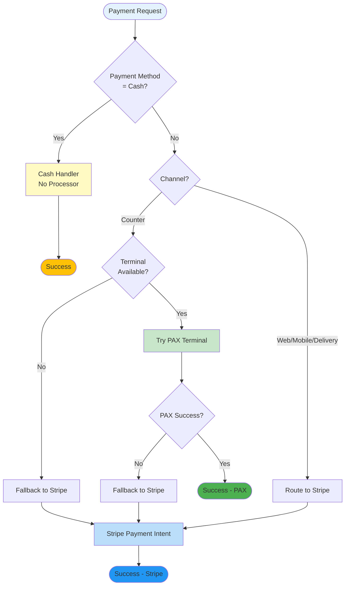

---

## 3. Risk Heat Map

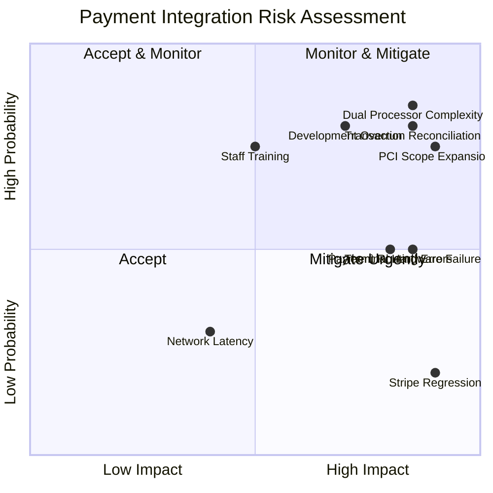

### Risk Legend

**🔴 HIGH RISK (Quadrant 1 - Monitor & Mitigate):**
- Dual Processor Complexity
- PCI Scope Expansion
- Transaction Reconciliation
- Development Timeline Overrun

**🟡 MEDIUM RISK (Quadrant 2 & 4):**
- Terminal Hardware Failure
- Payment Routing Errors
- Staff Training Complexity

**🟢 LOW RISK (Quadrant 3):**
- Network Latency
- Stripe Regression (with proper testing)

---

## 4. Transaction Flow Sequence

### 4.1 Successful PAX Payment

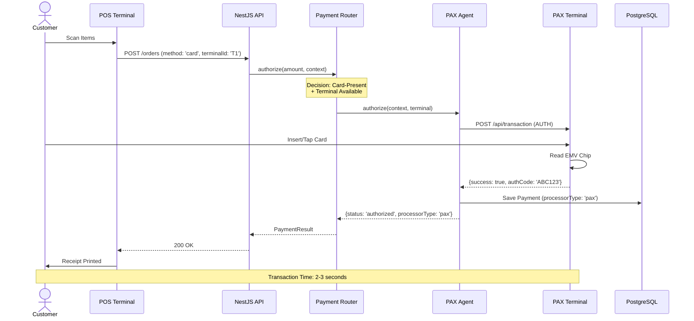

### 4.2 PAX Failure with Stripe Fallback

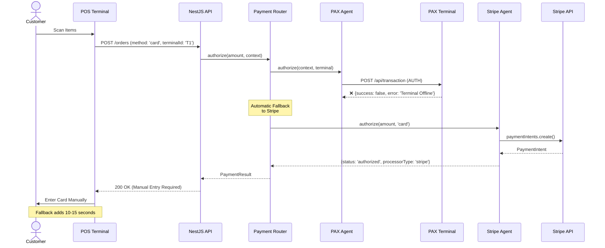

---

## 5. Database Schema Changes

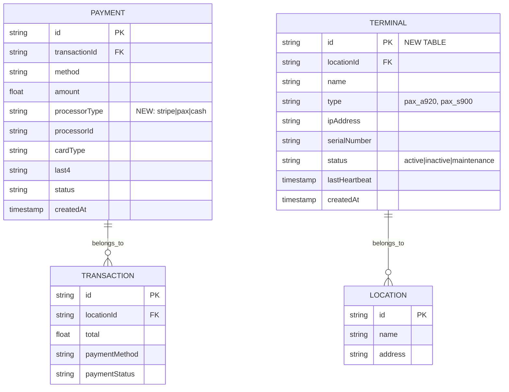

**Migration Script:**

```sql
-- Add processorType to Payment table
ALTER TABLE "Payment" 
ADD COLUMN "processorType" VARCHAR(20) DEFAULT 'stripe';

-- Create Terminal table
CREATE TABLE "Terminal" (
  "id" TEXT PRIMARY KEY,
  "locationId" TEXT NOT NULL,
  "name" TEXT NOT NULL,
  "type" TEXT NOT NULL,
  "ipAddress" TEXT,
  "serialNumber" TEXT UNIQUE,
  "status" TEXT NOT NULL DEFAULT 'active',
  "lastHeartbeat" TIMESTAMP,
  "createdAt" TIMESTAMP DEFAULT CURRENT_TIMESTAMP,
  "updatedAt" TIMESTAMP DEFAULT CURRENT_TIMESTAMP,
  FOREIGN KEY ("locationId") REFERENCES "Location"("id")
);

CREATE INDEX "Terminal_locationId_idx" ON "Terminal"("locationId");
CREATE INDEX "Terminal_status_idx" ON "Terminal"("status");
```

---

## 6. Component Architecture

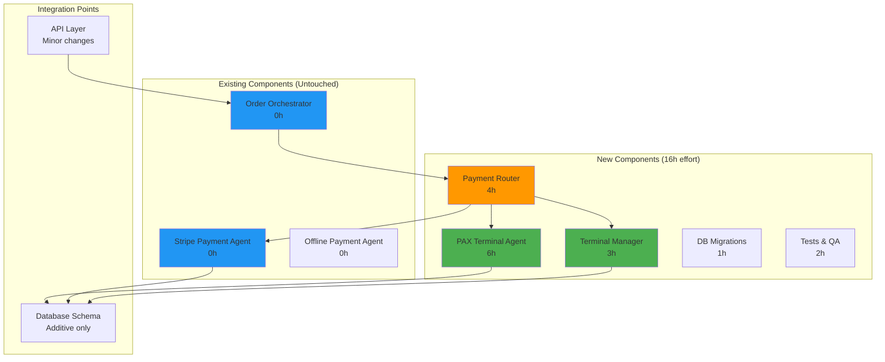

**Effort Breakdown:**
- 🟢 **New Development:** 14h (Router, PAX Agent, Terminal Manager, Migrations)
- 🔵 **Testing:** 2h (Unit, Integration, Regression)
- ⚪ **Existing Code:** 0h (Zero changes to Stripe, Orchestrator)

---

## 7. Rollout Timeline

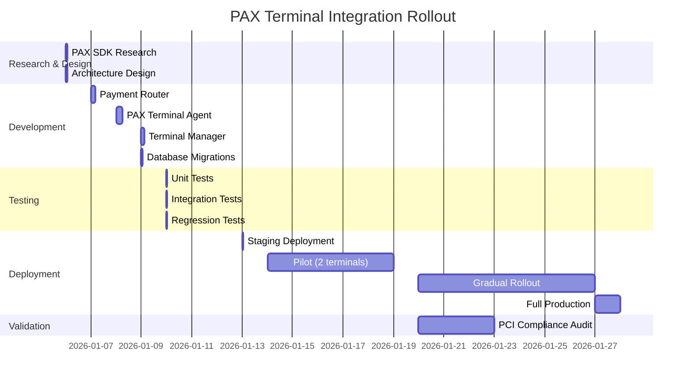

**Critical Milestones:**
- ✅ **Day 1-2:** Research & Design (4h)
- ✅ **Day 3-4:** Core Development (14h)
- ✅ **Day 5:** Testing (3h)
- ✅ **Day 6:** Staging Deployment
- ✅ **Day 7-11:** Pilot (2 terminals)
- ✅ **Day 12-18:** Gradual Rollout
- ✅ **Day 19+:** Full Production

---

## 8. Monitoring Dashboard Layout

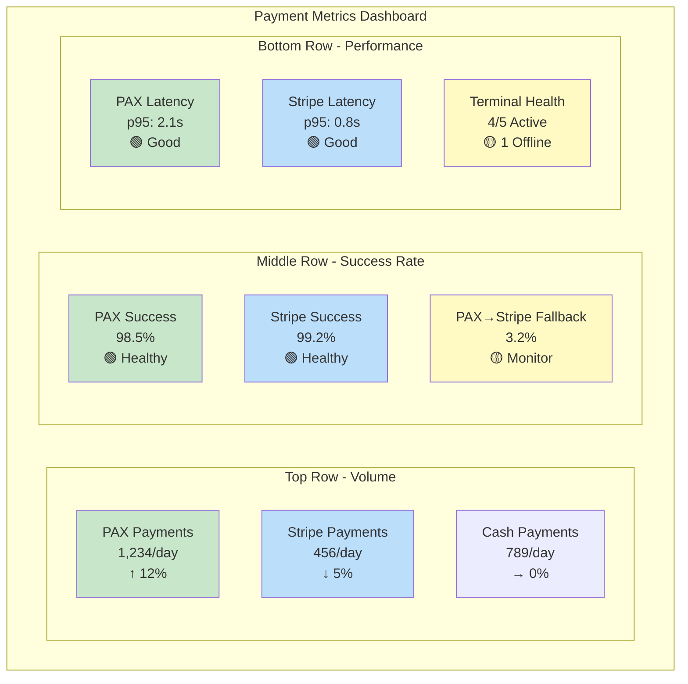

**Alert Thresholds:**
- 🔴 **Critical:** PAX success rate <95%, Terminal offline >5min
- 🟡 **Warning:** Fallback rate >20%, Latency p95 >5s
- 🟢 **Healthy:** All metrics within normal range

---

## 9. Cost-Benefit Summary

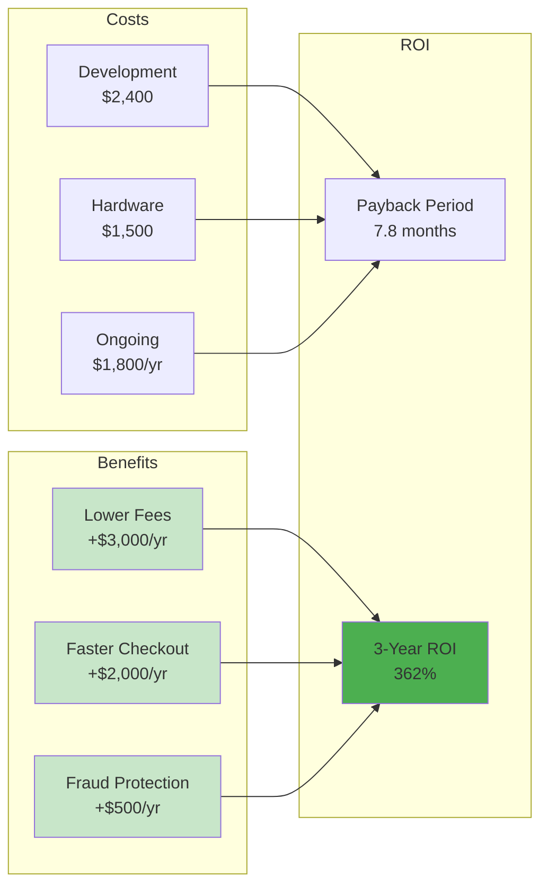

**Financial Summary:**
- **Total Investment:** $3,900 (one-time) + $1,800/yr (ongoing)
- **Annual Benefit:** $5,500/yr
- **Net Annual Benefit:** $3,700/yr
- **Payback Period:** 7.8 months
- **3-Year ROI:** 362%

---

## 10. Security & Compliance Architecture

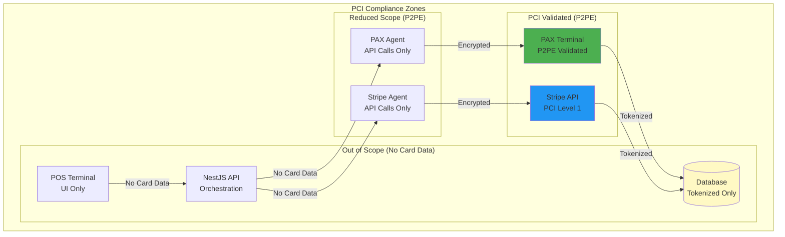

**Security Controls:**
- ✅ **P2PE Terminals:** PAX handles card data (encrypted end-to-end)
- ✅ **Tokenization:** Backend stores only last4 + cardType
- ✅ **TLS 1.3:** All API communication encrypted
- ✅ **No Logging:** Never log full PAN, CVV, or track data
- ✅ **Access Control:** Terminal registration with API keys
- ✅ **Annual Audit:** PCI DSS compliance validation

---

## 11. Decision Summary

### 11.1 Go/No-Go Decision Matrix

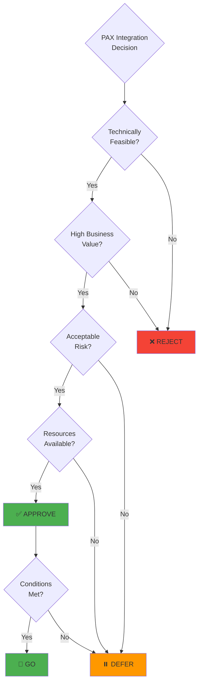

**Final Decision:** ✅ **GO - APPROVED WITH CONDITIONS**

**Conditions:**
1. ✅ PAX REST API confirmed compatible
2. ✅ Zero changes to Stripe integration
3. ✅ Comprehensive test coverage (>80%)
4. ✅ Gradual rollout with rollback plan
5. ✅ PCI compliance validation

### 11.2 Risk Mitigation Summary

| Risk Category | Risk Level | Mitigation Status |
|--------------|------------|-------------------|
| Technical | 🔴 HIGH | ✅ Mitigated (Router pattern, fallback) |
| Security | 🔴 HIGH | ✅ Mitigated (P2PE, tokenization) |
| Operational | 🟡 MEDIUM | ✅ Mitigated (monitoring, training) |
| Business | 🟡 MEDIUM | ✅ Mitigated (phased rollout, ROI) |

---

## 12. Next Steps

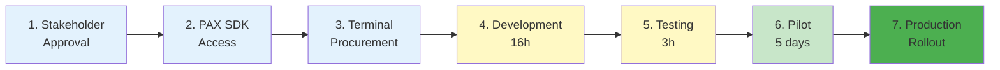

**Immediate Actions:**
1. ✅ Review formal review document with stakeholders
2. ✅ Contact PAX sales for SDK access and pricing
3. ✅ Procure 2 PAX terminals for pilot
4. ✅ Schedule kickoff meeting (Jan 6, 2026)
5. ✅ Begin Phase 1: Research & Design

---

**Document Version:** 1.0  
**Last Updated:** January 3, 2026  
**Companion Document:** PAYMENT_INTEGRATION_FORMAL_REVIEW.md

---

**For Questions or Clarifications:**
- Technical: Tech Lead
- Business: Product Manager
- Security: Security Team
- Operations: Operations Manager

