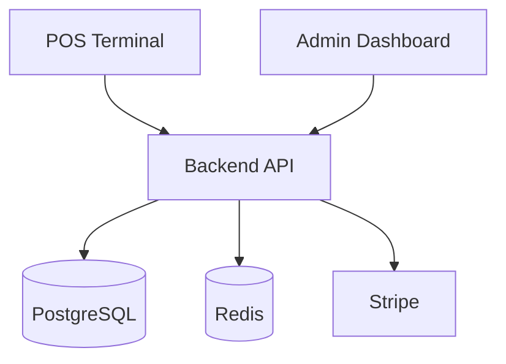
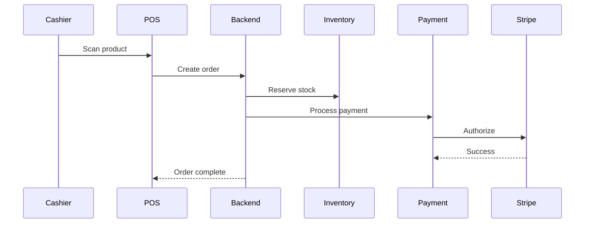
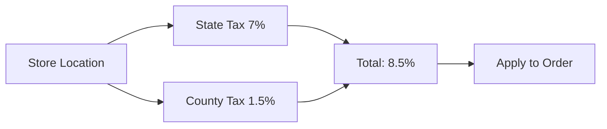

# ✅ Visual Architecture Diagrams - Complete

> **Comprehensive visual documentation** has been created for the Florida Liquor Store POS System

---

## 🎉 What's Been Created

I've generated **70+ comprehensive Mermaid diagrams** organized into 5 documents covering every aspect of your system:

### 📘 1. Visual Architecture Diagrams (25+ diagrams)
**File:** `docs/VISUAL_ARCHITECTURE_DIAGRAMS.md`

**Covers:**
- ✅ High-level system architecture
- ✅ Backend module structure (NestJS)
- ✅ Frontend architecture (React + Vite)
- ✅ Complete sequence diagrams (checkout, offline, auth, search, inventory)
- ✅ Integration patterns (Stripe, back-office, external services)
- ✅ Design patterns (SAGA, Agent, Repository, Event-driven)
- ✅ Complete database ERD with all relationships
- ✅ Configuration flows (tax, pricing, products, UI)
- ✅ UI component trees (POS terminal, admin dashboard)
- ✅ State management (Zustand stores, sync flows, offline mode)

### 🎨 2. UI Configuration Guide (20+ diagrams)
**File:** `docs/UI_CONFIGURATION_GUIDE.md`

**Covers:**
- ✅ Adding buttons and UI elements to POS
- ✅ Customizing cart display (compact, detailed, minimal)
- ✅ Checkout button states and behavior
- ✅ Product card layouts (grid, list, responsive)
- ✅ Theme customization (colors, fonts, spacing)
- ✅ Age verification rules and compliance
- ✅ Discount rules engine (manual, automatic, promotions)
- ✅ Inventory reorder rules and alerts
- ✅ Multi-tier pricing structure
- ✅ Tax calculation flows (state, county, special)
- ✅ Dynamic pricing rules
- ✅ Product category and attribute configuration
- ✅ Product image management
- ✅ Role-based access control (RBAC)
- ✅ User management and PIN authentication
- ✅ Offline mode configuration
- ✅ Cache strategy configuration
- ✅ Error handling configuration

### 🚀 3. Deployment & Integration Diagrams (25+ diagrams)
**File:** `docs/DEPLOYMENT_INTEGRATION_DIAGRAMS.md`

**Covers:**
- ✅ Production infrastructure (Vercel, Railway, PostgreSQL, Redis)
- ✅ Multi-region deployment strategy
- ✅ Container architecture (Docker)
- ✅ CI/CD pipelines (frontend, backend, database migrations)
- ✅ Stripe payment integration flow (authorize, capture, webhooks)
- ✅ Back-office sync integration
- ✅ Real-time inventory synchronization
- ✅ Webhook integration patterns
- ✅ Monitoring stack (Sentry, Prometheus, Grafana)
- ✅ Key metrics dashboard
- ✅ Alert rules (critical, high, medium priority)
- ✅ Backup strategy (continuous, daily, weekly, monthly)
- ✅ Disaster recovery runbook
- ✅ Point-in-time recovery (PITR)
- ✅ Horizontal scaling strategy
- ✅ Database scaling (read replicas, connection pooling)
- ✅ Cache scaling patterns
- ✅ Auto-scaling configuration
- ✅ Network topology and security layers

### 📑 4. Complete Index
**File:** `docs/DIAGRAMS_INDEX.md`

**Features:**
- ✅ Comprehensive table of contents
- ✅ Quick reference tables by topic
- ✅ Use case guides for different roles
- ✅ Searchable index
- ✅ Color legend and standards
- ✅ Viewing and updating instructions

### 📊 5. Summary & Quick Reference
**Files:** `docs/DIAGRAMS_SUMMARY.md` + `docs/QUICK_DIAGRAM_REFERENCE.md`

**Features:**
- ✅ Overview of all documentation
- ✅ Role-based quick access (developers, DevOps, PMs, managers)
- ✅ Common use cases and tasks
- ✅ Top 10 most important diagrams
- ✅ Fast lookup tables

---

## 📂 File Structure

```
docs/
├── VISUAL_ARCHITECTURE_DIAGRAMS.md      # 25+ architecture diagrams
├── UI_CONFIGURATION_GUIDE.md            # 20+ configuration diagrams
├── DEPLOYMENT_INTEGRATION_DIAGRAMS.md   # 25+ deployment diagrams
├── DIAGRAMS_INDEX.md                    # Complete searchable index
├── DIAGRAMS_SUMMARY.md                  # Overview and role-based guides
└── QUICK_DIAGRAM_REFERENCE.md           # Fast lookup reference card
```

**Updated:**
- `README.md` - Added links to visual diagrams section

---

## 🎯 What You Can Do Now

### 1. View the Diagrams

**In GitHub:**
- Just open any `.md` file
- Diagrams render automatically
- No setup required

**In VS Code:**
- Install: "Markdown Preview Mermaid Support"
- Open file and press `Ctrl+Shift+V`
- Interactive viewing

**Online:**
- Visit https://mermaid.live
- Copy any diagram code
- Edit and customize

### 2. Navigate by Role

#### 👨‍💻 Developers
**Start here:** [System Architecture](docs/VISUAL_ARCHITECTURE_DIAGRAMS.md#1-system-architecture)

**Common tasks:**
- [Adding a feature](docs/VISUAL_ARCHITECTURE_DIAGRAMS.md#4-design-patterns)
- [Understanding checkout](docs/VISUAL_ARCHITECTURE_DIAGRAMS.md#21-counter-checkout-flow-happy-path)
- [State management](docs/VISUAL_ARCHITECTURE_DIAGRAMS.md#8-state-management)
- [Database schema](docs/VISUAL_ARCHITECTURE_DIAGRAMS.md#51-entity-relationship-diagram)

#### 🛠️ DevOps Engineers
**Start here:** [Production Infrastructure](docs/DEPLOYMENT_INTEGRATION_DIAGRAMS.md#11-production-infrastructure)

**Common tasks:**
- [Deploying](docs/DEPLOYMENT_INTEGRATION_DIAGRAMS.md#2-cicd-pipelines)
- [Monitoring](docs/DEPLOYMENT_INTEGRATION_DIAGRAMS.md#41-monitoring-stack)
- [Scaling](docs/DEPLOYMENT_INTEGRATION_DIAGRAMS.md#6-scaling-strategies)
- [Disaster recovery](docs/DEPLOYMENT_INTEGRATION_DIAGRAMS.md#5-disaster-recovery)

#### 📊 Product Managers
**Start here:** [User Flows](docs/VISUAL_ARCHITECTURE_DIAGRAMS.md#2-sequence-diagrams)

**Common tasks:**
- [Business rules](docs/UI_CONFIGURATION_GUIDE.md#2-business-rules-configuration)
- [Pricing setup](docs/UI_CONFIGURATION_GUIDE.md#3-pricing--tax-configuration)
- [UI customization](docs/UI_CONFIGURATION_GUIDE.md#1-ui-component-configuration)

#### 🏪 Store Managers
**Start here:** [Product Management](docs/UI_CONFIGURATION_GUIDE.md#4-product-configuration)

**Common tasks:**
- [Adding products](docs/VISUAL_ARCHITECTURE_DIAGRAMS.md#63-adding-new-product-configuration)
- [Inventory management](docs/VISUAL_ARCHITECTURE_DIAGRAMS.md#25-inventory-adjustment-flow)
- [User management](docs/UI_CONFIGURATION_GUIDE.md#52-adding-a-new-user)
- [Tax configuration](docs/UI_CONFIGURATION_GUIDE.md#32-tax-calculation-flow)

### 3. Use the Quick References

**Need something specific?**
- [Quick Reference Card](docs/QUICK_DIAGRAM_REFERENCE.md) - Fast lookup
- [Complete Index](docs/DIAGRAMS_INDEX.md) - Searchable index
- [Summary](docs/DIAGRAMS_SUMMARY.md) - Overview

**Browse by category:**
- Architecture & Design
- User Flows & Sequences
- Configuration & Setup
- UI Components
- Integrations
- Deployment & Operations
- Monitoring & Observability
- Disaster Recovery
- Scaling

---

## 🌟 Key Highlights

### Comprehensive Coverage
- **70+ diagrams** across 5 documents
- **15 categories** from UI to deployment
- **50+ code examples** ready to use
- **30+ use cases** for different scenarios

### Multiple Perspectives
- **Developer view** - Implementation details
- **DevOps view** - Infrastructure and operations
- **Product view** - Business rules and flows
- **Manager view** - Configuration and setup

### Actionable Content
- **Step-by-step sequences** - Follow along
- **Configuration examples** - Copy and paste
- **Best practices** - Embedded in diagrams
- **Real-world scenarios** - Practical use cases

### Easy to Maintain
- **Text-based** - Version controlled
- **Mermaid syntax** - Industry standard
- **Organized structure** - Logical grouping
- **Clear standards** - Consistent styling

---

## 📖 Example Diagrams

### System Architecture


### Checkout Flow


### Tax Configuration


---

## 🎨 Diagram Types Included

### Architecture Diagrams
- System overview
- Module structure
- Component hierarchy
- Network topology

### Sequence Diagrams
- User flows
- API interactions
- Payment processing
- Sync operations

### Flowcharts
- Business logic
- Configuration flows
- Decision trees
- Error handling

### Entity Relationship Diagrams
- Database schema
- Data relationships
- Foreign keys
- Indexes

### State Diagrams
- Workflow states
- Button states
- System states
- Offline/online transitions

---

## 💡 Usage Examples

### For Adding a New Button

1. Open [UI Configuration Guide](docs/UI_CONFIGURATION_GUIDE.md#11-adding-a-new-button-to-pos)
2. Follow the flowchart
3. Copy the code example
4. Customize for your needs

### For Configuring Taxes

1. Open [Tax Configuration Flow](docs/UI_CONFIGURATION_GUIDE.md#32-tax-calculation-flow)
2. See the calculation formula
3. Check database configuration
4. Apply to your location

### For Deploying to Production

1. Review [Production Infrastructure](docs/DEPLOYMENT_INTEGRATION_DIAGRAMS.md#11-production-infrastructure)
2. Follow [CI/CD Pipeline](docs/DEPLOYMENT_INTEGRATION_DIAGRAMS.md#21-frontend-deployment-pipeline)
3. Set up [Monitoring](docs/DEPLOYMENT_INTEGRATION_DIAGRAMS.md#41-monitoring-stack)
4. Configure [Backups](docs/DEPLOYMENT_INTEGRATION_DIAGRAMS.md#51-backup-strategy)

---

## 📊 Statistics

| Metric | Count |
|--------|-------|
| **Total Diagrams** | 70+ |
| **Documents Created** | 5 |
| **Categories Covered** | 15 |
| **Code Examples** | 50+ |
| **Sequence Flows** | 10+ |
| **Architecture Views** | 8+ |
| **Configuration Flows** | 12+ |
| **Integration Patterns** | 6+ |

---

## 🔗 Quick Access Links

### Main Documents
1. [Visual Architecture Diagrams](docs/VISUAL_ARCHITECTURE_DIAGRAMS.md) - Core architecture
2. [UI Configuration Guide](docs/UI_CONFIGURATION_GUIDE.md) - UI and business rules
3. [Deployment & Integration](docs/DEPLOYMENT_INTEGRATION_DIAGRAMS.md) - Operations
4. [Complete Index](docs/DIAGRAMS_INDEX.md) - Searchable reference
5. [Quick Reference](docs/QUICK_DIAGRAM_REFERENCE.md) - Fast lookup

### By Topic
- [System Architecture](docs/VISUAL_ARCHITECTURE_DIAGRAMS.md#1-system-architecture)
- [Checkout Flow](docs/VISUAL_ARCHITECTURE_DIAGRAMS.md#21-counter-checkout-flow-happy-path)
- [Database Schema](docs/VISUAL_ARCHITECTURE_DIAGRAMS.md#51-entity-relationship-diagram)
- [Tax Configuration](docs/UI_CONFIGURATION_GUIDE.md#32-tax-calculation-flow)
- [Deployment](docs/DEPLOYMENT_INTEGRATION_DIAGRAMS.md#11-production-infrastructure)

---

## ✅ Next Steps

### 1. Explore the Diagrams
- Start with the [Summary](docs/DIAGRAMS_SUMMARY.md)
- Browse by your role
- Bookmark useful diagrams

### 2. Use in Development
- Reference during coding
- Follow sequence diagrams
- Copy configuration examples

### 3. Share with Team
- Send relevant diagrams to team members
- Use in documentation
- Include in presentations

### 4. Keep Updated
- Update diagrams when features change
- Add new diagrams as needed
- Follow the standards in [Index](docs/DIAGRAMS_INDEX.md)

---

## 🎯 Success!

You now have:
- ✅ Complete visual documentation
- ✅ 70+ professional Mermaid diagrams
- ✅ Multiple perspectives and use cases
- ✅ Searchable index and quick references
- ✅ Code examples and best practices
- ✅ Easy-to-maintain text-based format

**All diagrams are:**
- 📱 GitHub-compatible (render automatically)
- 💻 VS Code-compatible (with extension)
- 🌐 Web-compatible (Mermaid Live Editor)
- 📝 Text-based (version controlled)
- 🎨 Professional (consistent styling)

---

**Created:** January 3, 2026  
**Total Diagrams:** 70+  
**Format:** Mermaid  
**Status:** ✅ Complete and Ready to Use

---

## 📞 Need Help?

- **Finding a diagram:** Use [Quick Reference](docs/QUICK_DIAGRAM_REFERENCE.md)
- **Understanding architecture:** See [Visual Architecture](docs/VISUAL_ARCHITECTURE_DIAGRAMS.md)
- **Configuring the system:** Check [UI Configuration](docs/UI_CONFIGURATION_GUIDE.md)
- **Deploying:** Review [Deployment Diagrams](docs/DEPLOYMENT_INTEGRATION_DIAGRAMS.md)

**Happy coding! 🚀**

