# Deployment & Integration Diagrams

> **Comprehensive deployment, CI/CD, and integration flow diagrams** for the Florida Liquor Store POS System.

---

## Table of Contents

1. [Deployment Architecture](#1-deployment-architecture)
2. [CI/CD Pipelines](#2-cicd-pipelines)
3. [Integration Patterns](#3-integration-patterns)
4. [Monitoring & Observability](#4-monitoring--observability)
5. [Disaster Recovery](#5-disaster-recovery)
6. [Scaling Strategies](#6-scaling-strategies)

---

## 1. Deployment Architecture

### 1.1 Production Infrastructure

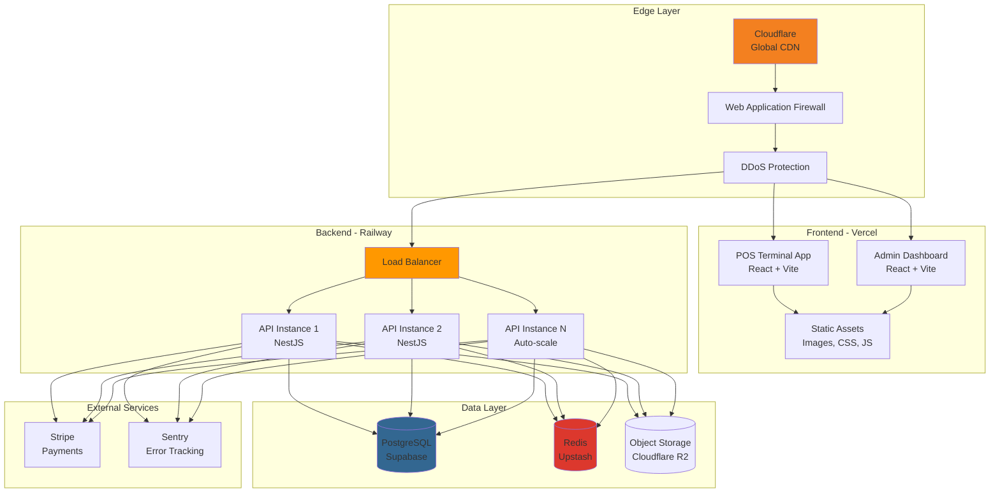
```mermaid
graph TB
    subgraph "Edge Layer"
        CF[Cloudflare<br/>Global CDN]
        WAF[Web Application Firewall]
        DDOS[DDoS Protection]
    end
    
    subgraph "Frontend - Vercel"
        POS_APP[POS Terminal App<br/>React + Vite]
        ADMIN_APP[Admin Dashboard<br/>React + Vite]
        STATIC[Static Assets<br/>Images, CSS, JS]
    end
    
    subgraph "Backend - Railway"
        LB[Load Balancer]
        API1[API Instance 1<br/>NestJS]
        API2[API Instance 2<br/>NestJS]
        API3[API Instance N<br/>Auto-scale]
    end
    
    subgraph "Data Layer"
        POSTGRES[(PostgreSQL<br/>Supabase)]
        REDIS[(Redis<br/>Upstash)]
        R2[(Object Storage<br/>Cloudflare R2)]
    end
    
    subgraph "External Services"
        STRIPE[Stripe<br/>Payments]
        SENTRY[Sentry<br/>Error Tracking]
    end
    
    CF --> WAF
    WAF --> DDOS
    DDOS --> POS_APP
    DDOS --> ADMIN_APP
    DDOS --> LB
    
    POS_APP --> STATIC
    ADMIN_APP --> STATIC
    
    LB --> API1
    LB --> API2
    LB --> API3
    
    API1 --> POSTGRES
    API1 --> REDIS
    API1 --> R2
    API2 --> POSTGRES
    API2 --> REDIS
    API2 --> R2
    API3 --> POSTGRES
    API3 --> REDIS
    API3 --> R2
    
    API1 --> STRIPE
    API1 --> SENTRY
    API2 --> STRIPE
    API2 --> SENTRY
    API3 --> STRIPE
    API3 --> SENTRY
    
    style CF fill:#F38020
    style LB fill:#FF9800
    style POSTGRES fill:#336791
    style REDIS fill:#DC382D
```

### 1.2 Multi-Region Deployment

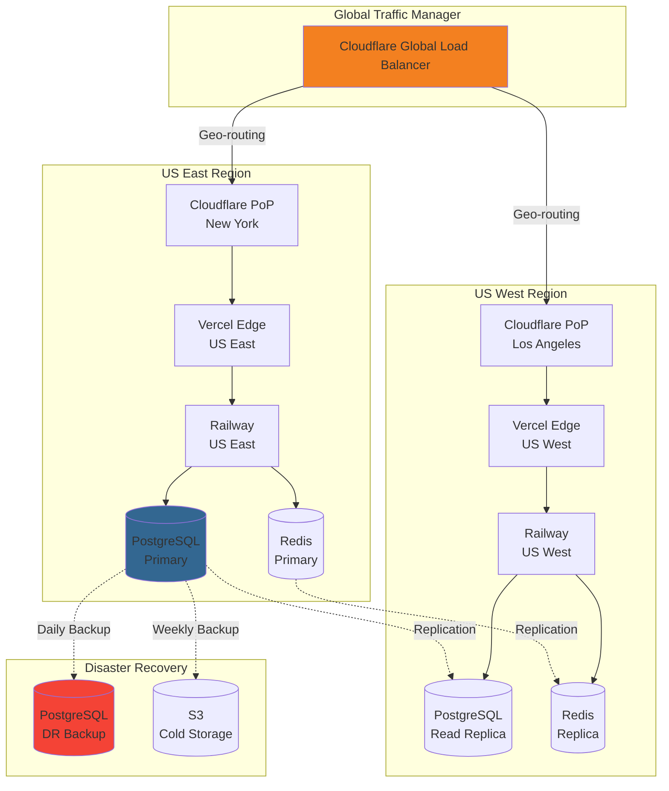
```mermaid
graph TB
    subgraph "Global Traffic Manager"
        GTM[Cloudflare Global Load Balancer]
    end
    
    subgraph "US East Region"
        EAST_CF[Cloudflare PoP<br/>New York]
        EAST_APP[Vercel Edge<br/>US East]
        EAST_API[Railway<br/>US East]
        EAST_DB[(PostgreSQL<br/>Primary)]
        EAST_REDIS[(Redis<br/>Primary)]
    end
    
    subgraph "US West Region"
        WEST_CF[Cloudflare PoP<br/>Los Angeles]
        WEST_APP[Vercel Edge<br/>US West]
        WEST_API[Railway<br/>US West]
        WEST_DB[(PostgreSQL<br/>Read Replica)]
        WEST_REDIS[(Redis<br/>Replica)]
    end
    
    subgraph "Disaster Recovery"
        DR_DB[(PostgreSQL<br/>DR Backup)]
        DR_STORAGE[(S3<br/>Cold Storage)]
    end
    
    GTM -->|Geo-routing| EAST_CF
    GTM -->|Geo-routing| WEST_CF
    
    EAST_CF --> EAST_APP
    EAST_APP --> EAST_API
    EAST_API --> EAST_DB
    EAST_API --> EAST_REDIS
    
    WEST_CF --> WEST_APP
    WEST_APP --> WEST_API
    WEST_API --> WEST_DB
    WEST_API --> WEST_REDIS
    
    EAST_DB -.->|Replication| WEST_DB
    EAST_REDIS -.->|Replication| WEST_REDIS
    
    EAST_DB -.->|Daily Backup| DR_DB
    EAST_DB -.->|Weekly Backup| DR_STORAGE
    
    style GTM fill:#F38020
    style EAST_DB fill:#336791
    style DR_DB fill:#F44336
```

### 1.3 Container Architecture


```mermaid
graph TB
    subgraph "Docker Container"
        CONTAINER[NestJS Application]
        
        subgraph "Application Layer"
            APP[Node.js 18<br/>NestJS Framework]
            MODULES[Business Modules]
        end
        
        subgraph "Dependencies"
            PRISMA[Prisma Client]
            REDIS_CLIENT[Redis Client]
            STRIPE_SDK[Stripe SDK]
        end
        
        subgraph "Configuration"
            ENV[Environment Variables]
            SECRETS[Secrets Manager]
        end
    end
    
    subgraph "External Connections"
        DB[(PostgreSQL)]
        CACHE[(Redis)]
        STRIPE[Stripe API]
    end
    
    APP --> MODULES
    MODULES --> PRISMA
    MODULES --> REDIS_CLIENT
    MODULES --> STRIPE_SDK
    
    ENV --> APP
    SECRETS --> APP
    
    PRISMA --> DB
    REDIS_CLIENT --> CACHE
    STRIPE_SDK --> STRIPE
    
    subgraph "Health Checks"
        HEALTH[Health Endpoint<br/>/health]
        READY[Readiness Probe<br/>/health/ready]
        LIVE[Liveness Probe<br/>/health/live]
    end
    
    APP --> HEALTH
    APP --> READY
    APP --> LIVE
    
    style CONTAINER fill:#0B0D0E
    style APP fill:#E0234E
```

---

## 2. CI/CD Pipelines

### 2.1 Frontend Deployment Pipeline


```mermaid
graph LR
    DEV[Developer] -->|git push| GITHUB[GitHub Repository]
    
    GITHUB -->|Webhook| VERCEL[Vercel CI/CD]
    
    subgraph "Build Process"
        VERCEL --> INSTALL[npm install]
        INSTALL --> LINT[ESLint Check]
        LINT --> TYPE[TypeScript Check]
        TYPE --> BUILD[Vite Build]
        BUILD --> OPTIMIZE[Optimize Assets]
    end
    
    subgraph "Preview Deployment"
        OPTIMIZE --> PREVIEW{Branch?}
        PREVIEW -->|feature/*| PREVIEW_ENV[Preview Environment]
        PREVIEW_ENV --> PREVIEW_URL[Preview URL]
    end
    
    subgraph "Production Deployment"
        PREVIEW -->|main| PROD_BUILD[Production Build]
        PROD_BUILD --> DEPLOY_EDGE[Deploy to Edge]
        DEPLOY_EDGE --> CDN_PURGE[Purge CDN Cache]
        CDN_PURGE --> PROD_LIVE[Production Live]
    end
    
    subgraph "Notifications"
        PROD_LIVE --> SLACK[Slack Notification]
        PREVIEW_URL --> SLACK
    end
    
    style GITHUB fill:#181717
    style VERCEL fill:#000000
    style PROD_LIVE fill:#4CAF50
```

### 2.2 Backend Deployment Pipeline


```mermaid
graph TB
    DEV[Developer] -->|git push| GITHUB[GitHub Repository]
    
    GITHUB -->|Webhook| ACTIONS[GitHub Actions]
    
    subgraph "CI Pipeline"
        ACTIONS --> CHECKOUT[Checkout Code]
        CHECKOUT --> SETUP[Setup Node.js 18]
        SETUP --> INSTALL[npm install]
        INSTALL --> LINT[ESLint]
        LINT --> TEST[Run Tests]
        TEST --> BUILD[TypeScript Build]
    end
    
    subgraph "Security Checks"
        BUILD --> AUDIT[npm audit]
        AUDIT --> SNYK[Snyk Security Scan]
        SNYK --> SONAR[SonarQube Analysis]
    end
    
    subgraph "Container Build"
        SONAR --> DOCKER[Build Docker Image]
        DOCKER --> TAG[Tag Image]
        TAG --> PUSH[Push to Registry]
    end
    
    subgraph "Deployment"
        PUSH --> RAILWAY[Railway Deploy]
        RAILWAY --> MIGRATE[Run Migrations]
        MIGRATE --> HEALTH[Health Check]
        HEALTH --> SMOKE[Smoke Tests]
    end
    
    subgraph "Post-Deploy"
        SMOKE --> SENTRY_RELEASE[Create Sentry Release]
        SENTRY_RELEASE --> NOTIFY[Slack Notification]
        NOTIFY --> ROLLBACK{Success?}
        ROLLBACK -->|No| REVERT[Auto Rollback]
        ROLLBACK -->|Yes| DONE[Deployment Complete]
    end
    
    style GITHUB fill:#181717
    style ACTIONS fill:#2088FF
    style RAILWAY fill:#0B0D0E
    style DONE fill:#4CAF50
```

### 2.3 Database Migration Pipeline

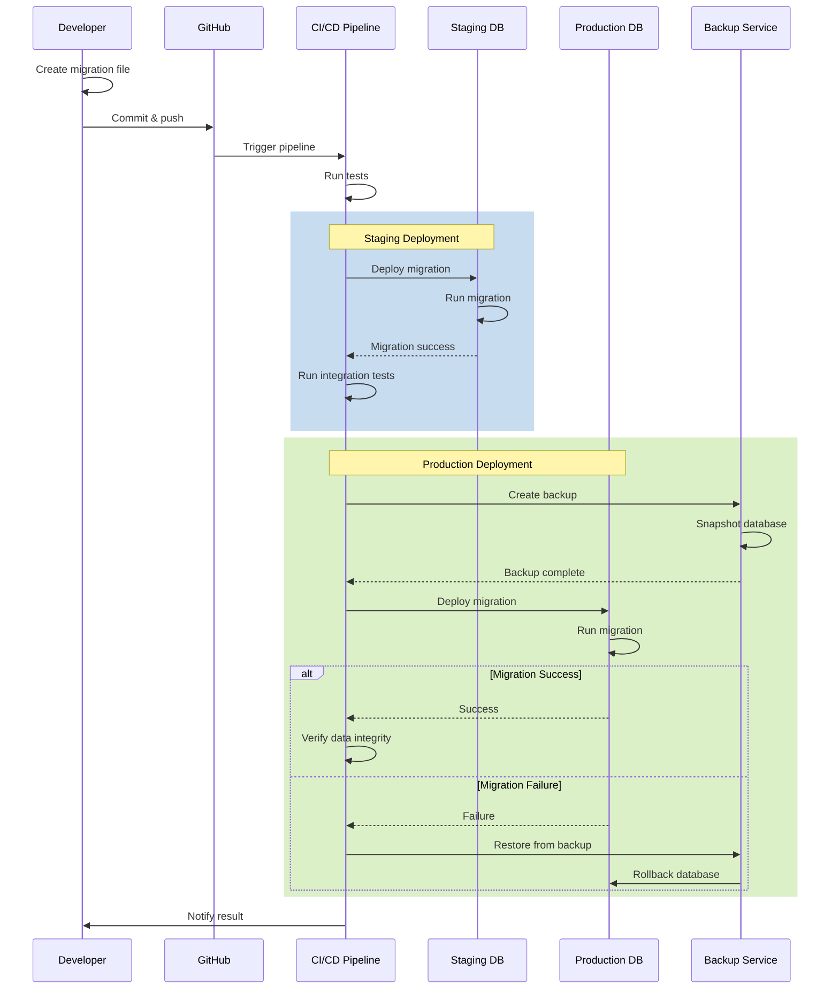
```mermaid
sequenceDiagram
    participant Dev as Developer
    participant Git as GitHub
    participant CI as CI/CD Pipeline
    participant Staging as Staging DB
    participant Prod as Production DB
    participant Backup as Backup Service
    
    Dev->>Dev: Create migration file
    Dev->>Git: Commit & push
    
    Git->>CI: Trigger pipeline
    CI->>CI: Run tests
    
    rect rgb(200, 220, 240)
        Note over CI,Staging: Staging Deployment
        CI->>Staging: Deploy migration
        Staging->>Staging: Run migration
        Staging-->>CI: Migration success
        CI->>CI: Run integration tests
    end
    
    rect rgb(220, 240, 200)
        Note over CI,Prod: Production Deployment
        CI->>Backup: Create backup
        Backup->>Backup: Snapshot database
        Backup-->>CI: Backup complete
        
        CI->>Prod: Deploy migration
        Prod->>Prod: Run migration
        
        alt Migration Success
            Prod-->>CI: Success
            CI->>CI: Verify data integrity
        else Migration Failure
            Prod-->>CI: Failure
            CI->>Backup: Restore from backup
            Backup->>Prod: Rollback database
        end
    end
    
    CI->>Dev: Notify result
```

---

## 3. Integration Patterns

### 3.1 Stripe Payment Integration Flow

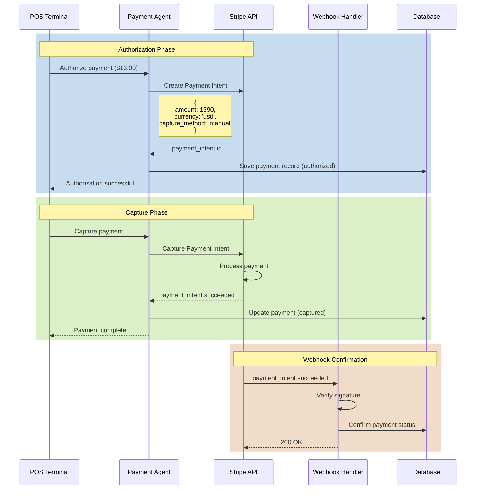
```mermaid
sequenceDiagram
    participant POS as POS Terminal
    participant Backend as Payment Agent
    participant Stripe as Stripe API
    participant Webhook as Webhook Handler
    participant DB as Database
    
    rect rgb(200, 220, 240)
        Note over POS,Stripe: Authorization Phase
        POS->>Backend: Authorize payment ($13.90)
        Backend->>Stripe: Create Payment Intent
        Note right of Backend: {<br/>  amount: 1390,<br/>  currency: 'usd',<br/>  capture_method: 'manual'<br/>}
        Stripe-->>Backend: payment_intent.id
        Backend->>DB: Save payment record (authorized)
        Backend-->>POS: Authorization successful
    end
    
    rect rgb(220, 240, 200)
        Note over POS,Stripe: Capture Phase
        POS->>Backend: Capture payment
        Backend->>Stripe: Capture Payment Intent
        Stripe->>Stripe: Process payment
        Stripe-->>Backend: payment_intent.succeeded
        Backend->>DB: Update payment (captured)
        Backend-->>POS: Payment complete
    end
    
    rect rgb(240, 220, 200)
        Note over Stripe,DB: Webhook Confirmation
        Stripe->>Webhook: payment_intent.succeeded
        Webhook->>Webhook: Verify signature
        Webhook->>DB: Confirm payment status
        Webhook-->>Stripe: 200 OK
    end
```

### 3.2 Back-Office Sync Integration

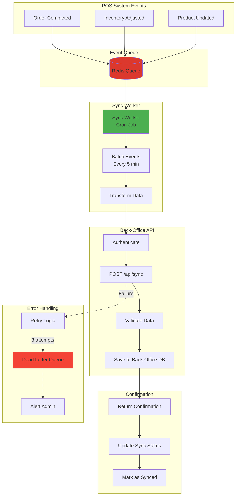
```mermaid
graph TB
    subgraph "POS System Events"
        ORDER[Order Completed]
        INVENTORY[Inventory Adjusted]
        PRODUCT[Product Updated]
    end
    
    subgraph "Event Queue"
        ORDER --> REDIS_Q[(Redis Queue)]
        INVENTORY --> REDIS_Q
        PRODUCT --> REDIS_Q
    end
    
    subgraph "Sync Worker"
        REDIS_Q --> WORKER[Sync Worker<br/>Cron Job]
        WORKER --> BATCH[Batch Events<br/>Every 5 min]
        BATCH --> TRANSFORM[Transform Data]
    end
    
    subgraph "Back-Office API"
        TRANSFORM --> BO_AUTH[Authenticate]
        BO_AUTH --> BO_POST[POST /api/sync]
        BO_POST --> BO_VALIDATE[Validate Data]
        BO_VALIDATE --> BO_SAVE[Save to Back-Office DB]
    end
    
    subgraph "Confirmation"
        BO_SAVE --> BO_RESPONSE[Return Confirmation]
        BO_RESPONSE --> UPDATE_STATUS[Update Sync Status]
        UPDATE_STATUS --> MARK_SYNCED[Mark as Synced]
    end
    
    subgraph "Error Handling"
        BO_POST -.->|Failure| RETRY[Retry Logic]
        RETRY -.->|3 attempts| DLQ[Dead Letter Queue]
        DLQ -.-> ALERT[Alert Admin]
    end
    
    style REDIS_Q fill:#DC382D
    style WORKER fill:#4CAF50
    style DLQ fill:#F44336
```

### 3.3 Real-Time Inventory Sync

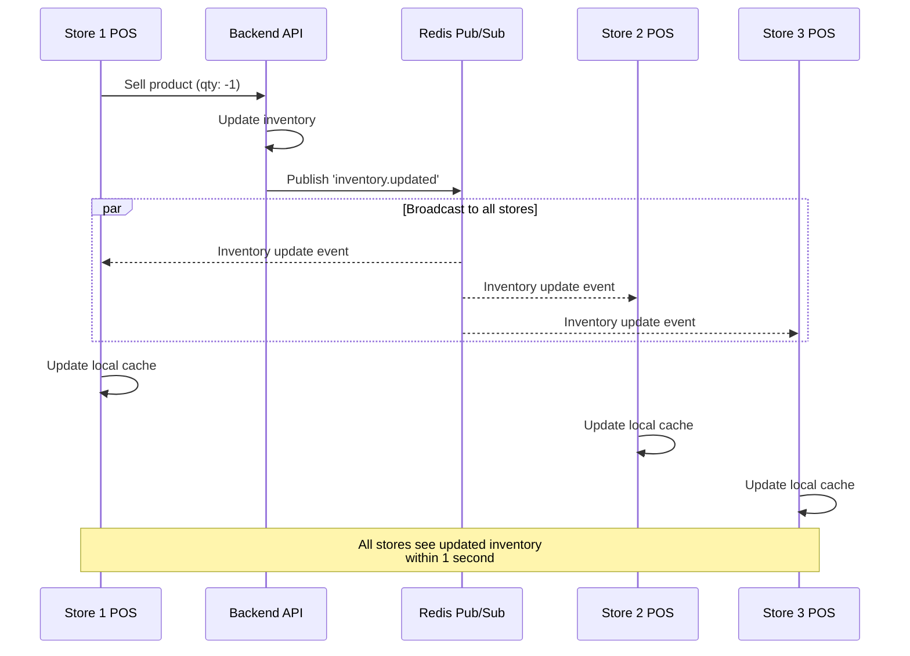
```mermaid
sequenceDiagram
    participant Store1 as Store 1 POS
    participant Backend as Backend API
    participant Redis as Redis Pub/Sub
    participant Store2 as Store 2 POS
    participant Store3 as Store 3 POS
    
    Store1->>Backend: Sell product (qty: -1)
    Backend->>Backend: Update inventory
    Backend->>Redis: Publish 'inventory.updated'
    
    par Broadcast to all stores
        Redis-->>Store1: Inventory update event
        Redis-->>Store2: Inventory update event
        Redis-->>Store3: Inventory update event
    end
    
    Store1->>Store1: Update local cache
    Store2->>Store2: Update local cache
    Store3->>Store3: Update local cache
    
    Note over Store1,Store3: All stores see updated inventory<br/>within 1 second
```

### 3.4 Webhook Integration Pattern

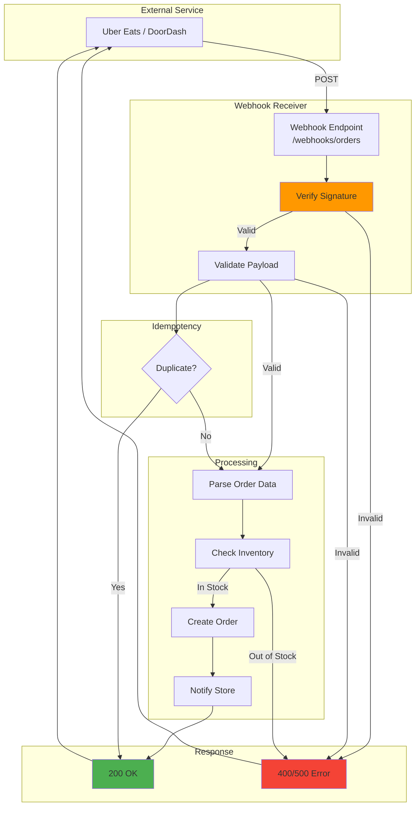
```mermaid
graph TB
    subgraph "External Service"
        EXTERNAL[Uber Eats / DoorDash]
    end
    
    subgraph "Webhook Receiver"
        WEBHOOK[Webhook Endpoint<br/>/webhooks/orders]
        VERIFY[Verify Signature]
        VALIDATE[Validate Payload]
    end
    
    subgraph "Processing"
        PARSE[Parse Order Data]
        CHECK_INV[Check Inventory]
        CREATE_ORDER[Create Order]
        NOTIFY[Notify Store]
    end
    
    subgraph "Response"
        SUCCESS[200 OK]
        ERROR[400/500 Error]
    end
    
    EXTERNAL -->|POST| WEBHOOK
    WEBHOOK --> VERIFY
    
    VERIFY -->|Valid| VALIDATE
    VERIFY -->|Invalid| ERROR
    
    VALIDATE -->|Valid| PARSE
    VALIDATE -->|Invalid| ERROR
    
    PARSE --> CHECK_INV
    CHECK_INV -->|In Stock| CREATE_ORDER
    CHECK_INV -->|Out of Stock| ERROR
    
    CREATE_ORDER --> NOTIFY
    NOTIFY --> SUCCESS
    
    SUCCESS --> EXTERNAL
    ERROR --> EXTERNAL
    
    subgraph "Idempotency"
        VALIDATE --> CHECK_DUP{Duplicate?}
        CHECK_DUP -->|Yes| SUCCESS
        CHECK_DUP -->|No| PARSE
    end
    
    style VERIFY fill:#FF9800
    style SUCCESS fill:#4CAF50
    style ERROR fill:#F44336
```

---

## 4. Monitoring & Observability

### 4.1 Monitoring Stack

```mermaid
graph TB
    subgraph "Application"
        APP[NestJS Application]
        METRICS[Metrics Collector]
        LOGS[Logger Service]
        TRACES[Trace Collector]
    end
    
    subgraph "Metrics"
        APP --> METRICS
        METRICS --> PROM[Prometheus<br/>Time-series DB]
        PROM --> GRAFANA[Grafana<br/>Dashboards]
    end
    
    subgraph "Logs"
        APP --> LOGS
        LOGS --> LOKI[Loki<br/>Log Aggregation]
        LOKI --> GRAFANA
    end
    
    subgraph "Traces"
        APP --> TRACES
        TRACES --> TEMPO[Tempo<br/>Distributed Tracing]
        TEMPO --> GRAFANA
    end
    
    subgraph "Errors"
        APP --> SENTRY[Sentry<br/>Error Tracking]
        SENTRY --> ALERTS[Alert Manager]
    end
    
    subgraph "Uptime"
        UPTIME[Uptime Robot]
        UPTIME --> HEALTH[/health endpoint]
        HEALTH --> APP
        UPTIME --> ALERTS
    end
    
    subgraph "Notifications"
        ALERTS --> SLACK[Slack]
        ALERTS --> EMAIL[Email]
        ALERTS --> PAGERDUTY[PagerDuty]
    end
    
    style GRAFANA fill:#F46800
    style SENTRY fill:#362D59
    style ALERTS fill:#F44336
```

### 4.2 Key Metrics Dashboard

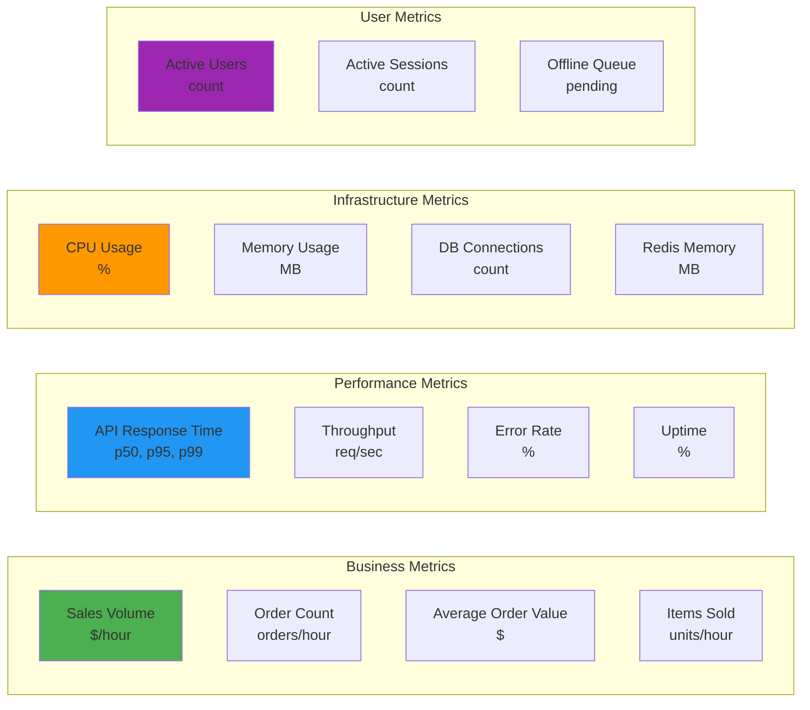
```mermaid
graph LR
    subgraph "Business Metrics"
        SALES[Sales Volume<br/>$/hour]
        ORDERS[Order Count<br/>orders/hour]
        AOV[Average Order Value<br/>$]
        ITEMS[Items Sold<br/>units/hour]
    end
    
    subgraph "Performance Metrics"
        RESPONSE[API Response Time<br/>p50, p95, p99]
        THROUGHPUT[Throughput<br/>req/sec]
        ERROR_RATE[Error Rate<br/>%]
        UPTIME[Uptime<br/>%]
    end
    
    subgraph "Infrastructure Metrics"
        CPU[CPU Usage<br/>%]
        MEMORY[Memory Usage<br/>MB]
        DB_CONN[DB Connections<br/>count]
        REDIS_MEM[Redis Memory<br/>MB]
    end
    
    subgraph "User Metrics"
        ACTIVE_USERS[Active Users<br/>count]
        SESSIONS[Active Sessions<br/>count]
        OFFLINE_QUEUE[Offline Queue<br/>pending]
    end
    
    style SALES fill:#4CAF50
    style RESPONSE fill:#2196F3
    style CPU fill:#FF9800
    style ACTIVE_USERS fill:#9C27B0
```

### 4.3 Alert Rules

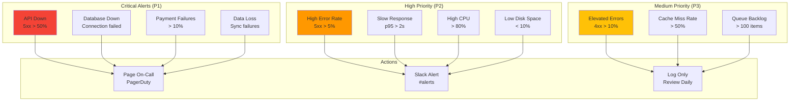
```mermaid
graph TB
    subgraph "Critical Alerts (P1)"
        CRIT1[API Down<br/>5xx > 50%]
        CRIT2[Database Down<br/>Connection failed]
        CRIT3[Payment Failures<br/>> 10%]
        CRIT4[Data Loss<br/>Sync failures]
    end
    
    subgraph "High Priority (P2)"
        HIGH1[High Error Rate<br/>5xx > 5%]
        HIGH2[Slow Response<br/>p95 > 2s]
        HIGH3[High CPU<br/>> 80%]
        HIGH4[Low Disk Space<br/>< 10%]
    end
    
    subgraph "Medium Priority (P3)"
        MED1[Elevated Errors<br/>4xx > 10%]
        MED2[Cache Miss Rate<br/>> 50%]
        MED3[Queue Backlog<br/>> 100 items]
    end
    
    subgraph "Actions"
        CRIT1 --> PAGE[Page On-Call<br/>PagerDuty]
        CRIT2 --> PAGE
        CRIT3 --> PAGE
        CRIT4 --> PAGE
        
        HIGH1 --> SLACK[Slack Alert<br/>#alerts]
        HIGH2 --> SLACK
        HIGH3 --> SLACK
        HIGH4 --> SLACK
        
        MED1 --> LOG[Log Only<br/>Review Daily]
        MED2 --> LOG
        MED3 --> LOG
    end
    
    style CRIT1 fill:#F44336
    style HIGH1 fill:#FF9800
    style MED1 fill:#FFC107
```

---

## 5. Disaster Recovery

### 5.1 Backup Strategy

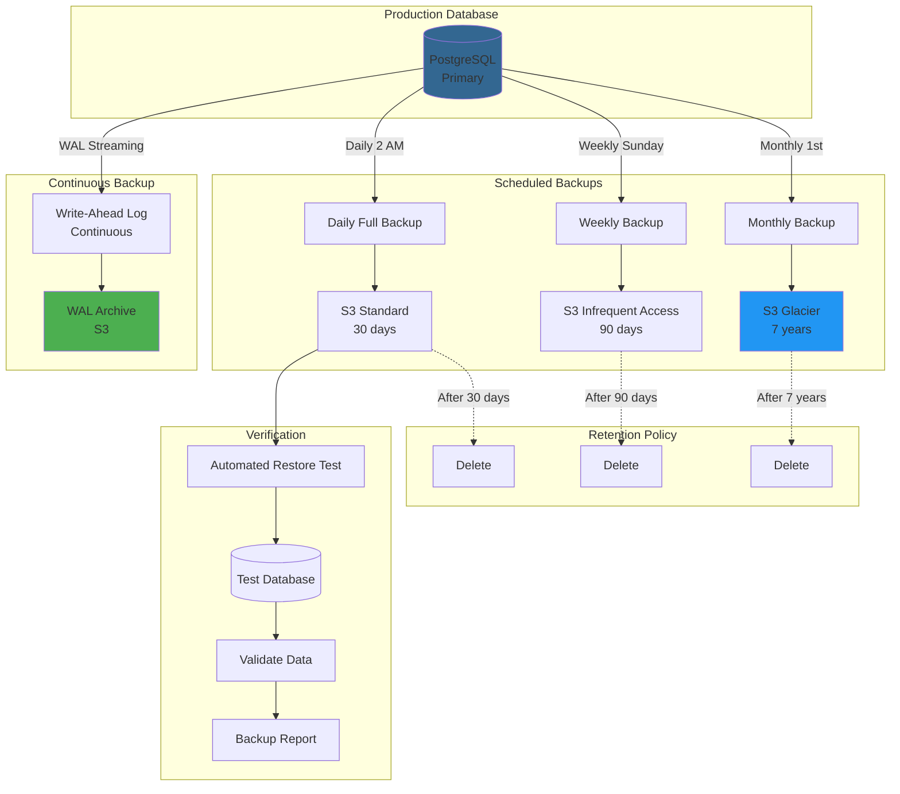
```mermaid
graph TB
    subgraph "Production Database"
        PROD_DB[(PostgreSQL<br/>Primary)]
    end
    
    subgraph "Continuous Backup"
        PROD_DB -->|WAL Streaming| WAL[Write-Ahead Log<br/>Continuous]
        WAL --> WAL_ARCHIVE[WAL Archive<br/>S3]
    end
    
    subgraph "Scheduled Backups"
        PROD_DB -->|Daily 2 AM| DAILY[Daily Full Backup]
        DAILY --> S3_DAILY[S3 Standard<br/>30 days]
        
        PROD_DB -->|Weekly Sunday| WEEKLY[Weekly Backup]
        WEEKLY --> S3_IA[S3 Infrequent Access<br/>90 days]
        
        PROD_DB -->|Monthly 1st| MONTHLY[Monthly Backup]
        MONTHLY --> GLACIER[S3 Glacier<br/>7 years]
    end
    
    subgraph "Verification"
        S3_DAILY --> VERIFY[Automated Restore Test]
        VERIFY --> TEST_DB[(Test Database)]
        TEST_DB --> VALIDATE[Validate Data]
        VALIDATE --> REPORT[Backup Report]
    end
    
    subgraph "Retention Policy"
        S3_DAILY -.->|After 30 days| DELETE1[Delete]
        S3_IA -.->|After 90 days| DELETE2[Delete]
        GLACIER -.->|After 7 years| DELETE3[Delete]
    end
    
    style PROD_DB fill:#336791
    style WAL_ARCHIVE fill:#4CAF50
    style GLACIER fill:#2196F3
```

### 5.2 Disaster Recovery Runbook

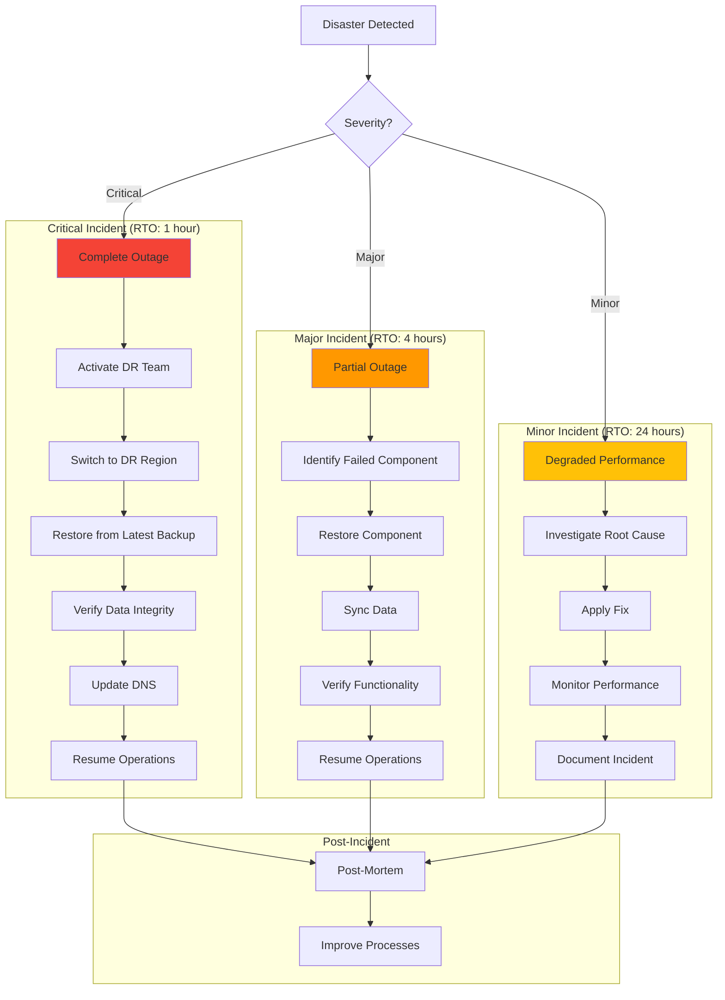
```mermaid
graph TB
    INCIDENT[Disaster Detected] --> ASSESS{Severity?}
    
    ASSESS -->|Critical| CRITICAL
    ASSESS -->|Major| MAJOR
    ASSESS -->|Minor| MINOR
    
    subgraph "Critical Incident (RTO: 1 hour)"
        CRITICAL[Complete Outage]
        CRITICAL --> CRIT1[Activate DR Team]
        CRIT1 --> CRIT2[Switch to DR Region]
        CRIT2 --> CRIT3[Restore from Latest Backup]
        CRIT3 --> CRIT4[Verify Data Integrity]
        CRIT4 --> CRIT5[Update DNS]
        CRIT5 --> CRIT6[Resume Operations]
    end
    
    subgraph "Major Incident (RTO: 4 hours)"
        MAJOR[Partial Outage]
        MAJOR --> MAJ1[Identify Failed Component]
        MAJ1 --> MAJ2[Restore Component]
        MAJ2 --> MAJ3[Sync Data]
        MAJ3 --> MAJ4[Verify Functionality]
        MAJ4 --> MAJ5[Resume Operations]
    end
    
    subgraph "Minor Incident (RTO: 24 hours)"
        MINOR[Degraded Performance]
        MINOR --> MIN1[Investigate Root Cause]
        MIN1 --> MIN2[Apply Fix]
        MIN2 --> MIN3[Monitor Performance]
        MIN3 --> MIN4[Document Incident]
    end
    
    subgraph "Post-Incident"
        CRIT6 --> POST[Post-Mortem]
        MAJ5 --> POST
        MIN4 --> POST
        POST --> IMPROVE[Improve Processes]
    end
    
    style CRITICAL fill:#F44336
    style MAJOR fill:#FF9800
    style MINOR fill:#FFC107
```

### 5.3 Point-in-Time Recovery

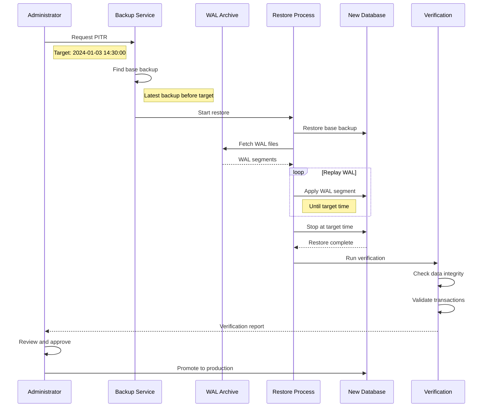
```mermaid
sequenceDiagram
    participant Admin as Administrator
    participant Backup as Backup Service
    participant WAL as WAL Archive
    participant Restore as Restore Process
    participant New_DB as New Database
    participant Verify as Verification
    
    Admin->>Backup: Request PITR
    Note right of Admin: Target: 2024-01-03 14:30:00
    
    Backup->>Backup: Find base backup
    Note right of Backup: Latest backup before target
    
    Backup->>Restore: Start restore
    Restore->>New_DB: Restore base backup
    
    Restore->>WAL: Fetch WAL files
    WAL-->>Restore: WAL segments
    
    loop Replay WAL
        Restore->>New_DB: Apply WAL segment
        Note right of Restore: Until target time
    end
    
    Restore->>New_DB: Stop at target time
    New_DB-->>Restore: Restore complete
    
    Restore->>Verify: Run verification
    Verify->>Verify: Check data integrity
    Verify->>Verify: Validate transactions
    Verify-->>Admin: Verification report
    
    Admin->>Admin: Review and approve
    Admin->>New_DB: Promote to production
```

---

## 6. Scaling Strategies

### 6.1 Horizontal Scaling

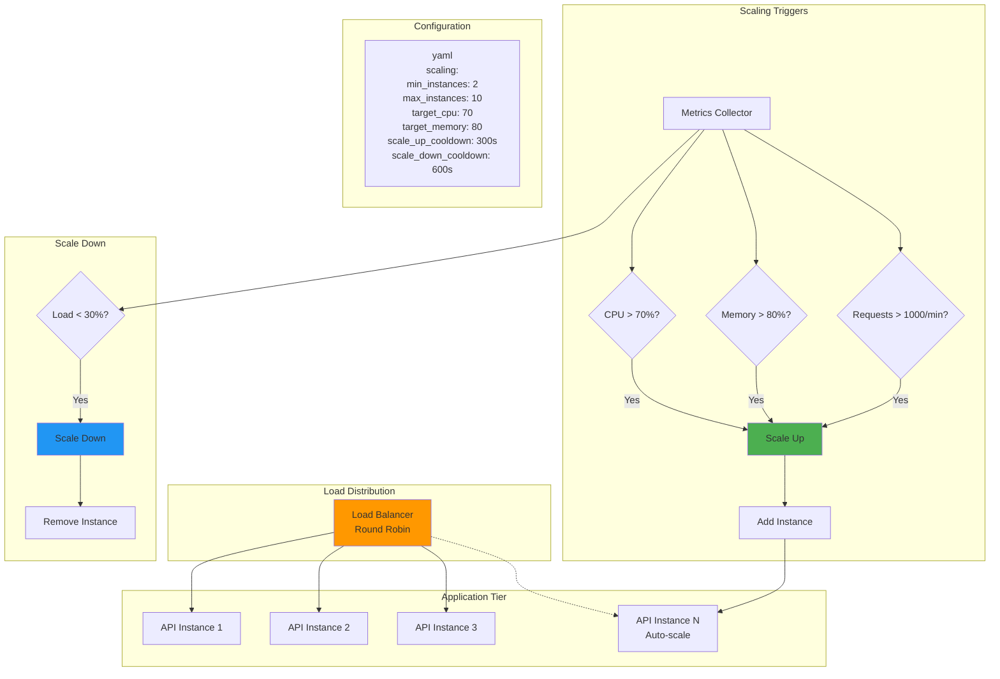
```mermaid
graph TB
    subgraph "Load Distribution"
        LB[Load Balancer<br/>Round Robin]
    end
    
    subgraph "Application Tier"
        LB --> API1[API Instance 1]
        LB --> API2[API Instance 2]
        LB --> API3[API Instance 3]
        LB -.-> APIX[API Instance N<br/>Auto-scale]
    end
    
    subgraph "Scaling Triggers"
        METRICS[Metrics Collector]
        METRICS --> CPU_CHECK{CPU > 70%?}
        METRICS --> MEM_CHECK{Memory > 80%?}
        METRICS --> REQ_CHECK{Requests > 1000/min?}
        
        CPU_CHECK -->|Yes| SCALE_UP
        MEM_CHECK -->|Yes| SCALE_UP
        REQ_CHECK -->|Yes| SCALE_UP
        
        SCALE_UP[Scale Up]
        SCALE_UP --> ADD_INSTANCE[Add Instance]
        ADD_INSTANCE --> APIX
    end
    
    subgraph "Scale Down"
        METRICS --> LOW_LOAD{Load < 30%?}
        LOW_LOAD -->|Yes| SCALE_DOWN[Scale Down]
        SCALE_DOWN --> REMOVE[Remove Instance]
    end
    
    subgraph "Configuration"
        CONFIG["`yaml
        scaling:
          min_instances: 2
          max_instances: 10
          target_cpu: 70
          target_memory: 80
          scale_up_cooldown: 300s
          scale_down_cooldown: 600s
        `"]
    end
    
    style LB fill:#FF9800
    style SCALE_UP fill:#4CAF50
    style SCALE_DOWN fill:#2196F3
```

### 6.2 Database Scaling Strategy

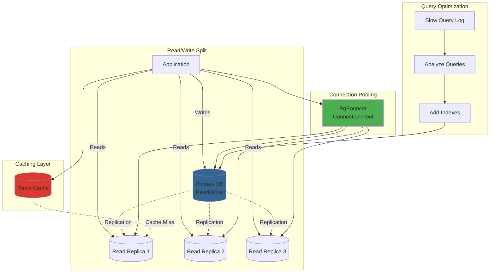
```mermaid
graph TB
    subgraph "Read/Write Split"
        APP[Application]
        APP -->|Writes| PRIMARY[(Primary DB<br/>Read/Write)]
        APP -->|Reads| REPLICA1[(Read Replica 1)]
        APP -->|Reads| REPLICA2[(Read Replica 2)]
        APP -->|Reads| REPLICA3[(Read Replica 3)]
        
        PRIMARY -.->|Replication| REPLICA1
        PRIMARY -.->|Replication| REPLICA2
        PRIMARY -.->|Replication| REPLICA3
    end
    
    subgraph "Connection Pooling"
        APP --> POOL[PgBouncer<br/>Connection Pool]
        POOL --> PRIMARY
        POOL --> REPLICA1
        POOL --> REPLICA2
        POOL --> REPLICA3
    end
    
    subgraph "Caching Layer"
        APP --> REDIS[(Redis Cache)]
        REDIS -.->|Cache Miss| REPLICA1
    end
    
    subgraph "Query Optimization"
        SLOW_QUERY[Slow Query Log]
        SLOW_QUERY --> ANALYZE[Analyze Queries]
        ANALYZE --> INDEX[Add Indexes]
        INDEX --> PRIMARY
    end
    
    style PRIMARY fill:#336791
    style REDIS fill:#DC382D
    style POOL fill:#4CAF50
```

### 6.3 Cache Scaling Pattern

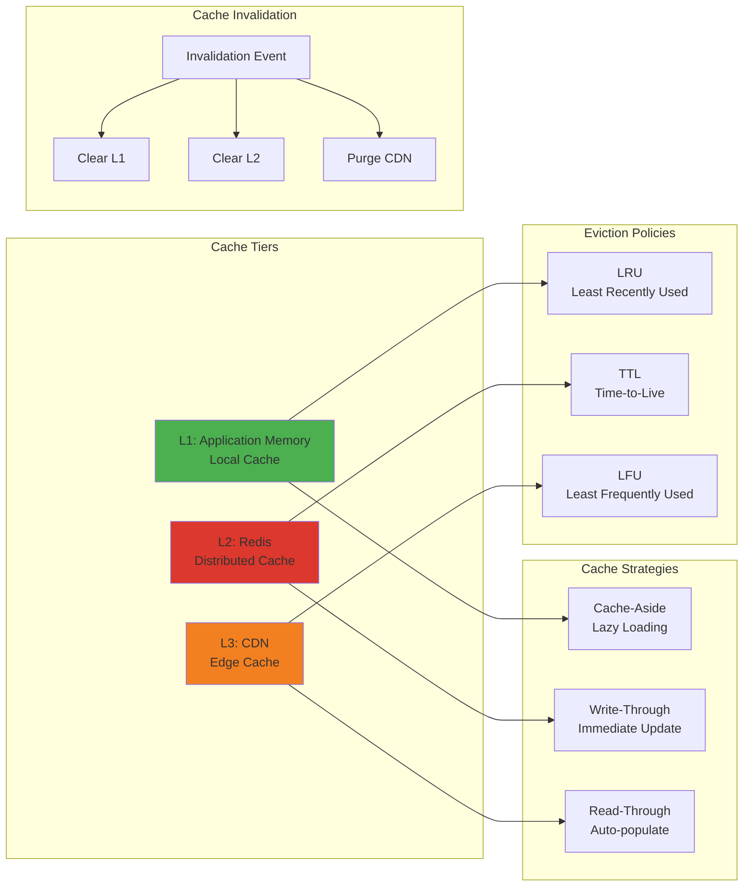
```mermaid
graph LR
    subgraph "Cache Tiers"
        L1[L1: Application Memory<br/>Local Cache]
        L2[L2: Redis<br/>Distributed Cache]
        L3[L3: CDN<br/>Edge Cache]
    end
    
    subgraph "Cache Strategies"
        L1 --> STRATEGY1[Cache-Aside<br/>Lazy Loading]
        L2 --> STRATEGY2[Write-Through<br/>Immediate Update]
        L3 --> STRATEGY3[Read-Through<br/>Auto-populate]
    end
    
    subgraph "Eviction Policies"
        L1 --> LRU1[LRU<br/>Least Recently Used]
        L2 --> TTL[TTL<br/>Time-to-Live]
        L3 --> LFU[LFU<br/>Least Frequently Used]
    end
    
    subgraph "Cache Invalidation"
        INVALIDATE[Invalidation Event]
        INVALIDATE --> CLEAR_L1[Clear L1]
        INVALIDATE --> CLEAR_L2[Clear L2]
        INVALIDATE --> PURGE_CDN[Purge CDN]
    end
    
    style L1 fill:#4CAF50
    style L2 fill:#DC382D
    style L3 fill:#F38020
```

### 6.4 Auto-Scaling Configuration

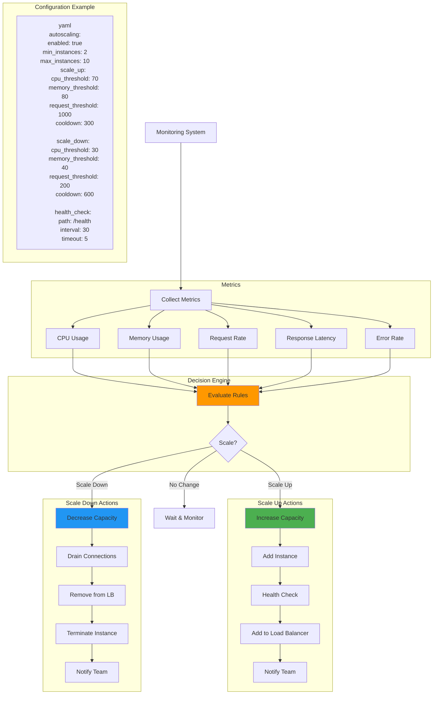
```mermaid
graph TB
    MONITOR[Monitoring System] --> COLLECT[Collect Metrics]
    
    subgraph "Metrics"
        COLLECT --> CPU[CPU Usage]
        COLLECT --> MEMORY[Memory Usage]
        COLLECT --> REQUESTS[Request Rate]
        COLLECT --> LATENCY[Response Latency]
        COLLECT --> ERRORS[Error Rate]
    end
    
    subgraph "Decision Engine"
        CPU --> EVALUATE[Evaluate Rules]
        MEMORY --> EVALUATE
        REQUESTS --> EVALUATE
        LATENCY --> EVALUATE
        ERRORS --> EVALUATE
        
        EVALUATE --> DECISION{Scale?}
    end
    
    DECISION -->|Scale Up| UP[Increase Capacity]
    DECISION -->|Scale Down| DOWN[Decrease Capacity]
    DECISION -->|No Change| WAIT[Wait & Monitor]
    
    subgraph "Scale Up Actions"
        UP --> ADD_INSTANCE[Add Instance]
        ADD_INSTANCE --> HEALTH_CHECK[Health Check]
        HEALTH_CHECK --> ADD_TO_LB[Add to Load Balancer]
        ADD_TO_LB --> NOTIFY_UP[Notify Team]
    end
    
    subgraph "Scale Down Actions"
        DOWN --> DRAIN[Drain Connections]
        DRAIN --> REMOVE_FROM_LB[Remove from LB]
        REMOVE_FROM_LB --> TERMINATE[Terminate Instance]
        TERMINATE --> NOTIFY_DOWN[Notify Team]
    end
    
    subgraph "Configuration Example"
        CONFIG["`yaml
        autoscaling:
          enabled: true
          min_instances: 2
          max_instances: 10
          
          scale_up:
            cpu_threshold: 70
            memory_threshold: 80
            request_threshold: 1000
            cooldown: 300
          
          scale_down:
            cpu_threshold: 30
            memory_threshold: 40
            request_threshold: 200
            cooldown: 600
          
          health_check:
            path: /health
            interval: 30
            timeout: 5
        `"]
    end
    
    style EVALUATE fill:#FF9800
    style UP fill:#4CAF50
    style DOWN fill:#2196F3
```

---

## 7. Network Architecture

### 7.1 Network Topology

```mermaid
graph TB
    subgraph "Public Internet"
        USERS[Users]
    end
    
    subgraph "Edge Network"
        USERS --> CF[Cloudflare<br/>DDoS Protection]
        CF --> WAF[Web Application Firewall]
    end
    
    subgraph "DMZ"
        WAF --> LB[Load Balancer<br/>Public Subnet]
    end
    
    subgraph "Application Tier - Private Subnet"
        LB --> API1[API Server 1<br/>10.0.1.10]
        LB --> API2[API Server 2<br/>10.0.1.11]
        LB --> API3[API Server 3<br/>10.0.1.12]
    end
    
    subgraph "Data Tier - Private Subnet"
        API1 --> DB[(PostgreSQL<br/>10.0.2.10)]
        API2 --> DB
        API3 --> DB
        
        API1 --> REDIS[(Redis<br/>10.0.2.20)]
        API2 --> REDIS
        API3 --> REDIS
    end
    
    subgraph "Security Groups"
        SG1[SG: Load Balancer<br/>Allow: 80, 443]
        SG2[SG: API Servers<br/>Allow: 3000 from LB]
        SG3[SG: Database<br/>Allow: 5432 from API]
        SG4[SG: Redis<br/>Allow: 6379 from API]
    end
    
    style CF fill:#F38020
    style LB fill:#FF9800
    style DB fill:#336791
    style REDIS fill:#DC382D
```

### 7.2 Security Layers

```mermaid
graph TB
    REQUEST[Incoming Request] --> LAYER1
    
    subgraph "Layer 1: Edge Security"
        LAYER1[Cloudflare]
        LAYER1 --> DDOS_CHECK{DDoS Attack?}
        DDOS_CHECK -->|Yes| BLOCK1[Block Request]
        DDOS_CHECK -->|No| WAF_CHECK{WAF Rules?}
        WAF_CHECK -->|Malicious| BLOCK2[Block Request]
        WAF_CHECK -->|Clean| LAYER2
    end
    
    subgraph "Layer 2: Network Security"
        LAYER2[Network Firewall]
        LAYER2 --> IP_CHECK{Allowed IP?}
        IP_CHECK -->|No| BLOCK3[Block Request]
        IP_CHECK -->|Yes| RATE_LIMIT{Rate Limit?}
        RATE_LIMIT -->|Exceeded| BLOCK4[Block Request]
        RATE_LIMIT -->|OK| LAYER3
    end
    
    subgraph "Layer 3: Application Security"
        LAYER3[API Gateway]
        LAYER3 --> CSRF{CSRF Token?}
        CSRF -->|Invalid| REJECT1[403 Forbidden]
        CSRF -->|Valid| AUTH{Authenticated?}
        AUTH -->|No| REJECT2[401 Unauthorized]
        AUTH -->|Yes| RBAC{Authorized?}
        RBAC -->|No| REJECT3[403 Forbidden]
        RBAC -->|Yes| LAYER4
    end
    
    subgraph "Layer 4: Data Security"
        LAYER4[Business Logic]
        LAYER4 --> VALIDATE{Valid Input?}
        VALIDATE -->|No| REJECT4[400 Bad Request]
        VALIDATE -->|Yes| PROCESS[Process Request]
        PROCESS --> ENCRYPT[Encrypt Sensitive Data]
        ENCRYPT --> STORE[Store in Database]
    end
    
    style LAYER1 fill:#F38020
    style LAYER2 fill:#FF9800
    style LAYER3 fill:#4CAF50
    style LAYER4 fill:#2196F3
```

---

## Configuration Examples

### Railway Deployment Configuration

```yaml
# railway.json
{
  "build": {
    "builder": "NIXPACKS",
    "buildCommand": "npm run build"
  },
  "deploy": {
    "startCommand": "npm run start:prod",
    "healthcheckPath": "/health",
    "healthcheckTimeout": 300,
    "restartPolicyType": "ON_FAILURE",
    "restartPolicyMaxRetries": 10
  }
}
```

### Docker Compose for Local Development

```yaml
version: '3.8'

services:
  backend:
    build: ./backend
    ports:
      - "3000:3000"
    environment:
      - DATABASE_URL=postgresql://postgres:password@db:5432/liquor_pos
      - REDIS_URL=redis://redis:6379
    depends_on:
      - db
      - redis

  frontend:
    build: ./frontend
    ports:
      - "5173:5173"
    environment:
      - VITE_API_URL=http://localhost:3000

  db:
    image: postgres:15-alpine
    ports:
      - "5432:5432"
    environment:
      - POSTGRES_DB=liquor_pos
      - POSTGRES_PASSWORD=password
    volumes:
      - postgres_data:/var/lib/postgresql/data

  redis:
    image: redis:7-alpine
    ports:
      - "6379:6379"
    volumes:
      - redis_data:/data

volumes:
  postgres_data:
  redis_data:
```

---

## Related Documentation

- [Visual Architecture Diagrams](VISUAL_ARCHITECTURE_DIAGRAMS.md) - System architecture
- [UI Configuration Guide](UI_CONFIGURATION_GUIDE.md) - UI and business rules
- [Configuration Guide](configuration.md) - Environment variables
- [Deployment Guide](deployment.md) - Deployment instructions

---

**Last Updated:** January 3, 2026  
**Version:** 1.0

