# Visual Diagrams Index

> **Complete index** of all Mermaid diagrams for the Florida Liquor Store POS System

---

## 📚 Documentation Overview

This index provides quick access to all visual architecture diagrams, organized by category. All diagrams are created using Mermaid and can be viewed in GitHub, VS Code, or any Mermaid-compatible viewer.

---

## 🗂️ Document Structure

### 1. [Visual Architecture Diagrams](VISUAL_ARCHITECTURE_DIAGRAMS.md)
**Core system architecture, sequences, and patterns**

#### System Architecture
- High-Level System Architecture
- Module Architecture (Backend)
- Frontend Architecture

#### Sequence Diagrams
- Counter Checkout Flow (Happy Path)
- Offline Order Processing
- Authentication Flow
- Product Search with AI
- Inventory Adjustment Flow

#### Integration Diagrams
- External Integrations Overview
- Stripe Payment Integration
- Back-Office Sync Integration

#### Design Patterns
- SAGA Pattern (Order Orchestration)
- Agent Pattern (Order Processing)
- Repository Pattern (Frontend)
- Event-Driven Architecture

#### Database Schema
- Entity Relationship Diagram
- Database Indexes Strategy

#### Configuration Flows
- Tax Configuration Flow
- Pricing Configuration Flow
- Adding New Product Configuration
- Button/UI Configuration

#### UI Component Architecture
- POS Terminal Component Tree
- Admin Dashboard Component Tree
- Component State Flow

#### State Management
- Zustand Store Architecture
- State Synchronization Flow
- Offline State Management

---

### 2. [UI Configuration Guide](UI_CONFIGURATION_GUIDE.md)
**UI customization, business rules, and configuration patterns**

#### UI Component Configuration
- Adding a New Button to POS
- Customizing Cart Display
- Checkout Button States
- Product Card Layout Configuration
- Theme Customization

#### Business Rules Configuration
- Age Verification Rules
- Discount Rules Engine
- Inventory Reorder Rules

#### Pricing & Tax Configuration
- Multi-Tier Pricing Structure
- Tax Calculation Flow
- Dynamic Pricing Rules

#### Product Configuration
- Adding a New Product Category
- Product Attribute Configuration
- Product Image Management

#### User & Role Configuration
- Role-Based Access Control (RBAC)
- Adding a New User
- User Authentication Flow with PIN

#### System Behavior Configuration
- Offline Mode Configuration
- Cache Strategy Configuration
- Error Handling Configuration

---

### 3. [Deployment & Integration Diagrams](DEPLOYMENT_INTEGRATION_DIAGRAMS.md)
**Deployment, CI/CD, monitoring, and scaling strategies**

#### Deployment Architecture
- Production Infrastructure
- Multi-Region Deployment
- Container Architecture

#### CI/CD Pipelines
- Frontend Deployment Pipeline
- Backend Deployment Pipeline
- Database Migration Pipeline

#### Integration Patterns
- Stripe Payment Integration Flow
- Back-Office Sync Integration
- Real-Time Inventory Sync
- Webhook Integration Pattern

#### Monitoring & Observability
- Monitoring Stack
- Key Metrics Dashboard
- Alert Rules

#### Disaster Recovery
- Backup Strategy
- Disaster Recovery Runbook
- Point-in-Time Recovery

#### Scaling Strategies
- Horizontal Scaling
- Database Scaling Strategy
- Cache Scaling Pattern
- Auto-Scaling Configuration

#### Network Architecture
- Network Topology
- Security Layers

---

## 🔍 Quick Reference by Topic

### Architecture & Design

| Topic | Document | Section |
|-------|----------|---------|
| System Overview | [Visual Architecture](VISUAL_ARCHITECTURE_DIAGRAMS.md) | 1.1 High-Level System Architecture |
| Backend Modules | [Visual Architecture](VISUAL_ARCHITECTURE_DIAGRAMS.md) | 1.2 Module Architecture |
| Frontend Structure | [Visual Architecture](VISUAL_ARCHITECTURE_DIAGRAMS.md) | 1.3 Frontend Architecture |
| Design Patterns | [Visual Architecture](VISUAL_ARCHITECTURE_DIAGRAMS.md) | Section 4 |
| Database Schema | [Visual Architecture](VISUAL_ARCHITECTURE_DIAGRAMS.md) | Section 5 |

### User Flows & Sequences

| Flow | Document | Section |
|------|----------|---------|
| Checkout Process | [Visual Architecture](VISUAL_ARCHITECTURE_DIAGRAMS.md) | 2.1 Counter Checkout Flow |
| Offline Mode | [Visual Architecture](VISUAL_ARCHITECTURE_DIAGRAMS.md) | 2.2 Offline Order Processing |
| User Login | [Visual Architecture](VISUAL_ARCHITECTURE_DIAGRAMS.md) | 2.3 Authentication Flow |
| Product Search | [Visual Architecture](VISUAL_ARCHITECTURE_DIAGRAMS.md) | 2.4 Product Search with AI |
| Inventory Update | [Visual Architecture](VISUAL_ARCHITECTURE_DIAGRAMS.md) | 2.5 Inventory Adjustment Flow |

### Configuration & Setup

| Configuration | Document | Section |
|---------------|----------|---------|
| Tax Setup | [Visual Architecture](VISUAL_ARCHITECTURE_DIAGRAMS.md) | 6.1 Tax Configuration |
| Pricing Setup | [Visual Architecture](VISUAL_ARCHITECTURE_DIAGRAMS.md) | 6.2 Pricing Configuration |
| Product Setup | [Visual Architecture](VISUAL_ARCHITECTURE_DIAGRAMS.md) | 6.3 Adding New Product |
| UI Customization | [Visual Architecture](VISUAL_ARCHITECTURE_DIAGRAMS.md) | 6.4 Button/UI Configuration |
| Business Rules | [UI Configuration](UI_CONFIGURATION_GUIDE.md) | Section 2 |

### UI Components

| Component | Document | Section |
|-----------|----------|---------|
| POS Terminal | [Visual Architecture](VISUAL_ARCHITECTURE_DIAGRAMS.md) | 7.1 POS Terminal Tree |
| Admin Dashboard | [Visual Architecture](VISUAL_ARCHITECTURE_DIAGRAMS.md) | 7.2 Admin Dashboard Tree |
| Button Styling | [UI Configuration](UI_CONFIGURATION_GUIDE.md) | 1.1 Adding a Button |
| Cart Display | [UI Configuration](UI_CONFIGURATION_GUIDE.md) | 1.2 Customizing Cart |
| Theme System | [UI Configuration](UI_CONFIGURATION_GUIDE.md) | 1.5 Theme Customization |

### Integrations

| Integration | Document | Section |
|-------------|----------|---------|
| Stripe Payments | [Visual Architecture](VISUAL_ARCHITECTURE_DIAGRAMS.md) | 3.2 Stripe Integration |
| Back-Office Sync | [Visual Architecture](VISUAL_ARCHITECTURE_DIAGRAMS.md) | 3.3 Back-Office Sync |
| Payment Flow | [Deployment](DEPLOYMENT_INTEGRATION_DIAGRAMS.md) | 3.1 Stripe Payment Flow |
| Webhook Pattern | [Deployment](DEPLOYMENT_INTEGRATION_DIAGRAMS.md) | 3.4 Webhook Integration |
| Real-Time Sync | [Deployment](DEPLOYMENT_INTEGRATION_DIAGRAMS.md) | 3.3 Real-Time Inventory |

### Deployment & Operations

| Topic | Document | Section |
|-------|----------|---------|
| Production Setup | [Deployment](DEPLOYMENT_INTEGRATION_DIAGRAMS.md) | 1.1 Production Infrastructure |
| Multi-Region | [Deployment](DEPLOYMENT_INTEGRATION_DIAGRAMS.md) | 1.2 Multi-Region Deployment |
| CI/CD Pipeline | [Deployment](DEPLOYMENT_INTEGRATION_DIAGRAMS.md) | Section 2 |
| Monitoring | [Deployment](DEPLOYMENT_INTEGRATION_DIAGRAMS.md) | Section 4 |
| Disaster Recovery | [Deployment](DEPLOYMENT_INTEGRATION_DIAGRAMS.md) | Section 5 |
| Scaling | [Deployment](DEPLOYMENT_INTEGRATION_DIAGRAMS.md) | Section 6 |

### Security

| Security Topic | Document | Section |
|----------------|----------|---------|
| Authentication | [Visual Architecture](VISUAL_ARCHITECTURE_DIAGRAMS.md) | 2.3 Authentication Flow |
| Authorization (RBAC) | [UI Configuration](UI_CONFIGURATION_GUIDE.md) | 5.1 RBAC |
| Security Layers | [Deployment](DEPLOYMENT_INTEGRATION_DIAGRAMS.md) | 7.2 Security Layers |
| Network Security | [Deployment](DEPLOYMENT_INTEGRATION_DIAGRAMS.md) | 7.1 Network Topology |

---

## 🎯 Use Case Index

### For Developers

**Setting up the development environment:**
1. [Production Infrastructure](DEPLOYMENT_INTEGRATION_DIAGRAMS.md#11-production-infrastructure) - Understand the target architecture
2. [Container Architecture](DEPLOYMENT_INTEGRATION_DIAGRAMS.md#13-container-architecture) - Local Docker setup
3. [Frontend Architecture](VISUAL_ARCHITECTURE_DIAGRAMS.md#13-frontend-architecture) - Frontend structure
4. [Module Architecture](VISUAL_ARCHITECTURE_DIAGRAMS.md#12-module-architecture-backend) - Backend structure

**Implementing a new feature:**
1. [Design Patterns](VISUAL_ARCHITECTURE_DIAGRAMS.md#4-design-patterns) - Choose appropriate pattern
2. [Component State Flow](VISUAL_ARCHITECTURE_DIAGRAMS.md#73-component-state-flow) - Understand state management
3. [API Integration](VISUAL_ARCHITECTURE_DIAGRAMS.md#3-integration-diagrams) - Connect to backend

**Adding a new integration:**
1. [Integration Patterns](DEPLOYMENT_INTEGRATION_DIAGRAMS.md#3-integration-patterns) - Choose pattern
2. [Webhook Integration](DEPLOYMENT_INTEGRATION_DIAGRAMS.md#34-webhook-integration-pattern) - Implement webhook
3. [Event-Driven Architecture](VISUAL_ARCHITECTURE_DIAGRAMS.md#44-event-driven-architecture) - Publish events

### For DevOps Engineers

**Deploying to production:**
1. [Production Infrastructure](DEPLOYMENT_INTEGRATION_DIAGRAMS.md#11-production-infrastructure) - Infrastructure overview
2. [CI/CD Pipelines](DEPLOYMENT_INTEGRATION_DIAGRAMS.md#2-cicd-pipelines) - Deployment automation
3. [Network Topology](DEPLOYMENT_INTEGRATION_DIAGRAMS.md#71-network-topology) - Network configuration

**Setting up monitoring:**
1. [Monitoring Stack](DEPLOYMENT_INTEGRATION_DIAGRAMS.md#41-monitoring-stack) - Monitoring tools
2. [Key Metrics Dashboard](DEPLOYMENT_INTEGRATION_DIAGRAMS.md#42-key-metrics-dashboard) - Important metrics
3. [Alert Rules](DEPLOYMENT_INTEGRATION_DIAGRAMS.md#43-alert-rules) - Alert configuration

**Scaling the system:**
1. [Horizontal Scaling](DEPLOYMENT_INTEGRATION_DIAGRAMS.md#61-horizontal-scaling) - Add more instances
2. [Database Scaling](DEPLOYMENT_INTEGRATION_DIAGRAMS.md#62-database-scaling-strategy) - Scale database
3. [Cache Scaling](DEPLOYMENT_INTEGRATION_DIAGRAMS.md#63-cache-scaling-pattern) - Optimize caching

### For Product Managers

**Understanding user flows:**
1. [Counter Checkout Flow](VISUAL_ARCHITECTURE_DIAGRAMS.md#21-counter-checkout-flow-happy-path) - POS checkout
2. [Offline Order Processing](VISUAL_ARCHITECTURE_DIAGRAMS.md#22-offline-order-processing) - Offline mode
3. [Product Search with AI](VISUAL_ARCHITECTURE_DIAGRAMS.md#24-product-search-with-ai) - Search feature

**Configuring business rules:**
1. [Age Verification Rules](UI_CONFIGURATION_GUIDE.md#21-age-verification-rules) - Compliance
2. [Discount Rules Engine](UI_CONFIGURATION_GUIDE.md#22-discount-rules-engine) - Promotions
3. [Tax Configuration](VISUAL_ARCHITECTURE_DIAGRAMS.md#61-tax-configuration-flow) - Tax setup

**Customizing the UI:**
1. [Theme Customization](UI_CONFIGURATION_GUIDE.md#15-theme-customization) - Branding
2. [Product Card Layout](UI_CONFIGURATION_GUIDE.md#14-product-card-layout-configuration) - Product display
3. [Checkout Button States](UI_CONFIGURATION_GUIDE.md#13-checkout-button-states) - Button behavior

### For Store Managers

**Adding products:**
1. [Adding New Product](VISUAL_ARCHITECTURE_DIAGRAMS.md#63-adding-new-product-configuration) - Product setup
2. [Product Attribute Configuration](UI_CONFIGURATION_GUIDE.md#42-product-attribute-configuration) - Product details
3. [Product Image Management](UI_CONFIGURATION_GUIDE.md#43-product-image-management) - Product images

**Managing inventory:**
1. [Inventory Adjustment Flow](VISUAL_ARCHITECTURE_DIAGRAMS.md#25-inventory-adjustment-flow) - Adjust stock
2. [Inventory Reorder Rules](UI_CONFIGURATION_GUIDE.md#23-inventory-reorder-rules) - Reorder alerts
3. [Real-Time Inventory Sync](DEPLOYMENT_INTEGRATION_DIAGRAMS.md#33-real-time-inventory-sync) - Multi-store sync

**Managing users:**
1. [Adding a New User](UI_CONFIGURATION_GUIDE.md#52-adding-a-new-user) - User creation
2. [RBAC](UI_CONFIGURATION_GUIDE.md#51-role-based-access-control-rbac) - User permissions
3. [User Authentication with PIN](UI_CONFIGURATION_GUIDE.md#53-user-authentication-flow-with-pin) - Quick login

### For System Administrators

**Disaster recovery:**
1. [Backup Strategy](DEPLOYMENT_INTEGRATION_DIAGRAMS.md#51-backup-strategy) - Backup plan
2. [Disaster Recovery Runbook](DEPLOYMENT_INTEGRATION_DIAGRAMS.md#52-disaster-recovery-runbook) - Recovery steps
3. [Point-in-Time Recovery](DEPLOYMENT_INTEGRATION_DIAGRAMS.md#53-point-in-time-recovery) - PITR

**Security configuration:**
1. [Security Layers](DEPLOYMENT_INTEGRATION_DIAGRAMS.md#72-security-layers) - Security overview
2. [Network Topology](DEPLOYMENT_INTEGRATION_DIAGRAMS.md#71-network-topology) - Network security
3. [Authentication Flow](VISUAL_ARCHITECTURE_DIAGRAMS.md#23-authentication-flow) - User authentication

---

## 📊 Diagram Statistics

### By Document

| Document | Total Diagrams | Categories |
|----------|----------------|------------|
| Visual Architecture Diagrams | 25+ | Architecture, Sequences, Patterns, Database, UI, State |
| UI Configuration Guide | 20+ | UI Components, Business Rules, Pricing, Products, Users, System |
| Deployment & Integration | 25+ | Deployment, CI/CD, Integrations, Monitoring, DR, Scaling |
| **Total** | **70+** | **15 categories** |

### By Category

| Category | Count | Documents |
|----------|-------|-----------|
| System Architecture | 8 | Visual Architecture, Deployment |
| Sequence Diagrams | 10 | Visual Architecture, Deployment |
| Configuration | 12 | Visual Architecture, UI Configuration |
| UI Components | 8 | Visual Architecture, UI Configuration |
| Integrations | 6 | Visual Architecture, Deployment |
| Deployment | 6 | Deployment |
| CI/CD | 3 | Deployment |
| Monitoring | 3 | Deployment |
| Security | 4 | Visual Architecture, Deployment |
| Scaling | 4 | Deployment |
| Business Rules | 3 | UI Configuration |
| State Management | 3 | Visual Architecture |

---

## 🛠️ Viewing the Diagrams

### In GitHub
All diagrams render automatically in GitHub's markdown viewer.

### In VS Code
1. Install: **Markdown Preview Mermaid Support** extension
2. Open any `.md` file
3. Press `Ctrl+Shift+V` (Windows/Linux) or `Cmd+Shift+V` (Mac)

### In Mermaid Live Editor
1. Visit https://mermaid.live
2. Copy diagram code
3. Paste and edit

### In Documentation Sites
These diagrams work with:
- GitBook
- Docusaurus
- MkDocs (with plugin)
- Notion
- Confluence (with plugin)

---

## 🔄 Updating Diagrams

### When to Update

Update diagrams when:
- ✅ Adding new features or modules
- ✅ Changing architecture or patterns
- ✅ Modifying user flows
- ✅ Updating deployment infrastructure
- ✅ Changing business rules
- ✅ Adding integrations

### How to Update

1. **Identify affected diagrams** using this index
2. **Update the diagram code** in the relevant `.md` file
3. **Test rendering** in GitHub or VS Code
4. **Update this index** if adding new diagrams
5. **Update the "Last Updated" date** in the document

### Diagram Standards

Follow these standards:
- Use consistent color coding (see legend below)
- Include clear labels and descriptions
- Add code examples where relevant
- Keep diagrams focused (one concept per diagram)
- Use subgraphs for logical grouping

---

## 🎨 Color Legend

### Standard Colors


### Technology Colors

```mermaid
graph LR
    POSTGRES[PostgreSQL<br/>#336791]
    REDIS[Redis<br/>#DC382D]
    CLOUDFLARE[Cloudflare<br/>#F38020]
    VERCEL[Vercel<br/>#000000]
    RAILWAY[Railway<br/>#0B0D0E]
    NESTJS[NestJS<br/>#E0234E]
    REACT[React<br/>#61DAFB]
    STRIPE[Stripe<br/>#635BFF]
    
    style POSTGRES fill:#336791
    style REDIS fill:#DC382D
    style CLOUDFLARE fill:#F38020
    style VERCEL fill:#000000
    style RAILWAY fill:#0B0D0E
    style NESTJS fill:#E0234E
    style REACT fill:#61DAFB
    style STRIPE fill:#635BFF
```



---

## 📝 Related Documentation

### Core Documentation
- [README](../README.md) - Project overview
- [Architecture](architecture.md) - Text-based architecture
- [PRD](PRD.md) - Product requirements
- [Setup Guide](setup.md) - Installation instructions

### Configuration
- [Configuration Guide](configuration.md) - Environment variables
- [Deployment Guide](deployment.md) - Deployment instructions

### Archive
- [Archive Folder](../archive/) - Historical documentation

---

## 🤝 Contributing

### Adding New Diagrams

1. Choose the appropriate document:
   - **Visual Architecture** - Core system architecture
   - **UI Configuration** - UI and business rules
   - **Deployment** - Infrastructure and operations

2. Follow the existing format:
   ```markdown
   ### X.Y Diagram Title
   
   ```mermaid
   graph TB
       ...
   ```
   
   Description of the diagram...
   ```

3. Update this index with the new diagram

4. Test rendering in multiple viewers

---

## 📞 Support

For questions about these diagrams:
- **Technical Questions**: See [Architecture](architecture.md)
- **Configuration Help**: See [Configuration Guide](configuration.md)
- **Setup Issues**: See [Setup Guide](setup.md)

---

**Last Updated:** January 3, 2026  
**Total Diagrams:** 70+  
**Version:** 1.0  
**Maintained By:** Development Team

