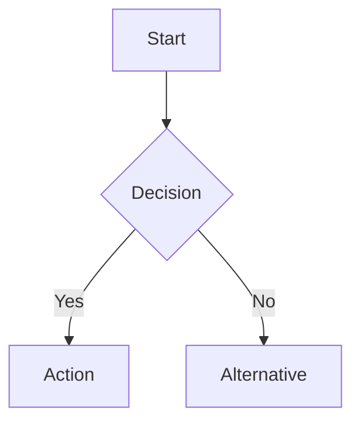
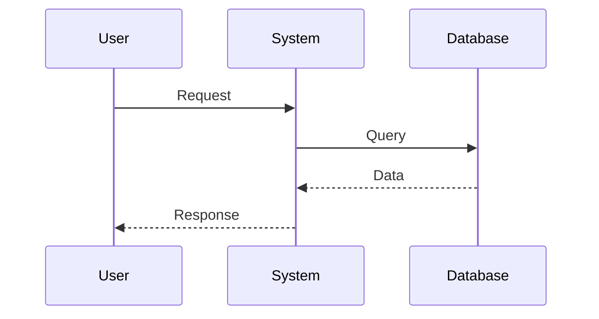
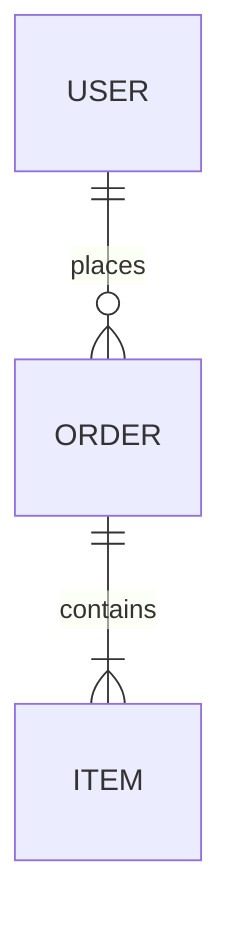
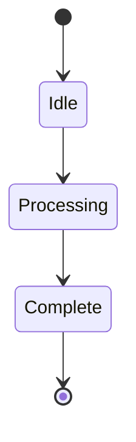
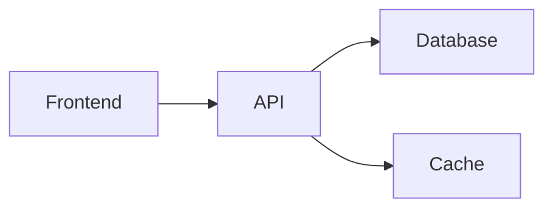

# Visual Diagrams Summary

> **Quick overview** of all visual architecture diagrams available for the Florida Liquor Store POS System

---

## 📚 Complete Documentation Set

We've created **70+ comprehensive Mermaid diagrams** covering every aspect of the system:

### 🏗️ [Visual Architecture Diagrams](VISUAL_ARCHITECTURE_DIAGRAMS.md)
**25+ diagrams** covering core system architecture, sequences, patterns, and database design

**Key Highlights:**
- ✅ High-level system architecture
- ✅ Backend module structure  
- ✅ Frontend component architecture
- ✅ Complete checkout flow sequence
- ✅ Offline mode handling
- ✅ Authentication & authorization
- ✅ SAGA pattern implementation
- ✅ Event-driven architecture
- ✅ Complete database ERD
- ✅ State management flows

### 🎨 [UI Configuration Guide](UI_CONFIGURATION_GUIDE.md)
**20+ diagrams** for UI customization, business rules, and configuration

**Key Highlights:**
- ✅ Adding buttons and UI elements
- ✅ Cart display customization
- ✅ Theme configuration
- ✅ Age verification rules
- ✅ Discount engine configuration
- ✅ Multi-tier pricing setup
- ✅ Tax calculation flows
- ✅ Product management
- ✅ Role-based access control
- ✅ Offline mode configuration

### 🚀 [Deployment & Integration Diagrams](DEPLOYMENT_INTEGRATION_DIAGRAMS.md)
**25+ diagrams** for deployment, CI/CD, monitoring, and scaling

**Key Highlights:**
- ✅ Production infrastructure
- ✅ Multi-region deployment
- ✅ CI/CD pipelines (frontend & backend)
- ✅ Stripe payment integration
- ✅ Back-office sync patterns
- ✅ Real-time inventory sync
- ✅ Monitoring stack
- ✅ Disaster recovery procedures
- ✅ Auto-scaling configuration
- ✅ Network security layers

### 📑 [Complete Index](DIAGRAMS_INDEX.md)
**Comprehensive index** with quick reference tables and use case guides

---

## 🎯 Quick Access by Role

### 👨‍💻 For Developers

**Start Here:**
1. [System Architecture](VISUAL_ARCHITECTURE_DIAGRAMS.md#1-system-architecture) - Understand the big picture
2. [Backend Modules](VISUAL_ARCHITECTURE_DIAGRAMS.md#12-module-architecture-backend) - Backend structure
3. [Frontend Architecture](VISUAL_ARCHITECTURE_DIAGRAMS.md#13-frontend-architecture) - Frontend structure
4. [Design Patterns](VISUAL_ARCHITECTURE_DIAGRAMS.md#4-design-patterns) - Implementation patterns

**Common Tasks:**
- [Adding a Button](UI_CONFIGURATION_GUIDE.md#11-adding-a-new-button-to-pos)
- [Checkout Flow](VISUAL_ARCHITECTURE_DIAGRAMS.md#21-counter-checkout-flow-happy-path)
- [State Management](VISUAL_ARCHITECTURE_DIAGRAMS.md#8-state-management)
- [API Integration](DEPLOYMENT_INTEGRATION_DIAGRAMS.md#3-integration-patterns)

### 🛠️ For DevOps Engineers

**Start Here:**
1. [Production Infrastructure](DEPLOYMENT_INTEGRATION_DIAGRAMS.md#11-production-infrastructure)
2. [CI/CD Pipelines](DEPLOYMENT_INTEGRATION_DIAGRAMS.md#2-cicd-pipelines)
3. [Monitoring Stack](DEPLOYMENT_INTEGRATION_DIAGRAMS.md#41-monitoring-stack)
4. [Disaster Recovery](DEPLOYMENT_INTEGRATION_DIAGRAMS.md#5-disaster-recovery)

**Common Tasks:**
- [Deploying to Production](DEPLOYMENT_INTEGRATION_DIAGRAMS.md#21-frontend-deployment-pipeline)
- [Setting Up Monitoring](DEPLOYMENT_INTEGRATION_DIAGRAMS.md#42-key-metrics-dashboard)
- [Scaling the System](DEPLOYMENT_INTEGRATION_DIAGRAMS.md#6-scaling-strategies)
- [Network Configuration](DEPLOYMENT_INTEGRATION_DIAGRAMS.md#71-network-topology)

### 📊 For Product Managers

**Start Here:**
1. [User Flows](VISUAL_ARCHITECTURE_DIAGRAMS.md#2-sequence-diagrams)
2. [Business Rules](UI_CONFIGURATION_GUIDE.md#2-business-rules-configuration)
3. [UI Components](VISUAL_ARCHITECTURE_DIAGRAMS.md#7-ui-component-architecture)
4. [Configuration Options](UI_CONFIGURATION_GUIDE.md#3-pricing--tax-configuration)

**Common Tasks:**
- [Understanding Checkout](VISUAL_ARCHITECTURE_DIAGRAMS.md#21-counter-checkout-flow-happy-path)
- [Configuring Discounts](UI_CONFIGURATION_GUIDE.md#22-discount-rules-engine)
- [Setting Tax Rates](UI_CONFIGURATION_GUIDE.md#32-tax-calculation-flow)
- [Customizing UI](UI_CONFIGURATION_GUIDE.md#1-ui-component-configuration)

### 🏪 For Store Managers

**Start Here:**
1. [Adding Products](UI_CONFIGURATION_GUIDE.md#41-adding-a-new-product-category)
2. [Managing Inventory](VISUAL_ARCHITECTURE_DIAGRAMS.md#25-inventory-adjustment-flow)
3. [User Management](UI_CONFIGURATION_GUIDE.md#52-adding-a-new-user)
4. [Pricing Setup](UI_CONFIGURATION_GUIDE.md#31-multi-tier-pricing-structure)

**Common Tasks:**
- [Product Configuration](UI_CONFIGURATION_GUIDE.md#42-product-attribute-configuration)
- [Inventory Reorder](UI_CONFIGURATION_GUIDE.md#23-inventory-reorder-rules)
- [User Roles](UI_CONFIGURATION_GUIDE.md#51-role-based-access-control-rbac)
- [Tax Configuration](UI_CONFIGURATION_GUIDE.md#32-tax-calculation-flow)

### 🔧 For System Administrators

**Start Here:**
1. [Security Architecture](DEPLOYMENT_INTEGRATION_DIAGRAMS.md#72-security-layers)
2. [Backup Strategy](DEPLOYMENT_INTEGRATION_DIAGRAMS.md#51-backup-strategy)
3. [Monitoring & Alerts](DEPLOYMENT_INTEGRATION_DIAGRAMS.md#43-alert-rules)
4. [Network Security](DEPLOYMENT_INTEGRATION_DIAGRAMS.md#71-network-topology)

**Common Tasks:**
- [Disaster Recovery](DEPLOYMENT_INTEGRATION_DIAGRAMS.md#52-disaster-recovery-runbook)
- [Point-in-Time Recovery](DEPLOYMENT_INTEGRATION_DIAGRAMS.md#53-point-in-time-recovery)
- [Security Configuration](DEPLOYMENT_INTEGRATION_DIAGRAMS.md#72-security-layers)
- [Performance Monitoring](DEPLOYMENT_INTEGRATION_DIAGRAMS.md#42-key-metrics-dashboard)

---

## 📖 Documentation Categories

### Architecture & Design (25+ diagrams)
- System architecture (high-level, modules, frontend)
- Design patterns (SAGA, Agent, Repository, Event-driven)
- Database schema (ERD, indexes)
- Component architecture (POS, Admin)

### User Flows & Sequences (10+ diagrams)
- Checkout process (online, offline)
- Authentication & authorization
- Product search with AI
- Inventory management
- Payment processing

### Configuration & Setup (12+ diagrams)
- Tax configuration
- Pricing setup (multi-tier, dynamic)
- Product management
- User & role management
- Business rules (age verification, discounts)

### UI Components (8+ diagrams)
- Button configuration
- Cart customization
- Theme system
- Product cards
- Component state flows

### Integrations (6+ diagrams)
- Stripe payments
- Back-office sync
- Real-time inventory
- Webhook patterns
- External services

### Deployment & Operations (15+ diagrams)
- Production infrastructure
- Multi-region deployment
- CI/CD pipelines
- Container architecture
- Network topology

### Monitoring & Observability (3+ diagrams)
- Monitoring stack
- Metrics dashboard
- Alert rules

### Disaster Recovery (3+ diagrams)
- Backup strategy
- Recovery runbook
- Point-in-time recovery

### Scaling (4+ diagrams)
- Horizontal scaling
- Database scaling
- Cache scaling
- Auto-scaling configuration

---

## 🎨 Diagram Types

### Flowcharts & Process Flows
Used for: Business logic, configuration flows, decision trees

### Sequence Diagrams
Used for: User flows, API interactions, time-based processes

### Entity Relationship Diagrams
Used for: Database schema, data relationships

### State Diagrams
Used for: State transitions, workflow states

### Architecture Diagrams
Used for: System components, infrastructure, deployments

---

## 💡 Key Features

### Comprehensive Coverage
- ✅ **70+ diagrams** covering all aspects of the system
- ✅ **15 categories** from architecture to deployment
- ✅ **Multiple perspectives** (developer, DevOps, PM, manager)
- ✅ **Code examples** included with many diagrams

### Easy to Use
- ✅ **GitHub native** - renders automatically
- ✅ **VS Code compatible** - with extension
- ✅ **Searchable index** - find diagrams quickly
- ✅ **Role-based guides** - tailored to your needs

### Maintainable
- ✅ **Mermaid syntax** - text-based, version controlled
- ✅ **Organized structure** - logical grouping
- ✅ **Clear standards** - consistent styling
- ✅ **Update guidelines** - easy to maintain

### Actionable
- ✅ **Configuration examples** - copy-paste ready
- ✅ **Step-by-step flows** - clear procedures
- ✅ **Best practices** - embedded in diagrams
- ✅ **Real-world scenarios** - practical use cases

---

## 🚀 Getting Started

### 1. Choose Your Path

**New to the project?**
→ Start with [System Architecture](VISUAL_ARCHITECTURE_DIAGRAMS.md#1-system-architecture)

**Need to configure something?**
→ Check [UI Configuration Guide](UI_CONFIGURATION_GUIDE.md)

**Deploying to production?**
→ See [Deployment Diagrams](DEPLOYMENT_INTEGRATION_DIAGRAMS.md)

**Looking for something specific?**
→ Use the [Complete Index](DIAGRAMS_INDEX.md)

### 2. View the Diagrams

**In GitHub:**
Just open any `.md` file - diagrams render automatically

**In VS Code:**
1. Install "Markdown Preview Mermaid Support"
2. Open file and press `Ctrl+Shift+V`

**Online:**
Copy diagram code to https://mermaid.live

### 3. Use the Information

- Follow sequence diagrams for implementation
- Use configuration examples as templates
- Reference architecture for design decisions
- Copy code snippets into your project

---

## 📊 Statistics

| Metric | Count |
|--------|-------|
| **Total Diagrams** | 70+ |
| **Documents** | 4 |
| **Categories** | 15 |
| **Code Examples** | 50+ |
| **Use Cases** | 30+ |
| **Sequence Flows** | 10+ |
| **Architecture Views** | 8+ |

---

## 🎯 Common Use Cases

### "I need to add a new feature"
1. Review [Design Patterns](VISUAL_ARCHITECTURE_DIAGRAMS.md#4-design-patterns)
2. Check [Component Architecture](VISUAL_ARCHITECTURE_DIAGRAMS.md#7-ui-component-architecture)
3. Follow [State Management](VISUAL_ARCHITECTURE_DIAGRAMS.md#8-state-management)
4. Reference similar [Sequence Diagrams](VISUAL_ARCHITECTURE_DIAGRAMS.md#2-sequence-diagrams)

### "I need to configure pricing/taxes"
1. See [Tax Calculation Flow](UI_CONFIGURATION_GUIDE.md#32-tax-calculation-flow)
2. Review [Multi-Tier Pricing](UI_CONFIGURATION_GUIDE.md#31-multi-tier-pricing-structure)
3. Check [Dynamic Pricing Rules](UI_CONFIGURATION_GUIDE.md#33-dynamic-pricing-rules)
4. Configure [Discount Rules](UI_CONFIGURATION_GUIDE.md#22-discount-rules-engine)

### "I need to deploy the system"
1. Review [Production Infrastructure](DEPLOYMENT_INTEGRATION_DIAGRAMS.md#11-production-infrastructure)
2. Follow [CI/CD Pipelines](DEPLOYMENT_INTEGRATION_DIAGRAMS.md#2-cicd-pipelines)
3. Set up [Monitoring](DEPLOYMENT_INTEGRATION_DIAGRAMS.md#4-monitoring--observability)
4. Configure [Backups](DEPLOYMENT_INTEGRATION_DIAGRAMS.md#51-backup-strategy)

### "I need to integrate with external services"
1. Review [Integration Patterns](DEPLOYMENT_INTEGRATION_DIAGRAMS.md#3-integration-patterns)
2. Follow [Stripe Integration](DEPLOYMENT_INTEGRATION_DIAGRAMS.md#31-stripe-payment-integration-flow)
3. Implement [Webhook Pattern](DEPLOYMENT_INTEGRATION_DIAGRAMS.md#34-webhook-integration-pattern)
4. Set up [Real-Time Sync](DEPLOYMENT_INTEGRATION_DIAGRAMS.md#33-real-time-inventory-sync)

### "I need to troubleshoot an issue"
1. Check [Monitoring Dashboard](DEPLOYMENT_INTEGRATION_DIAGRAMS.md#42-key-metrics-dashboard)
2. Review [Alert Rules](DEPLOYMENT_INTEGRATION_DIAGRAMS.md#43-alert-rules)
3. Follow [Error Handling](UI_CONFIGURATION_GUIDE.md#63-error-handling-configuration)
4. Use [Disaster Recovery](DEPLOYMENT_INTEGRATION_DIAGRAMS.md#52-disaster-recovery-runbook)

---

## 🔗 Quick Links

### Main Documents
- 📘 [Visual Architecture Diagrams](VISUAL_ARCHITECTURE_DIAGRAMS.md)
- 🎨 [UI Configuration Guide](UI_CONFIGURATION_GUIDE.md)
- 🚀 [Deployment & Integration Diagrams](DEPLOYMENT_INTEGRATION_DIAGRAMS.md)
- 📑 [Complete Index](DIAGRAMS_INDEX.md)

### Related Documentation
- 📖 [Architecture Overview](architecture.md)
- ⚙️ [Configuration Guide](configuration.md)
- 🛠️ [Setup Guide](setup.md)
- 📋 [Product Requirements](PRD.md)

### External Resources
- 🌐 [Mermaid Documentation](https://mermaid.js.org/)
- 🎨 [Mermaid Live Editor](https://mermaid.live/)
- 📚 [NestJS Documentation](https://docs.nestjs.com/)
- ⚛️ [React Documentation](https://react.dev/)

---

## 💬 Feedback

These diagrams are living documents. If you:
- Find an error or outdated information
- Need a diagram for a specific use case
- Have suggestions for improvements
- Want to add new diagrams

Please update the relevant document and this summary!

---

## 📅 Maintenance

### Update Schedule
- **After major features**: Update affected diagrams
- **Monthly**: Review and update outdated diagrams
- **Quarterly**: Comprehensive review of all diagrams

### Version History
- **v1.0** (Jan 3, 2026) - Initial comprehensive diagram set

---

**Last Updated:** January 3, 2026  
**Total Diagrams:** 70+  
**Coverage:** Complete system (UI, Backend, Deployment, Configuration)  
**Format:** Mermaid (GitHub/VS Code compatible)  
**Maintained By:** Development Team

