# Observability Architecture Diagrams

**System:** Florida Liquor Store POS System  
**Focus:** Logging, Monitoring, Error Tracking, Remote Debugging  
**Date:** January 3, 2026

---

## 1. Current State (Before Implementation)

### 1.1 Current Logging Architecture ❌

```mermaid
graph TB
    subgraph "Store 1 (NUC)"
        POS1[POS Terminal]
        BACKEND1[Backend Container]
        LOGS1[Local Logs]
        
        POS1 -->|Console logs| LOGS1
        BACKEND1 -->|File logs| LOGS1
    end
    
    subgraph "Store 2 (NUC)"
        POS2[POS Terminal]
        BACKEND2[Backend Container]
        LOGS2[Local Logs]
        
        POS2 -->|Console logs| LOGS2
        BACKEND2 -->|File logs| LOGS2
    end
    
    subgraph "Store 100 (NUC)"
        POS100[POS Terminal]
        BACKEND100[Backend Container]
        LOGS100[Local Logs]
        
        POS100 -->|Console logs| LOGS100
        BACKEND100 -->|File logs| LOGS100
    end
    
    subgraph "Support Team"
        SUPPORT[Support Engineer]
        CAR[🚗 Drive to Store]
    end
    
    SUPPORT -->|Can't access remotely| CAR
    CAR -->|2 hours| LOGS1
    
    style LOGS1 fill:#ff6b6b
    style LOGS2 fill:#ff6b6b
    style LOGS100 fill:#ff6b6b
    style CAR fill:#ff6b6b
```

**Problems:**
- ❌ Logs scattered across 100+ NUCs
- ❌ No way to search logs remotely
- ❌ Logs lost when container restarts
- ❌ Must drive to store to debug

---

## 2. Target State (After Implementation)

### 2.1 Centralized Observability Stack ✅

**Benefits:**
- ✅ All errors in one dashboard
- ✅ All logs searchable
- ✅ Real-time alerts
- ✅ Remote debugging

---

### 2.2 Error Flow with Rich Context

```mermaid
sequenceDiagram
    participant Terminal as POS Terminal<br/>Store 47, Term 02
    participant Backend as Backend API
    participant Sentry as Sentry
    participant Logtail as Logtail
    participant Slack as Slack
    participant Support as Support Team
    
    Terminal->>Backend: Process Payment ($125.50)
    
    rect rgb(255, 200, 200)
        Note over Backend: Payment fails!
        Backend->>Backend: Enrich error context
        Note right of Backend: storeId: STORE_047<br/>terminalId: TERM_02<br/>amount: 125.50<br/>userId: cashier_jane<br/>attemptNumber: 3<br/>networkStatus: online<br/>version: 2.1.3
    end
    
    par Send to Sentry
        Backend->>Sentry: Error + Context
        Sentry->>Sentry: Group & Deduplicate
        Sentry->>Slack: Alert: Payment Error
    and Send to Logtail
        Backend->>Logtail: Log + Context
        Logtail->>Logtail: Index & Store
    end
    
    Slack->>Support: 🚨 Payment Error @ Store 47
    
    Support->>Sentry: View Error Details
    Sentry-->>Support: Full context + stack trace
    
    Support->>Logtail: Search: "Store 47 payment"
    Logtail-->>Support: All related logs
    
    Support->>Backend: Remote Diagnostics
    Backend-->>Support: System info + logs
    
    Support->>Backend: Fix issue remotely
    
    Note over Support: Issue resolved in 15 minutes<br/>No drive to store needed! ✅
```

---

### 2.3 Log Aggregation Architecture

---

### 2.4 Remote Diagnostics Architecture

---

## 3. Error Context Flow

### 3.1 Error Enrichment Pipeline

---

### 3.2 Correlation ID Flow

```mermaid
sequenceDiagram
    participant Client as POS Terminal
    participant Gateway as API Gateway
    participant Orders as Orders Service
    participant Payment as Payment Service
    participant Inventory as Inventory Service
    participant Sentry as Sentry
    participant Logtail as Logtail
    
    Client->>Gateway: POST /orders
    Note over Gateway: Generate correlation ID<br/>corr_abc123
    Gateway->>Gateway: Add to request headers
    Gateway->>Gateway: Add to response headers
    
    Gateway->>Orders: Process Order<br/>(corr_abc123)
    Orders->>Orders: Log: "Processing order"<br/>(corr_abc123)
    Orders->>Logtail: Log + correlation ID
    
    Orders->>Payment: Authorize Payment<br/>(corr_abc123)
    Payment->>Payment: Log: "Authorizing payment"<br/>(corr_abc123)
    Payment->>Logtail: Log + correlation ID
    
    Payment-->>Orders: Payment failed!<br/>(corr_abc123)
    Orders->>Sentry: Error + correlation ID
    Orders->>Logtail: Error log + correlation ID
    
    Orders-->>Gateway: Error response<br/>(corr_abc123)
    Gateway-->>Client: Error + correlation ID
    
    Client->>Sentry: Frontend error<br/>(corr_abc123)
    Client->>Logtail: Frontend log<br/>(corr_abc123)
    
    Note over Logtail: Search by corr_abc123<br/>Shows full request flow:<br/>Frontend → Gateway → Orders → Payment
```

---

## 4. Alerting Architecture

### 4.1 Alert Flow

---

### 4.2 Escalation Policy

```mermaid
graph TB
    ALERT[🚨 Critical Alert]
    
    ALERT --> L1[Level 1: Slack Alert]
    L1 -->|No response 5 min| L2[Level 2: Email Alert]
    L2 -->|No response 10 min| L3[Level 3: PagerDuty]
    L3 -->|No response 15 min| L4[Level 4: SMS to Manager]
    L4 -->|No response 30 min| L5[Level 5: Call CTO]
    
    L1 -->|Acknowledged| RESOLVE[Investigate & Resolve]
    L2 -->|Acknowledged| RESOLVE
    L3 -->|Acknowledged| RESOLVE
    L4 -->|Acknowledged| RESOLVE
    L5 -->|Acknowledged| RESOLVE
    
    RESOLVE --> POSTMORTEM[Post-Mortem]
    
    style ALERT fill:#ff6b6b
    style L5 fill:#ff6b6b
```

---

## 5. Remote Access Architecture

### 5.1 Tailscale VPN Architecture

---

### 5.2 Remote Diagnostics Flow

```mermaid
sequenceDiagram
    participant Support as Support Engineer
    participant Admin as Admin Dashboard
    participant API as Diagnostics API
    participant NUC as Store 47 NUC
    
    Support->>Admin: Navigate to Diagnostics
    Admin->>Admin: Select Store 47
    
    Support->>Admin: Click "System Info"
    Admin->>API: GET /diagnostics/STORE_047/system-info
    API->>NUC: Collect system info
    NUC-->>API: CPU, Memory, Disk, Network
    API-->>Admin: System info JSON
    Admin-->>Support: Display system info
    
    Support->>Admin: Click "Docker Status"
    Admin->>API: GET /diagnostics/STORE_047/docker-status
    API->>NUC: docker ps
    NUC-->>API: Container status
    API-->>Admin: Container list
    Admin-->>Support: Display containers
    
    Support->>Admin: Click "View Logs"
    Admin->>API: GET /diagnostics/STORE_047/logs?service=backend
    API->>NUC: docker logs backend
    NUC-->>API: Last 100 lines
    API-->>Admin: Logs
    Admin-->>Support: Display logs
    
    Note over Support: Identifies issue: Backend OOM
    
    Support->>Admin: Click "Restart Service"
    Admin->>API: POST /diagnostics/STORE_047/restart-service<br/>{service: "backend"}
    API->>NUC: docker restart backend
    NUC-->>API: Success
    API-->>Admin: Service restarted
    Admin-->>Support: ✅ Backend restarted
    
    Note over Support: Issue resolved in 5 minutes!<br/>No drive to store needed!
```

---

## 6. Performance Monitoring

### 6.1 Performance Metrics Flow

---

## 7. Cost Comparison

### 7.1 Cost Without Observability

---

### 7.2 Cost With Observability

---

## 8. Implementation Timeline

### 8.1 Implementation Phases

---

### 8.2 Rollout Strategy

---

## 9. Success Metrics Dashboard

### 9.1 Key Metrics to Track

---

## Summary

This observability architecture provides:

1. **Centralized Error Tracking** - All errors from all stores in one place
2. **Centralized Logging** - All logs searchable and correlated
3. **Rich Error Context** - Every error includes full business and technical context
4. **Real-Time Alerts** - Proactive detection before customers notice
5. **Remote Diagnostics** - Debug and fix issues without on-site visits
6. **Performance Monitoring** - Track system performance across all stores
7. **Cost Savings** - 90% reduction in support costs

**Total Cost:** $39/month  
**Total ROI:** 24,000%+  
**Implementation Time:** 14 hours (Priority 1)

---

**Last Updated:** January 3, 2026  
**Status:** Ready for Implementation  
**Next Step:** Begin Priority 1 tasks

