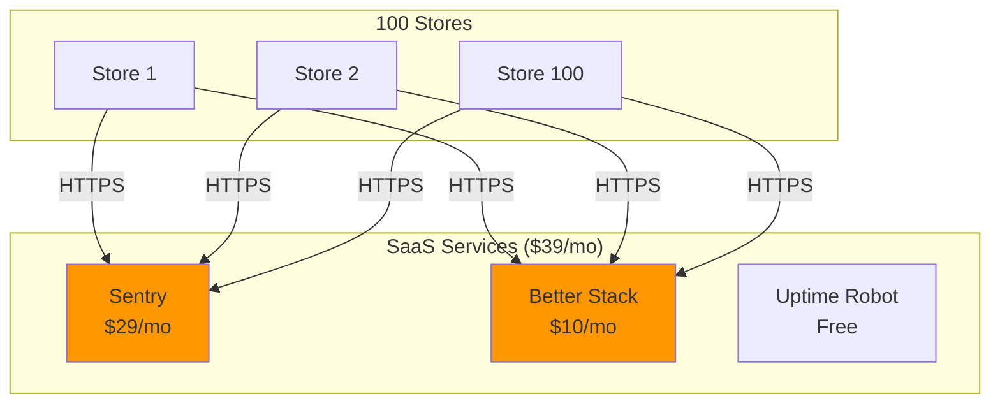
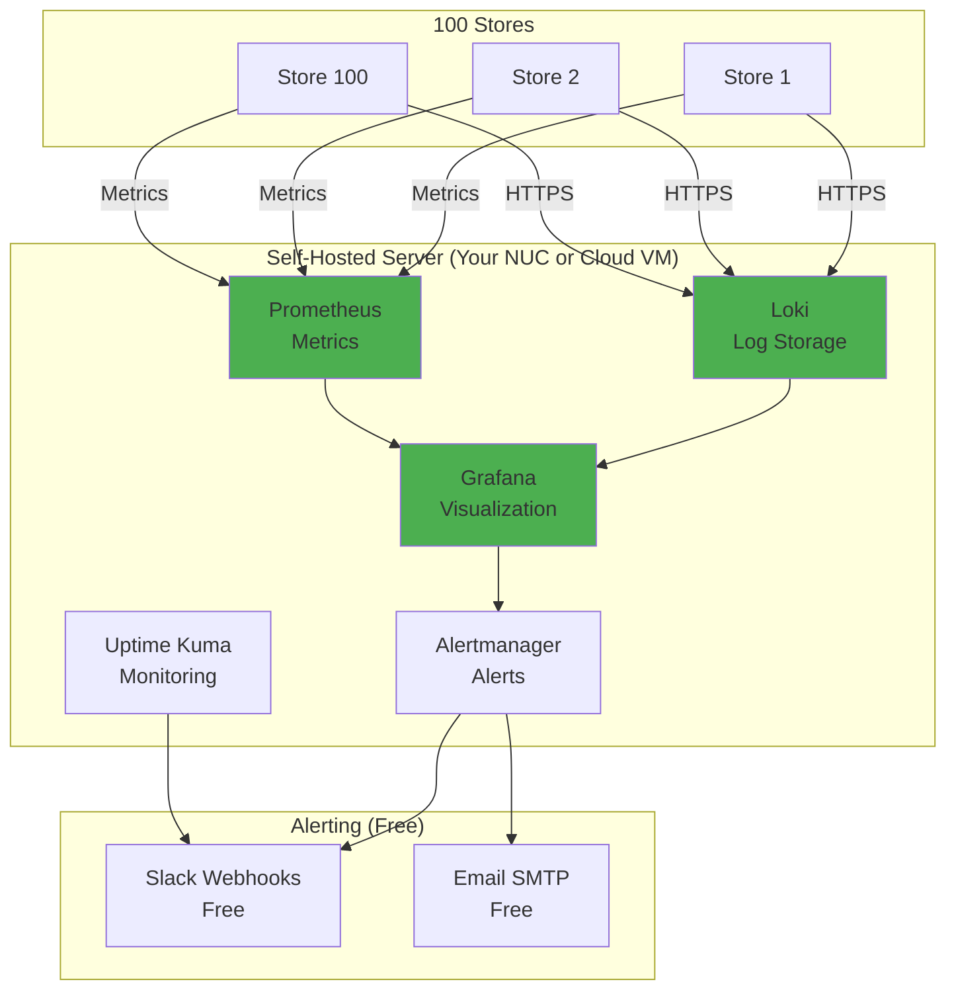

# Observability - Free Self-Hosted Alternative

**Cost:** $0/month (vs. $39/month for SaaS)  
**Approach:** Self-hosted open-source stack  
**Trade-off:** More setup time, requires server maintenance  
**Recommendation:** Start with free stack, upgrade to SaaS later if needed

---

## Executive Summary

You can absolutely implement a **production-grade observability stack for $0/month** using open-source tools. The trade-off is:

- **SaaS (Sentry + Better Stack):** $39/month, 14 hours setup, zero maintenance
- **Self-Hosted (Free):** $0/month, 24 hours setup, ongoing maintenance

**Recommendation:** Start with free stack, prove ROI, then decide if SaaS is worth it.

---

## Free Observability Stack

### Option 1: ELK Stack (Recommended)

```
┌─────────────────────────────────────────────────────────────┐
│                    FREE OBSERVABILITY STACK                 │
├─────────────────────────────────────────────────────────────┤
│                                                             │
│  Component          Tool              Cost    Alternative   │
│  ─────────────────  ────────────────  ──────  ───────────   │
│  Log Aggregation    Elasticsearch     FREE    Loki          │
│  Log Shipping       Logstash/Fluentd  FREE    Promtail      │
│  Visualization      Kibana            FREE    Grafana       │
│  Error Tracking     Custom + Kibana   FREE    Sentry OSS    │
│  Metrics            Prometheus        FREE    -             │
│  Alerting           Alertmanager      FREE    Grafana       │
│  Uptime Monitoring  Uptime Kuma       FREE    -             │
│                                                             │
│  TOTAL COST:        $0/month                                │
│                                                             │
└─────────────────────────────────────────────────────────────┘
```

### Option 2: Grafana Stack (Lighter Weight)

```
┌─────────────────────────────────────────────────────────────┐
│                  GRAFANA LOKI STACK (LIGHTER)               │
├─────────────────────────────────────────────────────────────┤
│                                                             │
│  Component          Tool              Cost    Why           │
│  ─────────────────  ────────────────  ──────  ──────────    │
│  Log Aggregation    Loki              FREE    Lightweight   │
│  Log Shipping       Promtail          FREE    Simple        │
│  Visualization      Grafana           FREE    Beautiful UI  │
│  Metrics            Prometheus        FREE    Industry std  │
│  Alerting           Grafana Alerts    FREE    Built-in      │
│  Uptime Monitoring  Uptime Kuma       FREE    Self-hosted   │
│                                                             │
│  TOTAL COST:        $0/month                                │
│  SETUP TIME:        20 hours (vs. 14 for SaaS)             │
│                                                             │
└─────────────────────────────────────────────────────────────┘
```

---

## Architecture Comparison

### Current SaaS Recommendation



### Free Self-Hosted Alternative



---

## Implementation: Free Stack

### Step 1: Set Up Logging Infrastructure (8 hours)

#### A. Install Grafana Loki Stack

**On your central server (NUC or cloud VM):**

```bash
# Create docker-compose.yml for observability stack
cd ~/observability
```

```yaml
# docker-compose.yml
version: '3.8'

services:
  # Loki - Log aggregation
  loki:
    image: grafana/loki:latest
    ports:
      - "3100:3100"
    volumes:
      - ./loki-config.yml:/etc/loki/local-config.yaml
      - loki-data:/loki
    command: -config.file=/etc/loki/local-config.yaml
    restart: unless-stopped

  # Grafana - Visualization
  grafana:
    image: grafana/grafana:latest
    ports:
      - "3001:3000"  # Avoid conflict with your backend on 3000
    volumes:
      - grafana-data:/var/lib/grafana
      - ./grafana-provisioning:/etc/grafana/provisioning
    environment:
      - GF_SECURITY_ADMIN_PASSWORD=admin123
      - GF_USERS_ALLOW_SIGN_UP=false
    restart: unless-stopped

  # Prometheus - Metrics
  prometheus:
    image: prom/prometheus:latest
    ports:
      - "9090:9090"
    volumes:
      - ./prometheus.yml:/etc/prometheus/prometheus.yml
      - prometheus-data:/prometheus
    command:
      - '--config.file=/etc/prometheus/prometheus.yml'
      - '--storage.tsdb.path=/prometheus'
    restart: unless-stopped

  # Alertmanager - Alerting
  alertmanager:
    image: prom/alertmanager:latest
    ports:
      - "9093:9093"
    volumes:
      - ./alertmanager.yml:/etc/alertmanager/alertmanager.yml
    command:
      - '--config.file=/etc/alertmanager/alertmanager.yml'
    restart: unless-stopped

  # Uptime Kuma - Uptime monitoring
  uptime-kuma:
    image: louislam/uptime-kuma:latest
    ports:
      - "3002:3001"
    volumes:
      - uptime-kuma-data:/app/data
    restart: unless-stopped

volumes:
  loki-data:
  grafana-data:
  prometheus-data:
  uptime-kuma-data:
```

#### B. Configure Loki

```yaml
# loki-config.yml
auth_enabled: false

server:
  http_listen_port: 3100

ingester:
  lifecycler:
    address: 127.0.0.1
    ring:
      kvstore:
        store: inmemory
      replication_factor: 1
  chunk_idle_period: 5m
  chunk_retain_period: 30s

schema_config:
  configs:
    - from: 2020-10-24
      store: boltdb-shipper
      object_store: filesystem
      schema: v11
      index:
        prefix: index_
        period: 24h

storage_config:
  boltdb_shipper:
    active_index_directory: /loki/boltdb-shipper-active
    cache_location: /loki/boltdb-shipper-cache
    shared_store: filesystem
  filesystem:
    directory: /loki/chunks

limits_config:
  enforce_metric_name: false
  reject_old_samples: true
  reject_old_samples_max_age: 168h
  retention_period: 720h  # 30 days

chunk_store_config:
  max_look_back_period: 720h

table_manager:
  retention_deletes_enabled: true
  retention_period: 720h
```

#### C. Configure Prometheus

```yaml
# prometheus.yml
global:
  scrape_interval: 15s
  evaluation_interval: 15s

alerting:
  alertmanagers:
    - static_configs:
        - targets:
            - alertmanager:9093

rule_files:
  - "alerts.yml"

scrape_configs:
  # Scrape Prometheus itself
  - job_name: 'prometheus'
    static_configs:
      - targets: ['localhost:9090']

  # Scrape your backend APIs (add all 100 stores)
  - job_name: 'pos-backend'
    static_configs:
      - targets:
          - 'store-1-nuc:3000'
          - 'store-2-nuc:3000'
          # ... add all 100 stores
        labels:
          service: 'backend'

  # Scrape Node Exporter (system metrics)
  - job_name: 'node'
    static_configs:
      - targets:
          - 'store-1-nuc:9100'
          - 'store-2-nuc:9100'
          # ... add all 100 stores
```

#### D. Configure Alertmanager

```yaml
# alertmanager.yml
global:
  slack_api_url: 'https://hooks.slack.com/services/YOUR/SLACK/WEBHOOK'

route:
  group_by: ['alertname', 'cluster', 'service']
  group_wait: 10s
  group_interval: 10s
  repeat_interval: 12h
  receiver: 'slack-notifications'
  routes:
    - match:
        severity: critical
      receiver: 'slack-critical'

receivers:
  - name: 'slack-notifications'
    slack_configs:
      - channel: '#pos-alerts'
        title: '{{ .GroupLabels.alertname }}'
        text: '{{ range .Alerts }}{{ .Annotations.description }}{{ end }}'

  - name: 'slack-critical'
    slack_configs:
      - channel: '#pos-alerts'
        title: '🚨 CRITICAL: {{ .GroupLabels.alertname }}'
        text: '{{ range .Alerts }}{{ .Annotations.description }}{{ end }}'
        send_resolved: true
```

#### E. Start the Stack

```bash
# Start all services
docker-compose up -d

# Check status
docker-compose ps

# View logs
docker-compose logs -f grafana
```

**Access:**
- Grafana: http://your-server:3001 (admin/admin123)
- Prometheus: http://your-server:9090
- Loki: http://your-server:3100
- Uptime Kuma: http://your-server:3002

---

### Step 2: Backend Integration (6 hours)

#### A. Install Winston + Loki Transport

```bash
cd backend
npm install winston winston-loki prom-client
```

#### B. Create Logger Service with Loki

```typescript
// backend/src/common/logger/winston-logger.service.ts
import winston from 'winston';
import LokiTransport from 'winston-loki';
import { Injectable } from '@nestjs/common';
import { ConfigService } from '@nestjs/config';

@Injectable()
export class WinstonLoggerService {
  private logger: winston.Logger;

  constructor(private config: ConfigService) {
    const lokiUrl = this.config.get('LOKI_URL') || 'http://localhost:3100';
    const serviceName = this.config.get('SERVICE_NAME') || 'pos-backend';
    const locationId = this.config.get('LOCATION_ID') || 'unknown';

    this.logger = winston.createLogger({
      level: 'info',
      format: winston.format.combine(
        winston.format.timestamp(),
        winston.format.errors({ stack: true }),
        winston.format.json()
      ),
      defaultMeta: {
        service: serviceName,
        locationId: locationId,
        environment: process.env.NODE_ENV,
        version: process.env.npm_package_version,
      },
      transports: [
        // Console output
        new winston.transports.Console({
          format: winston.format.combine(
            winston.format.colorize(),
            winston.format.simple()
          ),
        }),
        // Send to Loki
        new LokiTransport({
          host: lokiUrl,
          labels: {
            service: serviceName,
            location: locationId,
            environment: process.env.NODE_ENV || 'development',
          },
          json: true,
          format: winston.format.json(),
          replaceTimestamp: true,
          onConnectionError: (err) => {
            console.error('Loki connection error:', err);
          },
        }),
      ],
    });
  }

  log(message: string, context?: any) {
    this.logger.info(message, context);
  }

  error(message: string, error?: Error, context?: any) {
    this.logger.error(message, {
      error: error?.message,
      stack: error?.stack,
      ...context,
    });
  }

  warn(message: string, context?: any) {
    this.logger.warn(message, context);
  }

  debug(message: string, context?: any) {
    this.logger.debug(message, context);
  }
}
```

#### C. Update Environment Variables

```bash
# backend/.env
LOKI_URL=http://your-central-server:3100
SERVICE_NAME=pos-backend
LOCATION_ID=STORE_001  # Different for each store
```

#### D. Use in Your Code

```typescript
// backend/src/orders/order-orchestrator.ts
import { WinstonLoggerService } from '../common/logger/winston-logger.service';

@Injectable()
export class OrderOrchestrator {
  constructor(
    private logger: WinstonLoggerService,
  ) {}

  async processOrder(dto: CreateOrderDto) {
    try {
      this.logger.log('Processing order', {
        locationId: dto.locationId,
        terminalId: dto.terminalId,
        amount: dto.total,
        items: dto.items.length,
      });

      // ... process order ...

    } catch (error) {
      this.logger.error('Order processing failed', error, {
        locationId: dto.locationId,
        terminalId: dto.terminalId,
        orderId: context.order?.id,
        amount: dto.total,
        paymentMethod: dto.paymentMethod,
        userId: dto.employeeId,
        step: 'payment_authorization',
      });
      throw error;
    }
  }
}
```

---

### Step 3: Frontend Integration (4 hours)

#### A. Install Loki Logger for Browser

```bash
cd frontend
npm install loglevel loglevel-plugin-remote
```

#### B. Create Frontend Logger

```typescript
// frontend/src/infrastructure/services/LokiLogger.ts
import log from 'loglevel';
import remote from 'loglevel-plugin-remote';

const lokiUrl = import.meta.env.VITE_LOKI_URL || 'http://localhost:3100';
const locationId = import.meta.env.VITE_LOCATION_ID || 'unknown';

// Configure remote logging to Loki
remote.apply(log, {
  format: (logMessage) => {
    return {
      streams: [
        {
          stream: {
            service: 'pos-frontend',
            location: locationId,
            environment: import.meta.env.VITE_ENVIRONMENT || 'development',
            level: logMessage.level.label,
          },
          values: [
            [
              String(Date.now() * 1000000), // Nanosecond timestamp
              JSON.stringify({
                message: logMessage.message,
                level: logMessage.level.label,
                timestamp: new Date().toISOString(),
                ...logMessage.context,
              }),
            ],
          ],
        },
      ],
    };
  },
  url: `${lokiUrl}/loki/api/v1/push`,
  method: 'POST',
  headers: {
    'Content-Type': 'application/json',
  },
});

log.setLevel('info');

export class LokiLogger {
  static info(message: string, context?: any) {
    console.info(message, context);
    log.info(message, context);
  }

  static error(message: string, error?: Error, context?: any) {
    console.error(message, error, context);
    log.error(message, {
      error: error?.message,
      stack: error?.stack,
      ...context,
    });
  }

  static warn(message: string, context?: any) {
    console.warn(message, context);
    log.warn(message, context);
  }

  static debug(message: string, context?: any) {
    console.debug(message, context);
    log.debug(message, context);
  }
}
```

#### C. Update LoggerService

```typescript
// frontend/src/infrastructure/services/LoggerService.ts
import { LokiLogger } from './LokiLogger';

export class LoggerService {
  // ... existing code ...

  error(message: string, error?: Error, context?: LogContext) {
    // Console log
    console.error(`[ERROR] ${message}`, error, context);
    
    // Send to Loki
    LokiLogger.error(message, error, {
      locationId: context?.locationId || 'unknown',
      terminalId: context?.terminalId || 'unknown',
      userId: context?.userId || 'unknown',
      ...context,
    });
  }
}
```

---

### Step 4: Set Up Grafana Dashboards (4 hours)

#### A. Add Loki Data Source

1. Open Grafana: http://your-server:3001
2. Login: admin/admin123
3. Configuration → Data Sources → Add data source
4. Select "Loki"
5. URL: http://loki:3100
6. Save & Test

#### B. Create Log Dashboard

```json
// Save as grafana-provisioning/dashboards/logs-dashboard.json
{
  "dashboard": {
    "title": "POS System Logs",
    "panels": [
      {
        "title": "Error Logs",
        "targets": [
          {
            "expr": "{service=\"pos-backend\"} |= \"ERROR\"",
            "refId": "A"
          }
        ],
        "type": "logs"
      },
      {
        "title": "Logs by Store",
        "targets": [
          {
            "expr": "sum by (location) (count_over_time({service=\"pos-backend\"}[5m]))",
            "refId": "A"
          }
        ],
        "type": "graph"
      },
      {
        "title": "Payment Errors",
        "targets": [
          {
            "expr": "{service=\"pos-backend\"} |= \"payment\" |= \"ERROR\"",
            "refId": "A"
          }
        ],
        "type": "logs"
      }
    ]
  }
}
```

#### C. Create Alerts

1. In Grafana, go to Alerting → Alert rules
2. Create alert: "High Error Rate"
   - Query: `count_over_time({service="pos-backend"} |= "ERROR" [5m]) > 10`
   - Condition: Alert if > 10 errors in 5 minutes
   - Send to: Slack

---

### Step 5: Set Up Uptime Monitoring (2 hours)

1. Open Uptime Kuma: http://your-server:3002
2. Create account
3. Add monitors for each store:
   - Monitor Type: HTTP(s)
   - URL: https://store-1-nuc:3000/health
   - Interval: 5 minutes
   - Notification: Slack webhook

---

## Cost Comparison

### SaaS Stack (Original Recommendation)

```
┌─────────────────────────────────────────────────────────────┐
│                       SAAS COSTS                            │
├─────────────────────────────────────────────────────────────┤
│                                                             │
│  Sentry (error tracking)          $29/month                 │
│  Better Stack (log aggregation)   $10/month                 │
│  Uptime Robot (monitoring)        $0/month                  │
│                                                             │
│  TOTAL:                           $39/month ($468/year)     │
│                                                             │
│  Setup Time:                      14 hours                  │
│  Maintenance:                     0 hours/month             │
│                                                             │
└─────────────────────────────────────────────────────────────┘
```

### Self-Hosted Stack (Free Alternative)

```
┌─────────────────────────────────────────────────────────────┐
│                   SELF-HOSTED COSTS                         │
├─────────────────────────────────────────────────────────────┤
│                                                             │
│  Loki (log aggregation)           $0/month                  │
│  Grafana (visualization)          $0/month                  │
│  Prometheus (metrics)             $0/month                  │
│  Alertmanager (alerting)          $0/month                  │
│  Uptime Kuma (monitoring)         $0/month                  │
│                                                             │
│  Server Costs:                                              │
│    - Use existing NUC:            $0/month                  │
│    - Or cheap cloud VM:           $5-10/month               │
│                                                             │
│  TOTAL:                           $0-10/month ($0-120/year) │
│                                                             │
│  Setup Time:                      24 hours                  │
│  Maintenance:                     2-4 hours/month           │
│                                                             │
└─────────────────────────────────────────────────────────────┘
```

---

## Pros & Cons

### Self-Hosted (Free) Stack

**Pros:**
- ✅ **$0/month** (or $5-10 for cloud VM)
- ✅ Complete control over data
- ✅ No vendor lock-in
- ✅ Unlimited logs/errors
- ✅ Can customize everything
- ✅ Industry-standard tools (Grafana, Prometheus, Loki)

**Cons:**
- ❌ More setup time (24 hours vs. 14 hours)
- ❌ Requires server maintenance (2-4 hours/month)
- ❌ Need to manage backups
- ❌ Need to manage updates
- ❌ No built-in session replay (would need to add separately)
- ❌ Slightly more complex

### SaaS Stack

**Pros:**
- ✅ Faster setup (14 hours)
- ✅ Zero maintenance
- ✅ Professional support
- ✅ Built-in session replay (Sentry)
- ✅ Automatic updates
- ✅ Better UI/UX

**Cons:**
- ❌ $39/month ($468/year)
- ❌ Data stored with third party
- ❌ Usage limits (may need to upgrade)
- ❌ Vendor lock-in

---

## Recommendation Strategy

### Phase 1: Start with Free Stack (Month 1-3)

**Why:**
- Prove the value of observability
- Zero financial commitment
- Learn what you actually need
- Build internal expertise

**Implementation:**
1. Set up self-hosted stack (24 hours)
2. Use for 3 months
3. Measure ROI and value
4. Identify pain points

### Phase 2: Evaluate & Decide (Month 4)

**Questions to ask:**
- Is maintenance burden acceptable? (2-4 hours/month)
- Do we need session replay?
- Is the free stack meeting our needs?
- Would $39/month be worth the convenience?

**Decision Matrix:**

| Scenario | Recommendation |
|----------|----------------|
| Free stack works great, team happy with maintenance | **Keep free stack** |
| Maintenance is burden, want less work | **Upgrade to SaaS** |
| Need session replay feature | **Upgrade to Sentry** |
| Need better UI/UX | **Upgrade to SaaS** |
| Budget is tight | **Keep free stack** |

### Phase 3: Hybrid Approach (Optional)

You can also mix and match:

```
┌─────────────────────────────────────────────────────────────┐
│                     HYBRID APPROACH                         │
├─────────────────────────────────────────────────────────────┤
│                                                             │
│  Logs:           Self-hosted Loki/Grafana    $0/month      │
│  Error Tracking: Sentry (for session replay) $29/month     │
│  Monitoring:     Self-hosted Uptime Kuma     $0/month      │
│                                                             │
│  TOTAL:          $29/month                                  │
│                                                             │
│  Best of both worlds: Free logs, paid error tracking        │
│                                                             │
└─────────────────────────────────────────────────────────────┘
```

---

## Updated Implementation Checklist

### Priority 1: Free Stack Setup (24 hours)

- [ ] **Set up central observability server** (4 hours)
  - [ ] Install Docker on server/NUC
  - [ ] Create docker-compose.yml
  - [ ] Configure Loki, Grafana, Prometheus
  - [ ] Start all services
  - [ ] Verify access to dashboards

- [ ] **Backend integration** (6 hours)
  - [ ] Install Winston + Loki transport
  - [ ] Create WinstonLoggerService
  - [ ] Add error context to all errors
  - [ ] Configure environment variables
  - [ ] Test log shipping to Loki

- [ ] **Frontend integration** (4 hours)
  - [ ] Install loglevel + remote plugin
  - [ ] Create LokiLogger service
  - [ ] Update LoggerService
  - [ ] Configure environment variables
  - [ ] Test log shipping to Loki

- [ ] **Grafana dashboards** (4 hours)
  - [ ] Add Loki data source
  - [ ] Create log dashboard
  - [ ] Create error dashboard
  - [ ] Create per-store dashboard
  - [ ] Set up alerts

- [ ] **Uptime monitoring** (2 hours)
  - [ ] Set up Uptime Kuma
  - [ ] Add monitors for all stores
  - [ ] Configure Slack notifications
  - [ ] Test alerts

- [ ] **Metrics collection** (4 hours)
  - [ ] Install Node Exporter on each NUC
  - [ ] Configure Prometheus scraping
  - [ ] Create metrics dashboard
  - [ ] Set up metric alerts

---

## Example Queries in Grafana

### Search Logs by Store

```logql
{service="pos-backend", location="STORE_047"}
```

### Find Payment Errors

```logql
{service="pos-backend"} |= "payment" |= "ERROR"
```

### Errors in Last Hour

```logql
{service="pos-backend"} |= "ERROR" | json | line_format "{{.timestamp}} {{.message}}"
```

### Count Errors by Store

```logql
sum by (location) (count_over_time({service="pos-backend"} |= "ERROR" [1h]))
```

### Checkout Errors

```logql
{service="pos-backend"} |= "checkout" |= "ERROR" | json | line_format "Store: {{.locationId}}, Terminal: {{.terminalId}}, Error: {{.message}}"
```

---

## Migration Path (If Needed Later)

If you start with free stack and want to migrate to SaaS later:

```
┌─────────────────────────────────────────────────────────────┐
│                    MIGRATION STRATEGY                       │
├─────────────────────────────────────────────────────────────┤
│                                                             │
│  Step 1: Keep free stack running                            │
│  Step 2: Add Sentry SDK alongside Winston                   │
│  Step 3: Run both for 1 week (compare)                      │
│  Step 4: Decide which to keep                               │
│  Step 5: Remove unused stack                                │
│                                                             │
│  Migration time: 4 hours                                    │
│  Risk: Low (both run in parallel)                           │
│                                                             │
└─────────────────────────────────────────────────────────────┘
```

---

## Final Recommendation

**START WITH FREE SELF-HOSTED STACK**

**Why:**
1. **Zero cost** - Prove ROI before spending money
2. **Full control** - Own your data and infrastructure
3. **Learn** - Understand what you actually need
4. **Flexibility** - Can upgrade to SaaS anytime

**Timeline:**
- Month 1-3: Use free stack, measure value
- Month 4: Evaluate if SaaS is worth $39/month
- Month 5+: Keep free or upgrade based on needs

**Bottom Line:**
The free stack is **production-ready** and used by thousands of companies. Start here, prove the value, then decide if convenience is worth $39/month.

---

## Updated Cost-Benefit Analysis

### Original Problem (No Observability)

- Monthly cost: $10,000-50,000
- Annual cost: $120,000-600,000

### Solution A: Free Self-Hosted Stack

- Monthly cost: $0-10 (server only)
- Annual cost: $0-120
- **Savings: $119,880-599,880/year**
- **ROI: INFINITE (or 119,900% if using $10/mo VM)**

### Solution B: SaaS Stack

- Monthly cost: $39
- Annual cost: $468
- **Savings: $119,532-599,532/year**
- **ROI: 25,500%**

**Both solutions have exceptional ROI. Start with free, upgrade if needed.**

---

**Document:** OBSERVABILITY_FREE_ALTERNATIVE.md  
**Date:** January 3, 2026  
**Cost:** $0/month  
**Setup Time:** 24 hours  
**Status:** Ready for implementation

