# Requirements Review - Visual Diagrams
## REQ-001, REQ-002, REQ-003

---

## 1. Implementation Dependency Flow

```mermaid
graph TB
    START[Start Implementation] --> REQ001[REQ-001: Audit Log Immutability<br/>4 hours<br/>🟡 MEDIUM RISK]
    
    REQ001 --> PARALLEL{Parallel Development}
    
    PARALLEL --> REQ003[REQ-003: Manager Override<br/>3-4 days<br/>🔴 HIGH RISK]
    PARALLEL --> REQ002[REQ-002: Receipt Printing<br/>2-3 days<br/>🔴 HIGH RISK]
    
    REQ003 --> INTEGRATION[Integration Testing<br/>1 day]
    REQ002 --> INTEGRATION
    
    INTEGRATION --> DEPLOY[Production Deployment]
    
    style REQ001 fill:#fff3cd,stroke:#856404
    style REQ002 fill:#f8d7da,stroke:#721c24
    style REQ003 fill:#f8d7da,stroke:#721c24
    style INTEGRATION fill:#d4edda,stroke:#155724
    style DEPLOY fill:#d1ecf1,stroke:#0c5460
```

---

## 2. Risk Heat Map

---

## 3. Implementation Timeline

---

## 4. REQ-001: Audit Log Immutability Architecture

```mermaid
graph LR
    subgraph "Application Layer"
        APP[NestJS Application]
        PRISMA[Prisma Client]
    end
    
    subgraph "Database Layer"
        AUDIT[(AuditLog Table)]
        TRIGGER{PostgreSQL Trigger}
    end
    
    APP -->|Create Audit Log| PRISMA
    PRISMA -->|INSERT| AUDIT
    
    APP -.->|Attempt UPDATE| PRISMA
    PRISMA -.->|UPDATE| TRIGGER
    TRIGGER -.->|❌ BLOCK| PRISMA
    TRIGGER -.->|Raise Exception| APP
    
    APP -.->|Attempt DELETE| PRISMA
    PRISMA -.->|DELETE| TRIGGER
    TRIGGER -.->|❌ BLOCK| PRISMA
    
    style AUDIT fill:#d4edda,stroke:#155724
    style TRIGGER fill:#f8d7da,stroke:#721c24
    style APP fill:#d1ecf1,stroke:#0c5460
```

---

## 5. REQ-002: Receipt Printing Flow

---

## 6. REQ-003: Manager Override Flow

```mermaid
sequenceDiagram
    participant C as Cashier
    participant POS as POS Frontend
    participant API as Backend API
    participant PIN as PIN Auth Service
    participant OVR as Override Service
    participant AUDIT as Audit Service
    participant DB as Database
    
    C->>POS: Click "Override Price"
    POS->>C: Show Override Modal
    C->>POS: Enter Manager PIN
    
    POS->>API: POST /price-overrides
    API->>PIN: Authenticate PIN
    PIN->>DB: Find User by PIN
    DB-->>PIN: User Data
    PIN->>PIN: Validate Role (MANAGER/ADMIN)
    
    alt Valid Manager
        PIN-->>API: ✅ Manager Authenticated
        API->>OVR: Process Override
        OVR->>DB: Update Transaction Item
        OVR->>DB: Update Transaction Totals
        OVR->>DB: Create PriceOverride Record
        OVR->>AUDIT: Log Override (Immutable)
        AUDIT->>DB: Create AuditLog Entry
        OVR-->>API: Override Success
        API-->>POS: New Price
        POS->>C: Show Updated Price
    else Invalid PIN or Not Manager
        PIN-->>API: ❌ Authentication Failed
        API-->>POS: Error
        POS->>C: Show Error Message
    end
```

---

## 7. Data Model Relationships

---

## 8. Security Architecture (REQ-003)

```mermaid
graph TB
    subgraph "Security Layers"
        UI[Frontend UI]
        API[API Gateway]
        AUTH[PIN Authentication]
        RBAC[Role Validation]
        AUDIT[Audit Logging]
        MONITOR[Monitoring & Alerts]
    end
    
    UI -->|1. Manager PIN| API
    API -->|2. Authenticate| AUTH
    AUTH -->|3. Validate Role| RBAC
    
    RBAC -->|✅ MANAGER/ADMIN| PROCESS[Process Override]
    RBAC -->|❌ CASHIER| DENY[Deny Access]
    
    PROCESS -->|4. Log Action| AUDIT
    AUDIT -->|5. Immutable Record| DB[(Database)]
    
    AUDIT -->|6. Check Patterns| MONITOR
    MONITOR -->|Large Discount Alert| ALERT[Alert Manager]
    MONITOR -->|Unusual Pattern| ALERT
    
    style AUTH fill:#fff3cd,stroke:#856404
    style RBAC fill:#fff3cd,stroke:#856404
    style AUDIT fill:#d4edda,stroke:#155724
    style MONITOR fill:#d1ecf1,stroke:#0c5460
    style DENY fill:#f8d7da,stroke:#721c24
```

---

## 9. Risk Mitigation Strategy

---

## 10. Testing Strategy

---

## 11. Monitoring Dashboard

---

## 12. Deployment Pipeline

```mermaid
graph LR
    DEV[Development] --> TEST[Unit Tests]
    TEST --> LINT[Linting]
    LINT --> BUILD[Build]
    BUILD --> STAGE[Staging Deploy]
    
    STAGE --> INT[Integration Tests]
    INT --> SEC[Security Scan]
    SEC --> PERF[Performance Tests]
    
    PERF --> APPROVE{Manual Approval}
    
    APPROVE -->|✅ Approved| PROD[Production Deploy]
    APPROVE -->|❌ Rejected| DEV
    
    PROD --> SMOKE[Smoke Tests]
    SMOKE --> MONITOR[Monitoring]
    
    MONITOR -->|Issues Detected| ROLLBACK[Rollback]
    ROLLBACK --> DEV
    
    style PROD fill:#d4edda,stroke:#155724
    style ROLLBACK fill:#f8d7da,stroke:#721c24
    style APPROVE fill:#fff3cd,stroke:#856404
```

---

## 13. Success Metrics Dashboard

```mermaid
graph TB
    subgraph "Implementation Success"
        S1[✅ All Tests Passing]
        S2[✅ Zero Critical Bugs]
        S3[✅ Documentation Complete]
    end
    
    subgraph "Operational Success"
        S4[📊 Receipt Print Rate > 99%]
        S5[📊 Override Approval Time < 30s]
        S6[📊 Zero Audit Log Modifications]
    end
    
    subgraph "Business Success"
        S7[💰 Reduced Pricing Errors]
        S8[💰 Improved Customer Satisfaction]
        S9[💰 Compliance Maintained]
    end
    
    S1 --> SUCCESS[✅ Requirements Complete]
    S2 --> SUCCESS
    S3 --> SUCCESS
    S4 --> SUCCESS
    S5 --> SUCCESS
    S6 --> SUCCESS
    S7 --> SUCCESS
    S8 --> SUCCESS
    S9 --> SUCCESS
    
    style SUCCESS fill:#d4edda,stroke:#155724,stroke-width:3px
```

---

**Diagram Status:** ✅ COMPLETE  
**Total Diagrams:** 13  
**Date:** January 3, 2026

---

*These visual diagrams complement the formal review document and provide quick reference for architecture, flows, risks, and implementation strategy.*

