# UI & Configuration Guide

> **Visual guide** for configuring UI elements, business rules, pricing, taxes, and system behavior with Mermaid diagrams.

---

## Table of Contents

1. [UI Component Configuration](#1-ui-component-configuration)
2. [Business Rules Configuration](#2-business-rules-configuration)
3. [Pricing & Tax Configuration](#3-pricing--tax-configuration)
4. [Product Configuration](#4-product-configuration)
5. [User & Role Configuration](#5-user--role-configuration)
6. [System Behavior Configuration](#6-system-behavior-configuration)

---

## 1. UI Component Configuration

### 1.1 Adding a New Button to POS

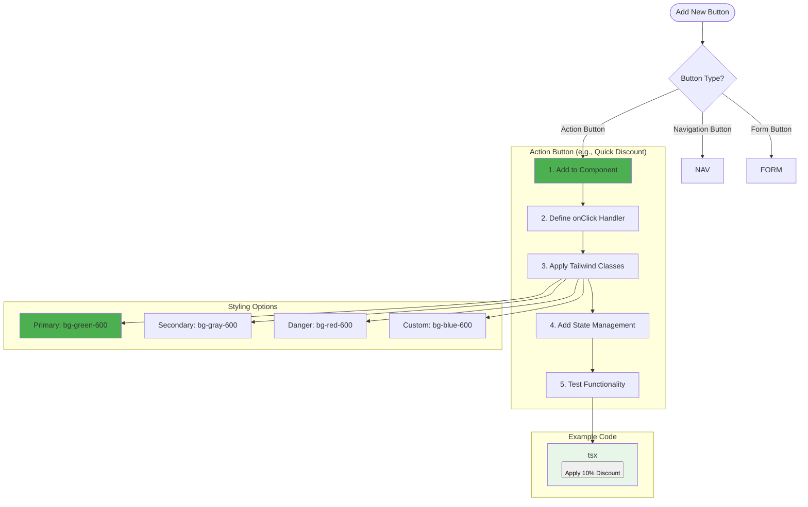
```mermaid
graph TB
    START([Add New Button]) --> DECIDE{Button Type?}
    
    DECIDE -->|Action Button| ACTION
    DECIDE -->|Navigation Button| NAV
    DECIDE -->|Form Button| FORM
    
    subgraph "Action Button (e.g., Quick Discount)"
        ACTION[1. Add to Component]
        ACTION --> ACTION_CODE[2. Define onClick Handler]
        ACTION_CODE --> ACTION_STYLE[3. Apply Tailwind Classes]
        ACTION_STYLE --> ACTION_STATE[4. Add State Management]
        ACTION_STATE --> ACTION_TEST[5. Test Functionality]
    end
    
    subgraph "Styling Options"
        ACTION_STYLE --> PRIMARY[Primary: bg-green-600]
        ACTION_STYLE --> SECONDARY[Secondary: bg-gray-600]
        ACTION_STYLE --> DANGER[Danger: bg-red-600]
        ACTION_STYLE --> CUSTOM[Custom: bg-blue-600]
    end
    
    subgraph "Example Code"
        ACTION_TEST --> CODE["`tsx
        <button
          onClick={handleDiscount}
          className='bg-green-600 hover:bg-green-700
                     text-white px-4 py-2 rounded-lg
                     transition-colors duration-200'
        >
          Apply 10% Discount
        </button>
        `"]
    end
    
    style ACTION fill:#4CAF50
    style PRIMARY fill:#4CAF50
    style CODE fill:#E8F5E9
```

### 1.2 Customizing Cart Display

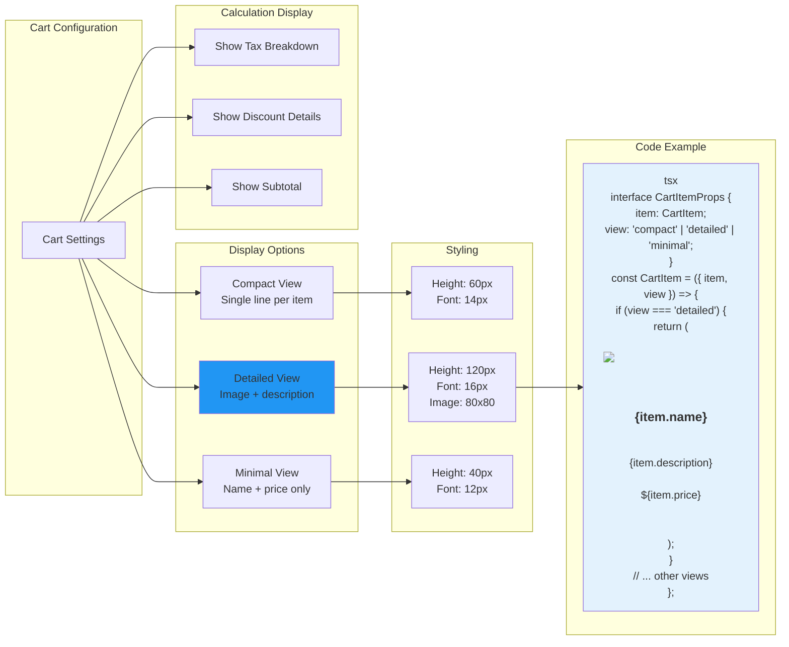
```mermaid
graph LR
    subgraph "Cart Configuration"
        CONFIG[Cart Settings]
    end
    
    subgraph "Display Options"
        CONFIG --> COMPACT[Compact View<br/>Single line per item]
        CONFIG --> DETAILED[Detailed View<br/>Image + description]
        CONFIG --> MINIMAL[Minimal View<br/>Name + price only]
    end
    
    subgraph "Calculation Display"
        CONFIG --> SHOW_TAX[Show Tax Breakdown]
        CONFIG --> SHOW_DISC[Show Discount Details]
        CONFIG --> SHOW_SUBTOTAL[Show Subtotal]
    end
    
    subgraph "Styling"
        COMPACT --> STYLE1[Height: 60px<br/>Font: 14px]
        DETAILED --> STYLE2[Height: 120px<br/>Font: 16px<br/>Image: 80x80]
        MINIMAL --> STYLE3[Height: 40px<br/>Font: 12px]
    end
    
    subgraph "Code Example"
        STYLE2 --> EXAMPLE["`tsx
        interface CartItemProps {
          item: CartItem;
          view: 'compact' | 'detailed' | 'minimal';
        }
        
        const CartItem = ({ item, view }) => {
          if (view === 'detailed') {
            return (
              <div className='flex gap-4 p-4'>
                <img src={item.image} className='w-20 h-20' />
                <div>
                  <h3>{item.name}</h3>
                  <p>{item.description}</p>
                  <span>${item.price}</span>
                </div>
              </div>
            );
          }
          // ... other views
        };
        `"]
    end
    
    style DETAILED fill:#2196F3
    style EXAMPLE fill:#E3F2FD
```

### 1.3 Checkout Button States

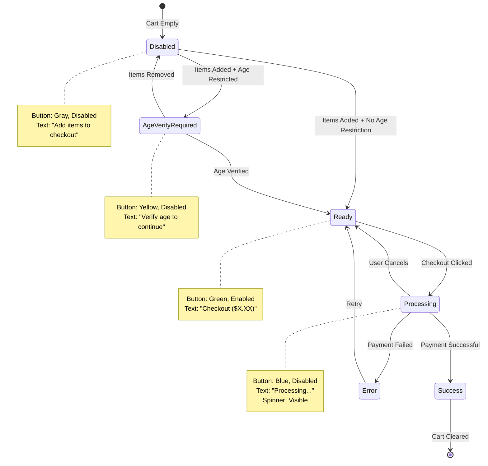
```mermaid
stateDiagram-v2
    [*] --> Disabled: Cart Empty
    
    Disabled --> AgeVerifyRequired: Items Added + Age Restricted
    Disabled --> Ready: Items Added + No Age Restriction
    
    AgeVerifyRequired --> Ready: Age Verified
    AgeVerifyRequired --> Disabled: Items Removed
    
    Ready --> Processing: Checkout Clicked
    Processing --> Success: Payment Successful
    Processing --> Error: Payment Failed
    Processing --> Ready: User Cancels
    
    Success --> [*]: Cart Cleared
    Error --> Ready: Retry
    
    note right of Disabled
        Button: Gray, Disabled
        Text: "Add items to checkout"
    end note
    
    note right of AgeVerifyRequired
        Button: Yellow, Disabled
        Text: "Verify age to continue"
    end note
    
    note right of Ready
        Button: Green, Enabled
        Text: "Checkout ($X.XX)"
    end note
    
    note right of Processing
        Button: Blue, Disabled
        Text: "Processing..."
        Spinner: Visible
    end note
```

### 1.4 Product Card Layout Configuration

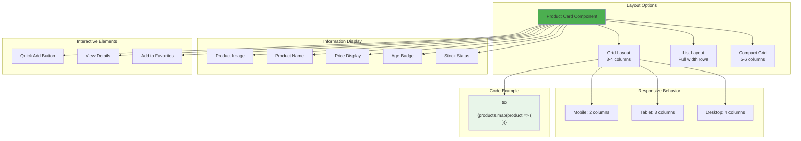
```mermaid
graph TB
    CARD[Product Card Component]
    
    subgraph "Layout Options"
        CARD --> GRID[Grid Layout<br/>3-4 columns]
        CARD --> LIST[List Layout<br/>Full width rows]
        CARD --> COMPACT[Compact Grid<br/>5-6 columns]
    end
    
    subgraph "Information Display"
        CARD --> IMG[Product Image]
        CARD --> NAME[Product Name]
        CARD --> PRICE[Price Display]
        CARD --> BADGE[Age Badge]
        CARD --> STOCK[Stock Status]
    end
    
    subgraph "Interactive Elements"
        CARD --> QUICK_ADD[Quick Add Button]
        CARD --> DETAILS[View Details]
        CARD --> FAVORITE[Add to Favorites]
    end
    
    subgraph "Responsive Behavior"
        GRID --> MOBILE_GRID[Mobile: 2 columns]
        GRID --> TABLET_GRID[Tablet: 3 columns]
        GRID --> DESKTOP_GRID[Desktop: 4 columns]
    end
    
    subgraph "Code Example"
        GRID --> GRID_CODE["`tsx
        <div className='grid grid-cols-2 md:grid-cols-3 lg:grid-cols-4 gap-4'>
          {products.map(product => (
            <ProductCard
              key={product.id}
              product={product}
              onAdd={handleAdd}
              layout='grid'
            />
          ))}
        </div>
        `"]
    end
    
    style CARD fill:#4CAF50
    style GRID_CODE fill:#E8F5E9
```

### 1.5 Theme Customization

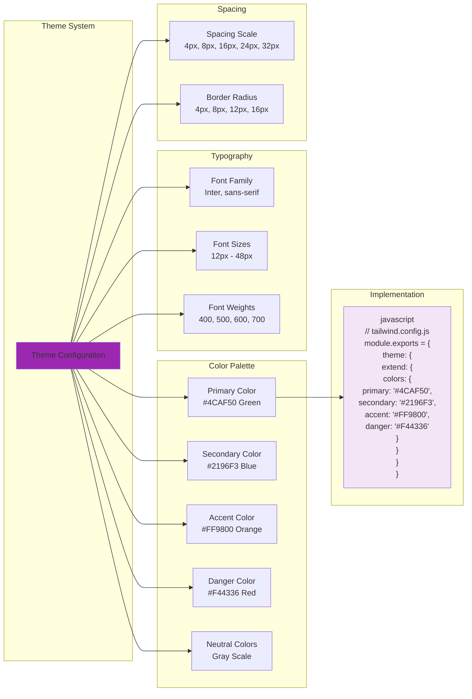
```mermaid
graph LR
    subgraph "Theme System"
        THEME[Theme Configuration]
    end
    
    subgraph "Color Palette"
        THEME --> PRIMARY[Primary Color<br/>#4CAF50 Green]
        THEME --> SECONDARY[Secondary Color<br/>#2196F3 Blue]
        THEME --> ACCENT[Accent Color<br/>#FF9800 Orange]
        THEME --> DANGER[Danger Color<br/>#F44336 Red]
        THEME --> NEUTRAL[Neutral Colors<br/>Gray Scale]
    end
    
    subgraph "Typography"
        THEME --> FONT_FAMILY[Font Family<br/>Inter, sans-serif]
        THEME --> FONT_SIZES[Font Sizes<br/>12px - 48px]
        THEME --> FONT_WEIGHTS[Font Weights<br/>400, 500, 600, 700]
    end
    
    subgraph "Spacing"
        THEME --> SPACING[Spacing Scale<br/>4px, 8px, 16px, 24px, 32px]
        THEME --> BORDER_RADIUS[Border Radius<br/>4px, 8px, 12px, 16px]
    end
    
    subgraph "Implementation"
        PRIMARY --> TAILWIND["`javascript
        // tailwind.config.js
        module.exports = {
          theme: {
            extend: {
              colors: {
                primary: '#4CAF50',
                secondary: '#2196F3',
                accent: '#FF9800',
                danger: '#F44336'
              }
            }
          }
        }
        `"]
    end
    
    style THEME fill:#9C27B0
    style TAILWIND fill:#F3E5F5
```

---

## 2. Business Rules Configuration

### 2.1 Age Verification Rules

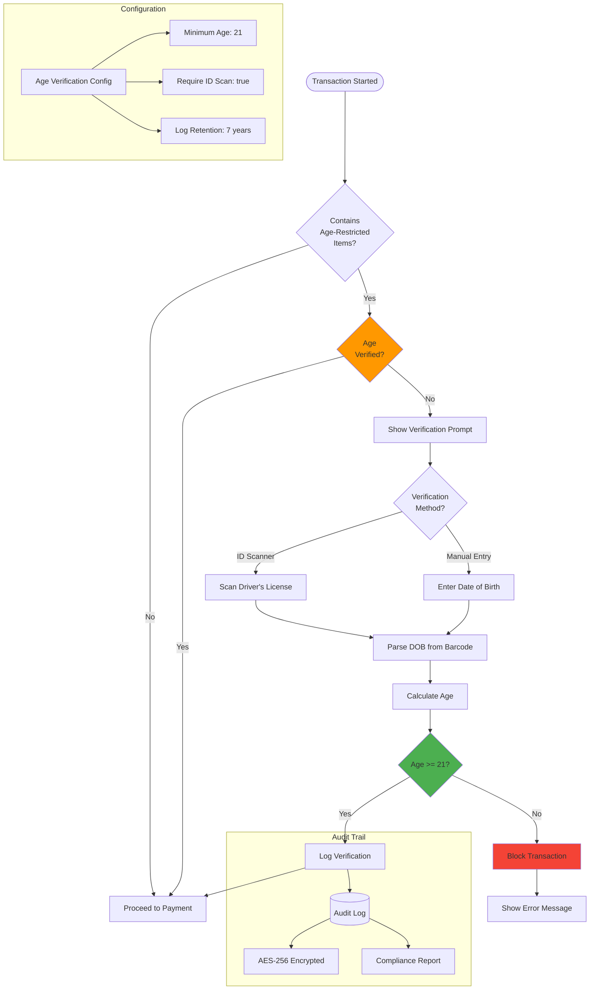
```mermaid
graph TB
    START([Transaction Started]) --> CHECK{Contains<br/>Age-Restricted<br/>Items?}
    
    CHECK -->|No| PROCEED[Proceed to Payment]
    CHECK -->|Yes| VERIFY{Age<br/>Verified?}
    
    VERIFY -->|Yes| PROCEED
    VERIFY -->|No| PROMPT[Show Verification Prompt]
    
    PROMPT --> METHOD{Verification<br/>Method?}
    
    METHOD -->|ID Scanner| SCAN[Scan Driver's License]
    METHOD -->|Manual Entry| MANUAL[Enter Date of Birth]
    
    SCAN --> PARSE[Parse DOB from Barcode]
    MANUAL --> PARSE
    
    PARSE --> CALC[Calculate Age]
    CALC --> AGE_CHECK{Age >= 21?}
    
    AGE_CHECK -->|Yes| LOG_SUCCESS[Log Verification]
    AGE_CHECK -->|No| REJECT[Block Transaction]
    
    LOG_SUCCESS --> PROCEED
    REJECT --> ERROR[Show Error Message]
    
    subgraph "Configuration"
        CONFIG[Age Verification Config]
        CONFIG --> MIN_AGE[Minimum Age: 21]
        CONFIG --> REQUIRE_SCAN[Require ID Scan: true]
        CONFIG --> LOG_RETENTION[Log Retention: 7 years]
    end
    
    subgraph "Audit Trail"
        LOG_SUCCESS --> AUDIT[(Audit Log)]
        AUDIT --> ENCRYPTED[AES-256 Encrypted]
        AUDIT --> COMPLIANCE[Compliance Report]
    end
    
    style VERIFY fill:#FF9800
    style AGE_CHECK fill:#4CAF50
    style REJECT fill:#F44336
```

### 2.2 Discount Rules Engine

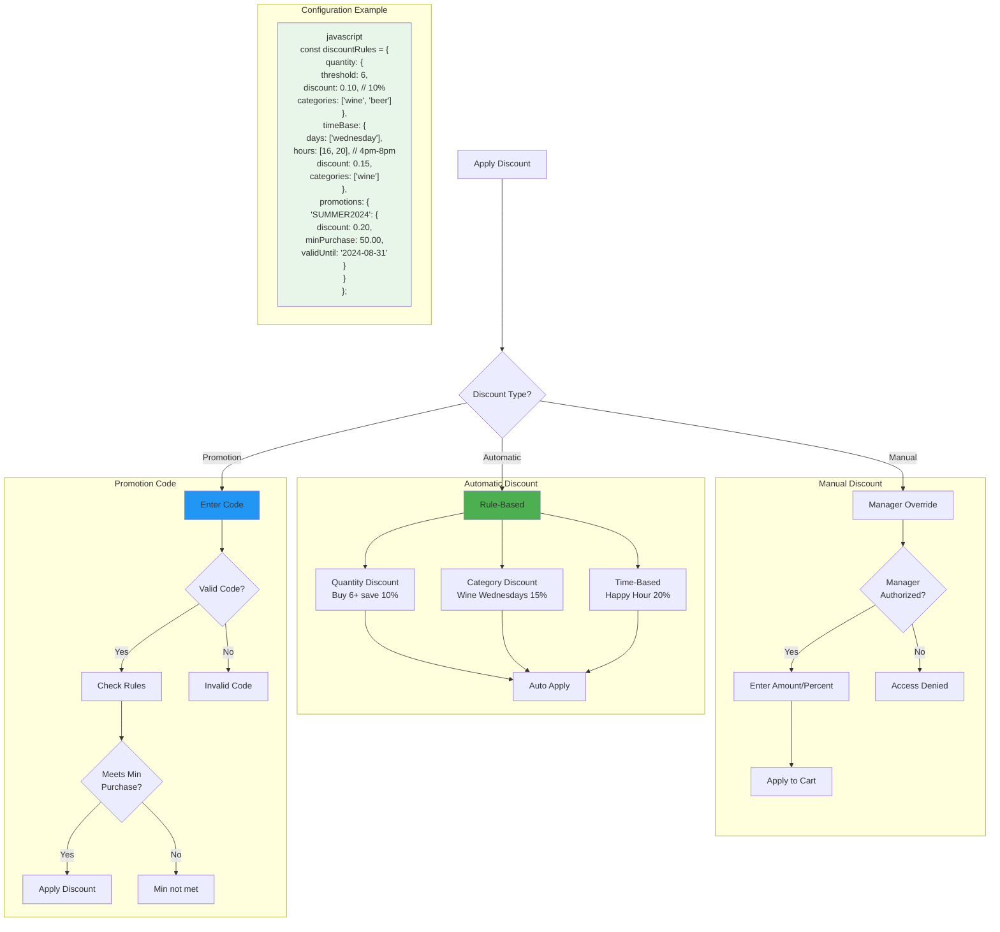
```mermaid
graph TB
    DISCOUNT[Apply Discount] --> TYPE{Discount Type?}
    
    TYPE -->|Manual| MANUAL_DISC
    TYPE -->|Automatic| AUTO_DISC
    TYPE -->|Promotion| PROMO_DISC
    
    subgraph "Manual Discount"
        MANUAL_DISC[Manager Override]
        MANUAL_DISC --> AUTH1{Manager<br/>Authorized?}
        AUTH1 -->|Yes| MANUAL_AMOUNT[Enter Amount/Percent]
        AUTH1 -->|No| DENY1[Access Denied]
        MANUAL_AMOUNT --> APPLY1[Apply to Cart]
    end
    
    subgraph "Automatic Discount"
        AUTO_DISC[Rule-Based]
        AUTO_DISC --> RULE1[Quantity Discount<br/>Buy 6+ save 10%]
        AUTO_DISC --> RULE2[Category Discount<br/>Wine Wednesdays 15%]
        AUTO_DISC --> RULE3[Time-Based<br/>Happy Hour 20%]
        RULE1 --> APPLY2[Auto Apply]
        RULE2 --> APPLY2
        RULE3 --> APPLY2
    end
    
    subgraph "Promotion Code"
        PROMO_DISC[Enter Code]
        PROMO_DISC --> VALIDATE{Valid Code?}
        VALIDATE -->|Yes| CHECK_RULES[Check Rules]
        VALIDATE -->|No| DENY2[Invalid Code]
        CHECK_RULES --> MIN_PURCHASE{Meets Min<br/>Purchase?}
        MIN_PURCHASE -->|Yes| APPLY3[Apply Discount]
        MIN_PURCHASE -->|No| DENY3[Min not met]
    end
    
    subgraph "Configuration Example"
        CONFIG["`javascript
        const discountRules = {
          quantity: {
            threshold: 6,
            discount: 0.10, // 10%
            categories: ['wine', 'beer']
          },
          timeBase: {
            days: ['wednesday'],
            hours: [16, 20], // 4pm-8pm
            discount: 0.15,
            categories: ['wine']
          },
          promotions: {
            'SUMMER2024': {
              discount: 0.20,
              minPurchase: 50.00,
              validUntil: '2024-08-31'
            }
          }
        };
        `"]
    end
    
    style AUTO_DISC fill:#4CAF50
    style PROMO_DISC fill:#2196F3
    style CONFIG fill:#E8F5E9
```

### 2.3 Inventory Reorder Rules

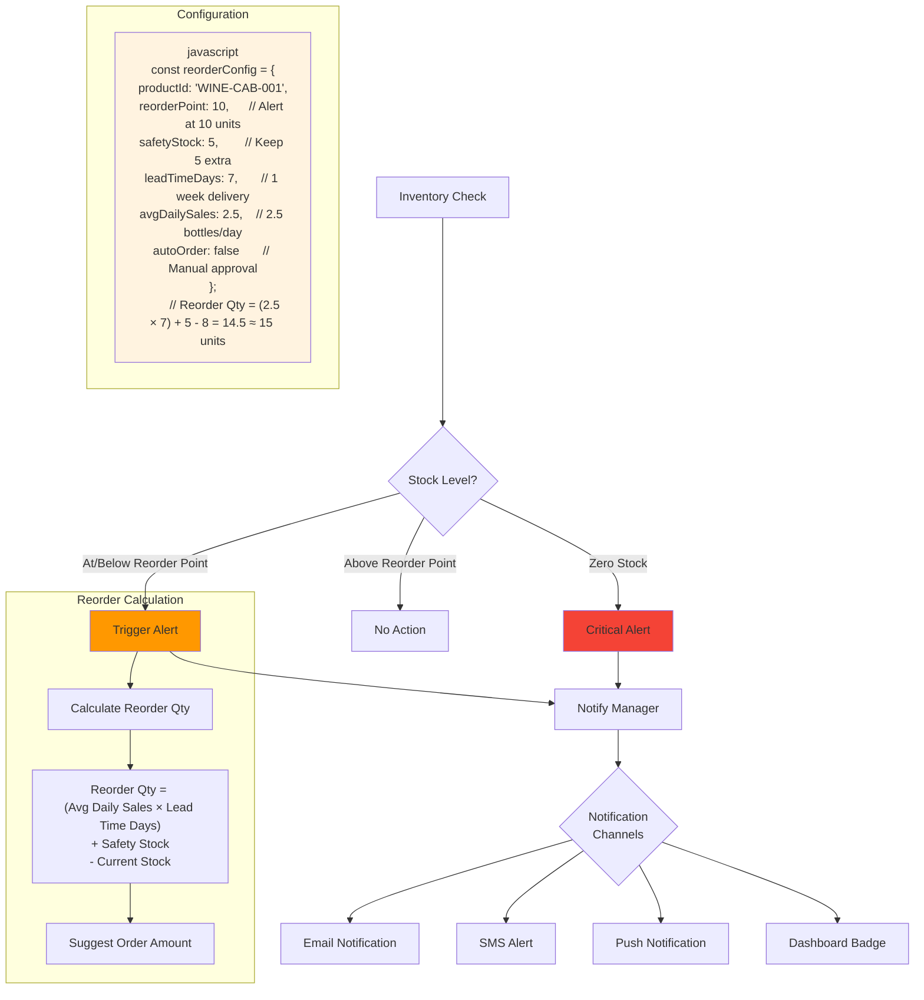
```mermaid
graph TB
    CHECK[Inventory Check] --> LEVEL{Stock Level?}
    
    LEVEL -->|Above Reorder Point| OK[No Action]
    LEVEL -->|At/Below Reorder Point| ALERT[Trigger Alert]
    LEVEL -->|Zero Stock| CRITICAL[Critical Alert]
    
    ALERT --> NOTIFY[Notify Manager]
    CRITICAL --> NOTIFY
    
    NOTIFY --> CHANNELS{Notification<br/>Channels}
    
    CHANNELS --> EMAIL[Email Notification]
    CHANNELS --> SMS[SMS Alert]
    CHANNELS --> PUSH[Push Notification]
    CHANNELS --> DASHBOARD[Dashboard Badge]
    
    subgraph "Reorder Calculation"
        ALERT --> CALC[Calculate Reorder Qty]
        CALC --> FORMULA["`
        Reorder Qty = 
          (Avg Daily Sales × Lead Time Days)
          + Safety Stock
          - Current Stock
        `"]
        FORMULA --> SUGGEST[Suggest Order Amount]
    end
    
    subgraph "Configuration"
        CONFIG["`javascript
        const reorderConfig = {
          productId: 'WINE-CAB-001',
          reorderPoint: 10,      // Alert at 10 units
          safetyStock: 5,        // Keep 5 extra
          leadTimeDays: 7,       // 1 week delivery
          avgDailySales: 2.5,    // 2.5 bottles/day
          autoOrder: false       // Manual approval
        };
        
        // Reorder Qty = (2.5 × 7) + 5 - 8 = 14.5 ≈ 15 units
        `"]
    end
    
    style CRITICAL fill:#F44336
    style ALERT fill:#FF9800
    style CONFIG fill:#FFF3E0
```

---

## 3. Pricing & Tax Configuration

### 3.1 Multi-Tier Pricing Structure

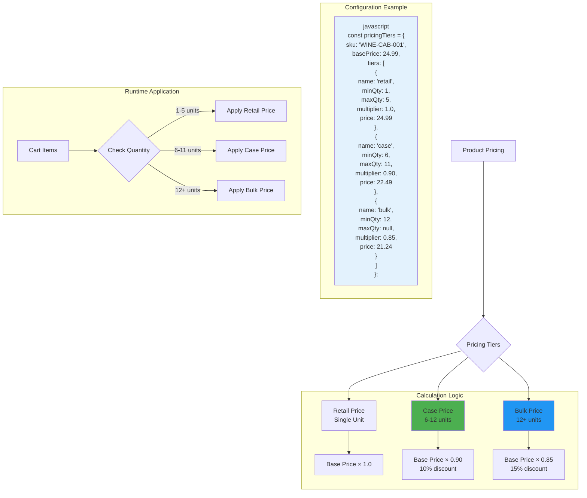
```mermaid
graph TB
    PRODUCT[Product Pricing] --> TIERS{Pricing Tiers}
    
    TIERS --> RETAIL[Retail Price<br/>Single Unit]
    TIERS --> CASE[Case Price<br/>6-12 units]
    TIERS --> BULK[Bulk Price<br/>12+ units]
    
    subgraph "Calculation Logic"
        RETAIL --> R_CALC[Base Price × 1.0]
        CASE --> C_CALC[Base Price × 0.90<br/>10% discount]
        BULK --> B_CALC[Base Price × 0.85<br/>15% discount]
    end
    
    subgraph "Configuration Example"
        CONFIG["`javascript
        const pricingTiers = {
          sku: 'WINE-CAB-001',
          basePrice: 24.99,
          tiers: [
            {
              name: 'retail',
              minQty: 1,
              maxQty: 5,
              multiplier: 1.0,
              price: 24.99
            },
            {
              name: 'case',
              minQty: 6,
              maxQty: 11,
              multiplier: 0.90,
              price: 22.49
            },
            {
              name: 'bulk',
              minQty: 12,
              maxQty: null,
              multiplier: 0.85,
              price: 21.24
            }
          ]
        };
        `"]
    end
    
    subgraph "Runtime Application"
        CART[Cart Items] --> QTY_CHECK{Check Quantity}
        QTY_CHECK -->|1-5 units| APPLY_RETAIL[Apply Retail Price]
        QTY_CHECK -->|6-11 units| APPLY_CASE[Apply Case Price]
        QTY_CHECK -->|12+ units| APPLY_BULK[Apply Bulk Price]
    end
    
    style CASE fill:#4CAF50
    style BULK fill:#2196F3
    style CONFIG fill:#E3F2FD
```

### 3.2 Tax Calculation Flow

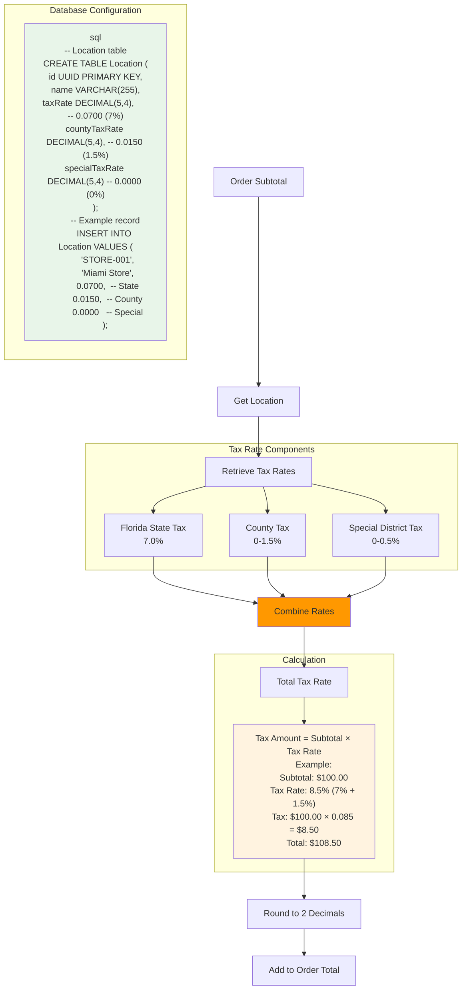
```mermaid
graph TB
    ORDER[Order Subtotal] --> LOCATION[Get Location]
    LOCATION --> TAX_RATES[Retrieve Tax Rates]
    
    subgraph "Tax Rate Components"
        TAX_RATES --> STATE[Florida State Tax<br/>7.0%]
        TAX_RATES --> COUNTY[County Tax<br/>0-1.5%]
        TAX_RATES --> SPECIAL[Special District Tax<br/>0-0.5%]
    end
    
    STATE --> COMBINE[Combine Rates]
    COUNTY --> COMBINE
    SPECIAL --> COMBINE
    
    COMBINE --> TOTAL_RATE[Total Tax Rate]
    
    subgraph "Calculation"
        TOTAL_RATE --> FORMULA["`
        Tax Amount = Subtotal × Tax Rate
        
        Example:
        Subtotal: $100.00
        Tax Rate: 8.5% (7% + 1.5%)
        Tax: $100.00 × 0.085 = $8.50
        Total: $108.50
        `"]
    end
    
    FORMULA --> ROUND[Round to 2 Decimals]
    ROUND --> APPLY[Add to Order Total]
    
    subgraph "Database Configuration"
        DB_CONFIG["`sql
        -- Location table
        CREATE TABLE Location (
          id UUID PRIMARY KEY,
          name VARCHAR(255),
          taxRate DECIMAL(5,4),      -- 0.0700 (7%)
          countyTaxRate DECIMAL(5,4), -- 0.0150 (1.5%)
          specialTaxRate DECIMAL(5,4) -- 0.0000 (0%)
        );
        
        -- Example record
        INSERT INTO Location VALUES (
          'STORE-001',
          'Miami Store',
          0.0700,  -- State
          0.0150,  -- County
          0.0000   -- Special
        );
        `"]
    end
    
    style COMBINE fill:#FF9800
    style FORMULA fill:#FFF3E0
    style DB_CONFIG fill:#E8F5E9
```

### 3.3 Dynamic Pricing Rules

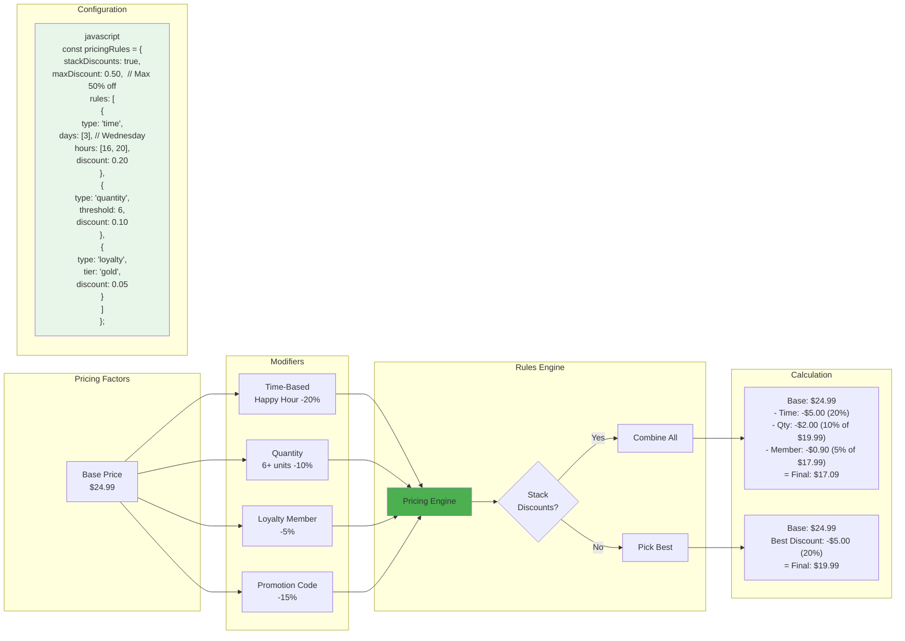
```mermaid
graph LR
    subgraph "Pricing Factors"
        BASE[Base Price<br/>$24.99]
    end
    
    subgraph "Modifiers"
        BASE --> TIME[Time-Based<br/>Happy Hour -20%]
        BASE --> QUANTITY[Quantity<br/>6+ units -10%]
        BASE --> MEMBER[Loyalty Member<br/>-5%]
        BASE --> PROMO[Promotion Code<br/>-15%]
    end
    
    subgraph "Rules Engine"
        TIME --> ENGINE[Pricing Engine]
        QUANTITY --> ENGINE
        MEMBER --> ENGINE
        PROMO --> ENGINE
        
        ENGINE --> STACK{Stack<br/>Discounts?}
        STACK -->|Yes| COMBINE[Combine All]
        STACK -->|No| BEST[Pick Best]
    end
    
    subgraph "Calculation"
        COMBINE --> CALC["`
        Base: $24.99
        - Time: -$5.00 (20%)
        - Qty: -$2.00 (10% of $19.99)
        - Member: -$0.90 (5% of $17.99)
        = Final: $17.09
        `"]
        
        BEST --> CALC2["`
        Base: $24.99
        Best Discount: -$5.00 (20%)
        = Final: $19.99
        `"]
    end
    
    subgraph "Configuration"
        CONFIG["`javascript
        const pricingRules = {
          stackDiscounts: true,
          maxDiscount: 0.50,  // Max 50% off
          rules: [
            {
              type: 'time',
              days: [3], // Wednesday
              hours: [16, 20],
              discount: 0.20
            },
            {
              type: 'quantity',
              threshold: 6,
              discount: 0.10
            },
            {
              type: 'loyalty',
              tier: 'gold',
              discount: 0.05
            }
          ]
        };
        `"]
    end
    
    style ENGINE fill:#4CAF50
    style CONFIG fill:#E8F5E9
```

---

## 4. Product Configuration

### 4.1 Adding a New Product Category

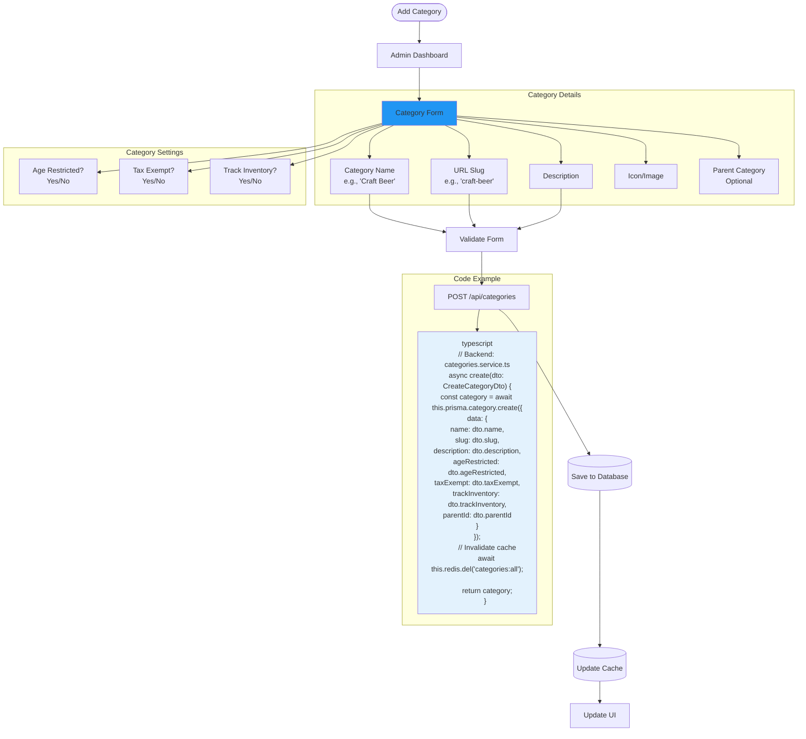
```mermaid
graph TB
    START([Add Category]) --> ADMIN[Admin Dashboard]
    
    ADMIN --> FORM[Category Form]
    
    subgraph "Category Details"
        FORM --> NAME[Category Name<br/>e.g., 'Craft Beer']
        FORM --> SLUG[URL Slug<br/>e.g., 'craft-beer']
        FORM --> DESC[Description]
        FORM --> ICON[Icon/Image]
        FORM --> PARENT[Parent Category<br/>Optional]
    end
    
    subgraph "Category Settings"
        FORM --> AGE_RESTRICT[Age Restricted?<br/>Yes/No]
        FORM --> TAX_EXEMPT[Tax Exempt?<br/>Yes/No]
        FORM --> TRACK_INV[Track Inventory?<br/>Yes/No]
    end
    
    NAME --> VALIDATE[Validate Form]
    SLUG --> VALIDATE
    DESC --> VALIDATE
    
    VALIDATE --> API[POST /api/categories]
    API --> DB[(Save to Database)]
    
    DB --> CACHE[(Update Cache)]
    CACHE --> UI[Update UI]
    
    subgraph "Code Example"
        API --> CODE["`typescript
        // Backend: categories.service.ts
        async create(dto: CreateCategoryDto) {
          const category = await this.prisma.category.create({
            data: {
              name: dto.name,
              slug: dto.slug,
              description: dto.description,
              ageRestricted: dto.ageRestricted,
              taxExempt: dto.taxExempt,
              trackInventory: dto.trackInventory,
              parentId: dto.parentId
            }
          });
          
          // Invalidate cache
          await this.redis.del('categories:all');
          
          return category;
        }
        `"]
    end
    
    style FORM fill:#2196F3
    style CODE fill:#E3F2FD
```

### 4.2 Product Attribute Configuration

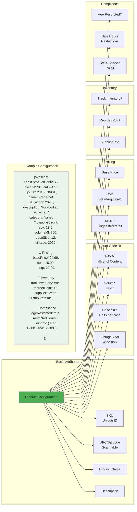
```mermaid
graph LR
    PRODUCT[Product Configuration]
    
    subgraph "Basic Attributes"
        PRODUCT --> SKU[SKU<br/>Unique ID]
        PRODUCT --> UPC[UPC/Barcode<br/>Scannable]
        PRODUCT --> NAME[Product Name]
        PRODUCT --> DESC[Description]
    end
    
    subgraph "Liquor-Specific"
        PRODUCT --> ABV[ABV %<br/>Alcohol Content]
        PRODUCT --> VOLUME[Volume<br/>ml/oz]
        PRODUCT --> CASE_SIZE[Case Size<br/>Units per case]
        PRODUCT --> VINTAGE[Vintage Year<br/>Wine only]
    end
    
    subgraph "Pricing"
        PRODUCT --> BASE_PRICE[Base Price]
        PRODUCT --> COST[Cost<br/>For margin calc]
        PRODUCT --> MSRP[MSRP<br/>Suggested retail]
    end
    
    subgraph "Inventory"
        PRODUCT --> TRACK[Track Inventory?]
        PRODUCT --> REORDER[Reorder Point]
        PRODUCT --> SUPPLIER[Supplier Info]
    end
    
    subgraph "Compliance"
        PRODUCT --> AGE_CHECK[Age Restricted?]
        PRODUCT --> RESTRICTED_HOURS[Sale Hours<br/>Restrictions]
        PRODUCT --> STATE_RULES[State-Specific<br/>Rules]
    end
    
    subgraph "Example Configuration"
        CONFIG["`javascript
        const productConfig = {
          sku: 'WINE-CAB-001',
          upc: '012345678901',
          name: 'Cabernet Sauvignon 2020',
          description: 'Full-bodied red wine...',
          category: 'wine',
          
          // Liquor-specific
          abv: 13.5,
          volumeMl: 750,
          caseSize: 12,
          vintage: 2020,
          
          // Pricing
          basePrice: 24.99,
          cost: 15.00,
          msrp: 29.99,
          
          // Inventory
          trackInventory: true,
          reorderPoint: 10,
          supplier: 'Wine Distributors Inc',
          
          // Compliance
          ageRestricted: true,
          restrictedHours: {
            sunday: { start: '12:00', end: '22:00' }
          }
        };
        `"]
    end
    
    style PRODUCT fill:#4CAF50
    style CONFIG fill:#E8F5E9
```

### 4.3 Product Image Management

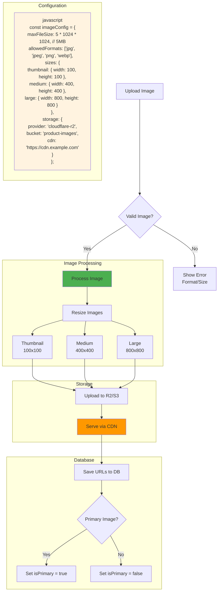
```mermaid
graph TB
    UPLOAD[Upload Image] --> VALIDATE{Valid Image?}
    
    VALIDATE -->|No| ERROR[Show Error<br/>Format/Size]
    VALIDATE -->|Yes| PROCESS[Process Image]
    
    subgraph "Image Processing"
        PROCESS --> RESIZE[Resize Images]
        RESIZE --> THUMB[Thumbnail<br/>100x100]
        RESIZE --> MEDIUM[Medium<br/>400x400]
        RESIZE --> LARGE[Large<br/>800x800]
    end
    
    subgraph "Storage"
        THUMB --> UPLOAD_S3[Upload to R2/S3]
        MEDIUM --> UPLOAD_S3
        LARGE --> UPLOAD_S3
        
        UPLOAD_S3 --> CDN[Serve via CDN]
    end
    
    subgraph "Database"
        CDN --> SAVE_DB[Save URLs to DB]
        SAVE_DB --> PRIMARY{Primary Image?}
        PRIMARY -->|Yes| SET_PRIMARY[Set isPrimary = true]
        PRIMARY -->|No| SET_SECONDARY[Set isPrimary = false]
    end
    
    subgraph "Configuration"
        CONFIG["`javascript
        const imageConfig = {
          maxFileSize: 5 * 1024 * 1024, // 5MB
          allowedFormats: ['jpg', 'jpeg', 'png', 'webp'],
          sizes: {
            thumbnail: { width: 100, height: 100 },
            medium: { width: 400, height: 400 },
            large: { width: 800, height: 800 }
          },
          storage: {
            provider: 'cloudflare-r2',
            bucket: 'product-images',
            cdn: 'https://cdn.example.com'
          }
        };
        `"]
    end
    
    style PROCESS fill:#4CAF50
    style CDN fill:#FF9800
    style CONFIG fill:#FFF3E0
```

---

## 5. User & Role Configuration

### 5.1 Role-Based Access Control (RBAC)


```mermaid
graph TB
    subgraph "User Roles"
        ADMIN[ADMIN<br/>Full Access]
        MANAGER[MANAGER<br/>Store Management]
        CASHIER[CASHIER<br/>POS Only]
    end
    
    subgraph "Permissions Matrix"
        ADMIN --> PERM_A1[✓ Manage Users]
        ADMIN --> PERM_A2[✓ Manage Products]
        ADMIN --> PERM_A3[✓ View Reports]
        ADMIN --> PERM_A4[✓ Configure System]
        ADMIN --> PERM_A5[✓ Process Refunds]
        ADMIN --> PERM_A6[✓ Adjust Inventory]
        ADMIN --> PERM_A7[✓ Process Sales]
        
        MANAGER --> PERM_M1[✗ Manage Users]
        MANAGER --> PERM_M2[✓ Manage Products]
        MANAGER --> PERM_M3[✓ View Reports]
        MANAGER --> PERM_M4[✗ Configure System]
        MANAGER --> PERM_M5[✓ Process Refunds]
        MANAGER --> PERM_M6[✓ Adjust Inventory]
        MANAGER --> PERM_M7[✓ Process Sales]
        
        CASHIER --> PERM_C1[✗ Manage Users]
        CASHIER --> PERM_C2[✗ Manage Products]
        CASHIER --> PERM_C3[✗ View Reports]
        CASHIER --> PERM_C4[✗ Configure System]
        CASHIER --> PERM_C5[✗ Process Refunds]
        CASHIER --> PERM_C6[✗ Adjust Inventory]
        CASHIER --> PERM_C7[✓ Process Sales]
    end
    
    subgraph "Implementation"
        CODE["`typescript
        // Backend: roles.guard.ts
        @Injectable()
        export class RolesGuard implements CanActivate {
          canActivate(context: ExecutionContext): boolean {
            const requiredRoles = this.reflector.get<Role[]>(
              'roles',
              context.getHandler()
            );
            
            const { user } = context.switchToHttp().getRequest();
            return requiredRoles.some(role => user.role === role);
          }
        }
        
        // Usage in controller
        @Post('products')
        @Roles(Role.ADMIN, Role.MANAGER)
        async createProduct(@Body() dto: CreateProductDto) {
          return this.productsService.create(dto);
        }
        `"]
    end
    
    style ADMIN fill:#F44336
    style MANAGER fill:#FF9800
    style CASHIER fill:#4CAF50
    style CODE fill:#E8F5E9
```

### 5.2 Adding a New User

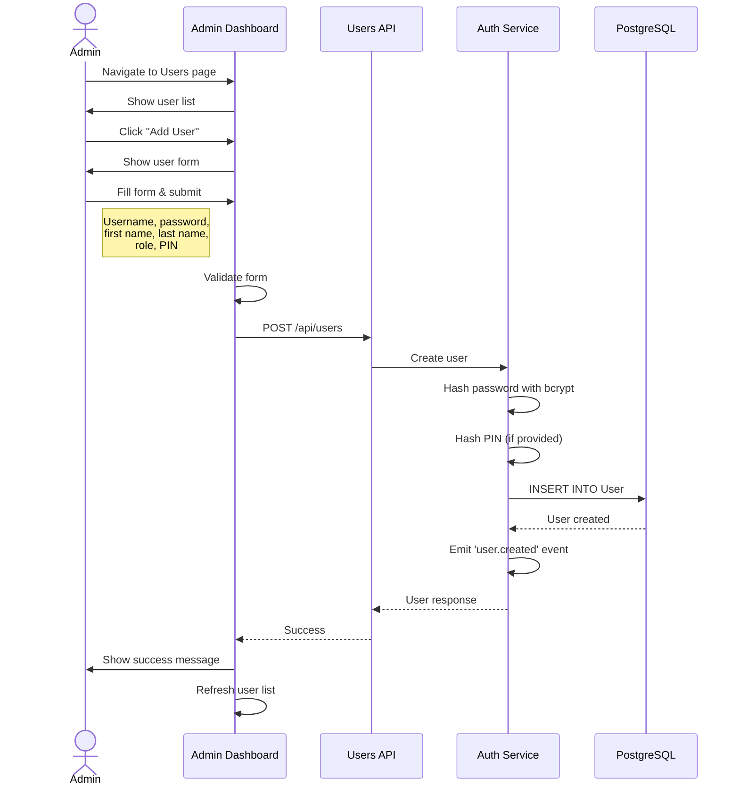
```mermaid
sequenceDiagram
    actor Admin
    participant UI as Admin Dashboard
    participant API as Users API
    participant Service as Auth Service
    participant DB as PostgreSQL
    
    Admin->>UI: Navigate to Users page
    UI->>Admin: Show user list
    
    Admin->>UI: Click "Add User"
    UI->>Admin: Show user form
    
    Admin->>UI: Fill form & submit
    Note right of Admin: Username, password,<br/>first name, last name,<br/>role, PIN
    
    UI->>UI: Validate form
    UI->>API: POST /api/users
    
    API->>Service: Create user
    Service->>Service: Hash password with bcrypt
    Service->>Service: Hash PIN (if provided)
    
    Service->>DB: INSERT INTO User
    DB-->>Service: User created
    
    Service->>Service: Emit 'user.created' event
    Service-->>API: User response
    API-->>UI: Success
    
    UI->>Admin: Show success message
    UI->>UI: Refresh user list
```

### 5.3 User Authentication Flow with PIN

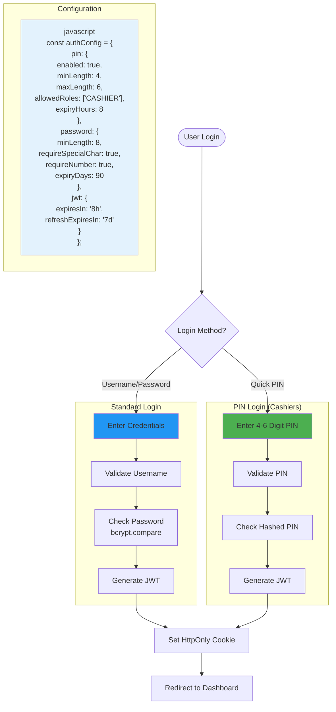
```mermaid
graph TB
    START([User Login]) --> METHOD{Login Method?}
    
    METHOD -->|Username/Password| STANDARD
    METHOD -->|Quick PIN| PIN_LOGIN
    
    subgraph "Standard Login"
        STANDARD[Enter Credentials]
        STANDARD --> VALIDATE1[Validate Username]
        VALIDATE1 --> CHECK_PASS[Check Password<br/>bcrypt.compare]
        CHECK_PASS --> SUCCESS1[Generate JWT]
    end
    
    subgraph "PIN Login (Cashiers)"
        PIN_LOGIN[Enter 4-6 Digit PIN]
        PIN_LOGIN --> VALIDATE2[Validate PIN]
        VALIDATE2 --> CHECK_PIN[Check Hashed PIN]
        CHECK_PIN --> SUCCESS2[Generate JWT]
    end
    
    SUCCESS1 --> SET_COOKIE[Set HttpOnly Cookie]
    SUCCESS2 --> SET_COOKIE
    
    SET_COOKIE --> REDIRECT[Redirect to Dashboard]
    
    subgraph "Configuration"
        CONFIG["`javascript
        const authConfig = {
          pin: {
            enabled: true,
            minLength: 4,
            maxLength: 6,
            allowedRoles: ['CASHIER'],
            expiryHours: 8
          },
          password: {
            minLength: 8,
            requireSpecialChar: true,
            requireNumber: true,
            expiryDays: 90
          },
          jwt: {
            expiresIn: '8h',
            refreshExpiresIn: '7d'
          }
        };
        `"]
    end
    
    style PIN_LOGIN fill:#4CAF50
    style STANDARD fill:#2196F3
    style CONFIG fill:#E3F2FD
```

---

## 6. System Behavior Configuration

### 6.1 Offline Mode Configuration

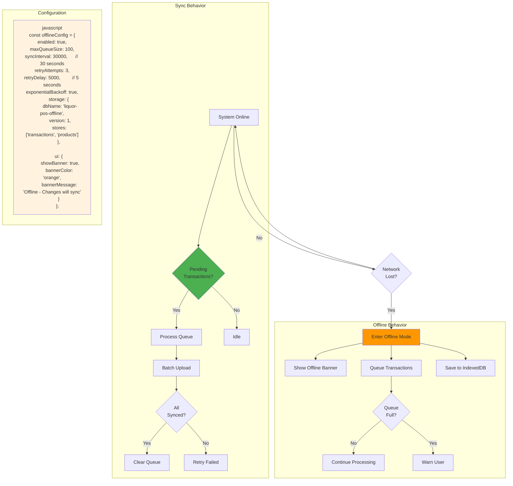
```mermaid
graph TB
    ONLINE[System Online] --> DETECT{Network<br/>Lost?}
    
    DETECT -->|No| ONLINE
    DETECT -->|Yes| OFFLINE[Enter Offline Mode]
    
    subgraph "Offline Behavior"
        OFFLINE --> BANNER[Show Offline Banner]
        OFFLINE --> QUEUE[Queue Transactions]
        OFFLINE --> LOCAL[Save to IndexedDB]
        
        QUEUE --> LIMIT{Queue<br/>Full?}
        LIMIT -->|No| CONTINUE[Continue Processing]
        LIMIT -->|Yes| WARN[Warn User]
    end
    
    subgraph "Sync Behavior"
        ONLINE --> SYNC{Pending<br/>Transactions?}
        SYNC -->|Yes| PROCESS[Process Queue]
        SYNC -->|No| IDLE[Idle]
        
        PROCESS --> BATCH[Batch Upload]
        BATCH --> SUCCESS{All<br/>Synced?}
        SUCCESS -->|Yes| CLEAR[Clear Queue]
        SUCCESS -->|No| RETRY[Retry Failed]
    end
    
    subgraph "Configuration"
        CONFIG["`javascript
        const offlineConfig = {
          enabled: true,
          maxQueueSize: 100,
          syncInterval: 30000,      // 30 seconds
          retryAttempts: 3,
          retryDelay: 5000,         // 5 seconds
          exponentialBackoff: true,
          
          storage: {
            dbName: 'liquor-pos-offline',
            version: 1,
            stores: ['transactions', 'products']
          },
          
          ui: {
            showBanner: true,
            bannerColor: 'orange',
            bannerMessage: 'Offline - Changes will sync'
          }
        };
        `"]
    end
    
    style OFFLINE fill:#FF9800
    style SYNC fill:#4CAF50
    style CONFIG fill:#FFF3E0
```

### 6.2 Cache Strategy Configuration

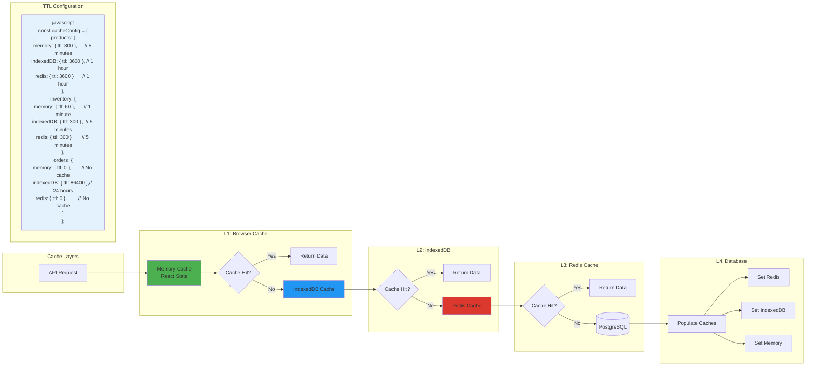
```mermaid
graph LR
    subgraph "Cache Layers"
        REQUEST[API Request]
    end
    
    subgraph "L1: Browser Cache"
        REQUEST --> MEMORY[Memory Cache<br/>React State]
        MEMORY --> HIT1{Cache Hit?}
        HIT1 -->|Yes| RETURN1[Return Data]
        HIT1 -->|No| L2
    end
    
    subgraph "L2: IndexedDB"
        L2[IndexedDB Cache]
        L2 --> HIT2{Cache Hit?}
        HIT2 -->|Yes| RETURN2[Return Data]
        HIT2 -->|No| L3
    end
    
    subgraph "L3: Redis Cache"
        L3[Redis Cache]
        L3 --> HIT3{Cache Hit?}
        HIT3 -->|Yes| RETURN3[Return Data]
        HIT3 -->|No| DB
    end
    
    subgraph "L4: Database"
        DB[(PostgreSQL)]
        DB --> POPULATE[Populate Caches]
        POPULATE --> REDIS_SET[Set Redis]
        POPULATE --> IDB_SET[Set IndexedDB]
        POPULATE --> MEM_SET[Set Memory]
    end
    
    subgraph "TTL Configuration"
        CONFIG["`javascript
        const cacheConfig = {
          products: {
            memory: { ttl: 300 },     // 5 minutes
            indexedDB: { ttl: 3600 }, // 1 hour
            redis: { ttl: 3600 }      // 1 hour
          },
          inventory: {
            memory: { ttl: 60 },      // 1 minute
            indexedDB: { ttl: 300 },  // 5 minutes
            redis: { ttl: 300 }       // 5 minutes
          },
          orders: {
            memory: { ttl: 0 },       // No cache
            indexedDB: { ttl: 86400 },// 24 hours
            redis: { ttl: 0 }         // No cache
          }
        };
        `"]
    end
    
    style MEMORY fill:#4CAF50
    style L2 fill:#2196F3
    style L3 fill:#DC382D
    style CONFIG fill:#E3F2FD
```

### 6.3 Error Handling Configuration

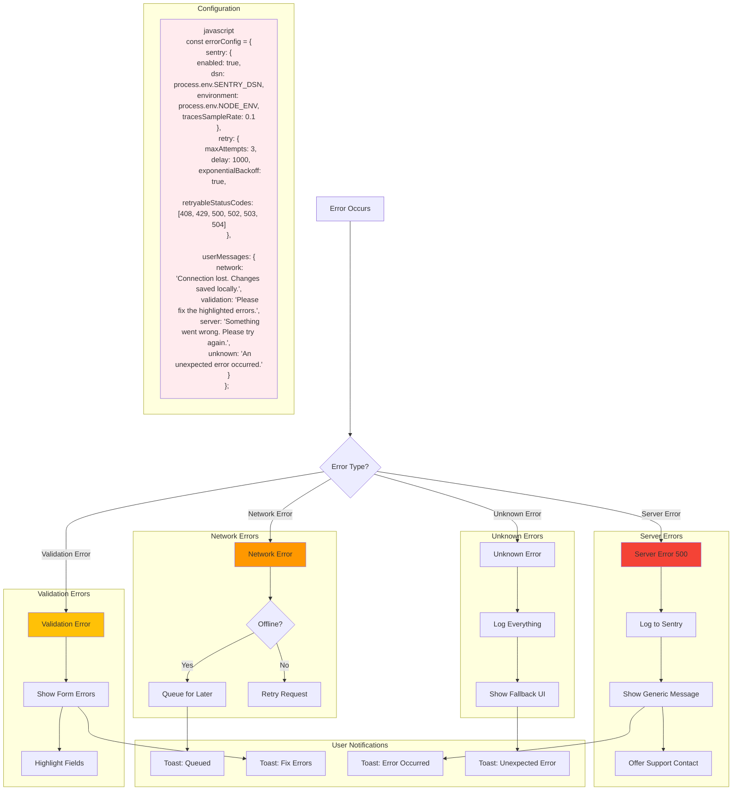
```mermaid
graph TB
    ERROR[Error Occurs] --> TYPE{Error Type?}
    
    TYPE -->|Network Error| NETWORK
    TYPE -->|Validation Error| VALIDATION
    TYPE -->|Server Error| SERVER
    TYPE -->|Unknown Error| UNKNOWN
    
    subgraph "Network Errors"
        NETWORK[Network Error]
        NETWORK --> OFFLINE_CHECK{Offline?}
        OFFLINE_CHECK -->|Yes| QUEUE_ERR[Queue for Later]
        OFFLINE_CHECK -->|No| RETRY_NET[Retry Request]
    end
    
    subgraph "Validation Errors"
        VALIDATION[Validation Error]
        VALIDATION --> SHOW_FORM[Show Form Errors]
        SHOW_FORM --> HIGHLIGHT[Highlight Fields]
    end
    
    subgraph "Server Errors"
        SERVER[Server Error 500]
        SERVER --> LOG_SENTRY[Log to Sentry]
        LOG_SENTRY --> SHOW_GENERIC[Show Generic Message]
        SHOW_GENERIC --> SUPPORT[Offer Support Contact]
    end
    
    subgraph "Unknown Errors"
        UNKNOWN[Unknown Error]
        UNKNOWN --> LOG_ALL[Log Everything]
        LOG_ALL --> FALLBACK[Show Fallback UI]
    end
    
    subgraph "User Notifications"
        QUEUE_ERR --> TOAST1[Toast: Queued]
        SHOW_FORM --> TOAST2[Toast: Fix Errors]
        SHOW_GENERIC --> TOAST3[Toast: Error Occurred]
        FALLBACK --> TOAST4[Toast: Unexpected Error]
    end
    
    subgraph "Configuration"
        CONFIG["`javascript
        const errorConfig = {
          sentry: {
            enabled: true,
            dsn: process.env.SENTRY_DSN,
            environment: process.env.NODE_ENV,
            tracesSampleRate: 0.1
          },
          
          retry: {
            maxAttempts: 3,
            delay: 1000,
            exponentialBackoff: true,
            retryableStatusCodes: [408, 429, 500, 502, 503, 504]
          },
          
          userMessages: {
            network: 'Connection lost. Changes saved locally.',
            validation: 'Please fix the highlighted errors.',
            server: 'Something went wrong. Please try again.',
            unknown: 'An unexpected error occurred.'
          }
        };
        `"]
    end
    
    style NETWORK fill:#FF9800
    style VALIDATION fill:#FFC107
    style SERVER fill:#F44336
    style CONFIG fill:#FFEBEE
```

---

## Quick Reference

### Common Configuration Files

```javascript
// frontend/src/config/app.config.ts
export const APP_CONFIG = {
  apiUrl: import.meta.env.VITE_API_URL || 'http://localhost:3000',
  locationId: 'STORE-001',
  terminalId: 'TERMINAL-001',
  
  features: {
    offlineMode: true,
    ageVerification: true,
    loyaltyProgram: false,
    aiSearch: true
  },
  
  ui: {
    theme: 'light',
    primaryColor: '#4CAF50',
    itemsPerPage: 20,
    animationDuration: 200
  },
  
  business: {
    taxRate: 0.07,
    currency: 'USD',
    minAge: 21,
    maxDiscountPercent: 50
  }
};
```

```typescript
// backend/src/config/app.config.ts
export const APP_CONFIG = {
  port: parseInt(process.env.PORT || '3000'),
  
  database: {
    url: process.env.DATABASE_URL,
    poolSize: 20,
    timeout: 30000
  },
  
  redis: {
    url: process.env.REDIS_URL,
    ttl: {
      products: 3600,
      inventory: 300,
      sessions: 28800
    }
  },
  
  stripe: {
    secretKey: process.env.STRIPE_SECRET_KEY,
    webhookSecret: process.env.STRIPE_WEBHOOK_SECRET
  },
  
  security: {
    jwtSecret: process.env.JWT_SECRET,
    jwtExpiration: '8h',
    bcryptRounds: 10,
    corsOrigins: process.env.ALLOWED_ORIGINS?.split(',') || []
  }
};
```

---

## Related Documentation

- [Visual Architecture Diagrams](VISUAL_ARCHITECTURE_DIAGRAMS.md) - System architecture
- [Configuration Guide](configuration.md) - Environment variables
- [Setup Guide](setup.md) - Installation instructions
- [PRD](PRD.md) - Product requirements

---

**Last Updated:** January 3, 2026  
**Version:** 1.0

