# Visual Architecture Diagrams

> **Comprehensive Mermaid diagrams** for the Florida Liquor Store POS System covering architecture, sequences, integrations, patterns, and configurations.

---

## Table of Contents

1. [System Architecture](#1-system-architecture)
2. [Sequence Diagrams](#2-sequence-diagrams)
3. [Integration Diagrams](#3-integration-diagrams)
4. [Design Patterns](#4-design-patterns)
5. [Database Schema](#5-database-schema)
6. [Configuration Flows](#6-configuration-flows)
7. [UI Component Architecture](#7-ui-component-architecture)
8. [State Management](#8-state-management)

---

## 1. System Architecture

### 1.1 High-Level System Architecture


### 1.2 Module Architecture (Backend)


### 1.3 Frontend Architecture


---

## 2. Sequence Diagrams

### 2.1 Counter Checkout Flow (Happy Path)


### 2.2 Offline Order Processing

```mermaid
sequenceDiagram
    actor Cashier
    participant POS as POS Terminal
    participant Network as Network Status
    participant IDB as IndexedDB
    participant Queue as Offline Queue
    participant API as API Client
    participant Backend as Backend API
    
    Cashier->>POS: Scan products & checkout
    POS->>Network: Check connectivity
    Network-->>POS: Offline
    
    rect rgb(255, 200, 200)
        Note over POS,IDB: Offline Mode Active
        POS->>IDB: Save transaction locally
        IDB-->>POS: Saved (UUID)
        POS->>Queue: Add to sync queue
        Queue-->>POS: Queued
        POS->>Cashier: ⚠️ Offline - Will sync later
    end
    
    Note over Network: Internet restored
    
    Network->>POS: Online event
    POS->>Queue: Process queue
    
    loop For each queued transaction
        Queue->>API: POST /api/orders
        API->>Backend: Create order
        
        alt Success
            Backend-->>API: Order created
            API-->>Queue: Success
            Queue->>IDB: Mark as synced
            Queue->>POS: Update UI
        else Failure
            Backend-->>API: Error
            API-->>Queue: Retry later
            Queue->>Queue: Exponential backoff
        end
    end
    
    Queue->>POS: All synced ✓
    POS->>Cashier: All transactions synced
```



### 2.3 Authentication Flow


### 2.4 Product Search with AI


### 2.5 Inventory Adjustment Flow


---

## 3. Integration Diagrams

### 3.1 External Integrations Overview


### 3.2 Stripe Payment Integration


### 3.3 Back-Office Sync Integration


---

## 4. Design Patterns

### 4.1 SAGA Pattern (Order Orchestration)


### 4.2 Agent Pattern (Order Processing)


### 4.3 Repository Pattern (Frontend)


### 4.4 Event-Driven Architecture


---

## 5. Database Schema

### 5.1 Entity Relationship Diagram


### 5.2 Database Indexes Strategy


---

## 6. Configuration Flows

### 6.1 Tax Configuration Flow

```mermaid
graph TB
    START([Configure Tax Rates]) --> LOCATION
    
    LOCATION[Select Location]
    LOCATION --> STATE[Florida State Tax<br/>7% base rate]
    
    STATE --> COUNTY{County Tax?}
    COUNTY -->|Yes| ADD_COUNTY[Add County Tax<br/>0-1.5%]
    COUNTY -->|No| CALC
    
    ADD_COUNTY --> CALC[Calculate Combined Rate]
    
    CALC --> SAVE[Save to Location Record]
    SAVE --> DB[(PostgreSQL)]
    
    DB --> APPLY[Apply to Transactions]
    
    subgraph "Runtime Calculation"
        APPLY --> ORDER[New Order]
        ORDER --> GET_RATE[Get Location Tax Rate]
        GET_RATE --> COMPUTE[Compute Tax<br/>subtotal × taxRate]
        COMPUTE --> TOTAL[Add to Total]
    end
    
    style STATE fill:#4CAF50
    style CALC fill:#2196F3
    style COMPUTE fill:#FF9800
```



### 6.2 Pricing Configuration Flow


### 6.3 Adding New Product Configuration


### 6.4 Button/UI Configuration

```mermaid
graph TB
    subgraph "UI Configuration"
        CONFIG[Frontend Config]
        THEME[Theme Settings]
        LAYOUT[Layout Config]
    end
    
    subgraph "Button Types"
        PRIMARY[Primary Actions<br/>Checkout, Save]
        SECONDARY[Secondary Actions<br/>Cancel, Back]
        DANGER[Danger Actions<br/>Delete, Refund]
        DISABLED[Disabled State]
    end
    
    subgraph "Styling System"
        TAILWIND[Tailwind CSS]
        CLASSES[Utility Classes]
        VARIANTS[Button Variants]
    end
    
    CONFIG --> THEME
    THEME --> TAILWIND
    
    TAILWIND --> CLASSES
    CLASSES --> PRIMARY
    CLASSES --> SECONDARY
    CLASSES --> DANGER
    CLASSES --> DISABLED
    
    PRIMARY -.->|bg-green-600| VARIANTS
    SECONDARY -.->|bg-gray-600| VARIANTS
    DANGER -.->|bg-red-600| VARIANTS
    DISABLED -.->|opacity-50| VARIANTS
    
    LAYOUT --> RESPONSIVE[Responsive Breakpoints]
    RESPONSIVE --> MOBILE[Mobile: sm]
    RESPONSIVE --> TABLET[Tablet: md]
    RESPONSIVE --> DESKTOP[Desktop: lg]
    
    style PRIMARY fill:#4CAF50
    style DANGER fill:#F44336
    style TAILWIND fill:#38BDF8
```

---

## 7. UI Component Architecture

### 7.1 POS Terminal Component Tree

```mermaid
graph TB
    APP[App.tsx]
    
    APP --> ROUTER[Router]
    ROUTER --> LOGIN[Login Page]
    ROUTER --> POS[POS Terminal Page]
    ROUTER --> ADMIN[Admin Layout]
    
    subgraph "POS Terminal"
        POS --> HEADER[Header<br/>User, Location]
        POS --> SEARCH[Product Search]
        POS --> CART[Cart Component]
        POS --> CHECKOUT[Checkout Component]
        POS --> OFFLINE[Offline Banner]
    end
    
    subgraph "Cart Component"
        CART --> CART_ITEMS[Cart Items List]
        CART --> CART_SUMMARY[Cart Summary]
        CART_ITEMS --> CART_ITEM[Cart Item<br/>× N]
    end
    
    subgraph "Checkout Component"
        CHECKOUT --> PAYMENT_SELECT[Payment Method]
        CHECKOUT --> AGE_VERIFY[Age Verification]
        CHECKOUT --> CHECKOUT_BTN[Checkout Button]
    end
    
    subgraph "Search Component"
        SEARCH --> SEARCH_INPUT[Search Input]
        SEARCH --> RESULTS[Product Results]
        RESULTS --> PRODUCT_CARD[Product Card<br/>× N]
    end
    
    APP --> TOAST[Toast Notifications]
    APP --> PWA[PWA Install Prompt]
    
    style POS fill:#4CAF50
    style CART fill:#2196F3
    style CHECKOUT fill:#FF9800
```

### 7.2 Admin Dashboard Component Tree

```mermaid
graph TB
    ADMIN[Admin Layout]
    
    ADMIN --> SIDEBAR[Sidebar Navigation]
    ADMIN --> CONTENT[Content Area]
    
    CONTENT --> DASH[Dashboard Page]
    CONTENT --> PRODUCTS[Products Page]
    CONTENT --> USERS[Users Page]
    CONTENT --> SETTINGS[Settings Page]
    
    subgraph "Dashboard Page"
        DASH --> STATS[Stats Cards]
        DASH --> CHART[Sales Chart]
        DASH --> RECENT[Recent Orders]
    end
    
    subgraph "Products Page"
        PRODUCTS --> FILTER[Filter Box]
        PRODUCTS --> TABLE[Products Table]
        PRODUCTS --> ACTIONS[Action Buttons]
        TABLE --> ROW[Product Row<br/>× N]
    end
    
    subgraph "Users Page"
        USERS --> USER_LIST[Users List]
        USERS --> USER_FORM[User Form]
        USER_LIST --> USER_CARD[User Card<br/>× N]
    end
    
    subgraph "Settings Page"
        SETTINGS --> TAX_CONFIG[Tax Configuration]
        SETTINGS --> LOCATION_CONFIG[Location Settings]
        SETTINGS --> SYSTEM_CONFIG[System Settings]
    end
    
    style DASH fill:#4CAF50
    style PRODUCTS fill:#2196F3
    style USERS fill:#FF9800
```

### 7.3 Component State Flow

```mermaid
graph LR
    subgraph "User Actions"
        SCAN[Scan Product]
        ADJUST[Adjust Quantity]
        REMOVE[Remove Item]
        CHECKOUT_ACT[Checkout]
    end
    
    subgraph "State Updates"
        CART_STORE[Cart Store<br/>Zustand]
        PRODUCTS_STORE[Products Store]
        SYNC_STORE[Sync Store]
    end
    
    subgraph "Side Effects"
        API_CALL[API Calls]
        IDB_SAVE[IndexedDB Save]
        TOAST_SHOW[Show Toast]
    end
    
    subgraph "UI Updates"
        RERENDER[Component Re-render]
        ANIMATION[Animations]
    end
    
    SCAN --> CART_STORE
    ADJUST --> CART_STORE
    REMOVE --> CART_STORE
    CHECKOUT_ACT --> CART_STORE
    
    CART_STORE --> API_CALL
    CART_STORE --> IDB_SAVE
    CART_STORE --> TOAST_SHOW
    
    CART_STORE --> RERENDER
    RERENDER --> ANIMATION
    
    API_CALL --> SYNC_STORE
    IDB_SAVE --> SYNC_STORE
    
    style CART_STORE fill:#FF9800
    style RERENDER fill:#4CAF50
```

---

## 8. State Management

### 8.1 Zustand Store Architecture

```mermaid
graph TB
    subgraph "Zustand Stores"
        CART[Cart Store]
        PRODUCTS[Products Store]
        OFFLINE[Offline Store]
        SYNC[Sync Store]
        TOAST[Toast Store]
    end
    
    subgraph "Store Contents"
        CART --> CART_STATE[State:<br/>items, total, tax]
        CART --> CART_ACTIONS[Actions:<br/>addItem, removeItem,<br/>checkout, clear]
        
        PRODUCTS --> PROD_STATE[State:<br/>products, loading]
        PRODUCTS --> PROD_ACTIONS[Actions:<br/>fetchProducts,<br/>searchProducts]
        
        OFFLINE --> OFF_STATE[State:<br/>isOffline, queue]
        OFFLINE --> OFF_ACTIONS[Actions:<br/>addToQueue,<br/>processQueue]
    end
    
    subgraph "Persistence"
        CART_ACTIONS --> IDB1[(IndexedDB)]
        OFFLINE --> IDB2[(IndexedDB)]
        SYNC --> IDB3[(IndexedDB)]
    end
    
    subgraph "API Integration"
        CART_ACTIONS --> API[API Client]
        PROD_ACTIONS --> API
        OFF_ACTIONS --> API
    end
    
    style CART fill:#4CAF50
    style PRODUCTS fill:#2196F3
    style OFFLINE fill:#FF9800
```

### 8.2 State Synchronization Flow

```mermaid
sequenceDiagram
    participant UI as React Component
    participant Store as Zustand Store
    participant IDB as IndexedDB
    participant API as API Client
    participant Backend as Backend API
    
    UI->>Store: Subscribe to state
    Store-->>UI: Initial state
    
    UI->>Store: Dispatch action
    Store->>Store: Update state
    Store-->>UI: Notify subscribers
    UI->>UI: Re-render
    
    par Persist Locally
        Store->>IDB: Save state
        IDB-->>Store: Saved
    and Sync to Backend
        Store->>API: POST request
        API->>Backend: HTTP request
        Backend-->>API: Response
        API-->>Store: Update state
        Store-->>UI: Notify subscribers
    end
```

### 8.3 Offline State Management

```mermaid
stateDiagram-v2
    [*] --> Online
    
    Online --> Offline: Network Lost
    Offline --> Online: Network Restored
    
    state Online {
        [*] --> Synced
        Synced --> Syncing: Action Triggered
        Syncing --> Synced: API Success
        Syncing --> Error: API Failure
        Error --> Syncing: Retry
    }
    
    state Offline {
        [*] --> Queued
        Queued --> Queued: Queue Action
        Queued --> PendingSync: Network Restored
    }
    
    PendingSync --> Online: Start Sync
    
    note right of Offline
        Actions saved to IndexedDB
        Will sync when online
    end note
    
    note right of Online
        Real-time sync with backend
        Immediate feedback
    end note
```

---

## 9. Deployment Architecture

### 9.1 Production Deployment

```mermaid
graph TB
    subgraph "Client Devices"
        POS_TABLET[POS Tablets<br/>8-10 inch]
        ADMIN_PC[Admin PC<br/>Desktop Browser]
        MOBILE[Mobile Devices<br/>Future]
    end
    
    subgraph "CDN Layer"
        CLOUDFLARE[Cloudflare CDN]
    end
    
    subgraph "Frontend Hosting"
        VERCEL[Vercel<br/>React Apps]
    end
    
    subgraph "Backend Hosting"
        RAILWAY[Railway<br/>NestJS API]
        SCALE[Auto-scaling<br/>2-10 instances]
    end
    
    subgraph "Database Layer"
        POSTGRES[PostgreSQL<br/>Supabase/Neon]
        REDIS[Redis<br/>Upstash]
    end
    
    subgraph "Storage"
        R2[Cloudflare R2<br/>Object Storage]
    end
    
    subgraph "Monitoring"
        SENTRY[Sentry<br/>Error Tracking]
        UPTIME[Uptime Robot<br/>Monitoring]
    end
    
    POS_TABLET --> CLOUDFLARE
    ADMIN_PC --> CLOUDFLARE
    MOBILE -.-> CLOUDFLARE
    
    CLOUDFLARE --> VERCEL
    CLOUDFLARE --> RAILWAY
    
    RAILWAY --> SCALE
    SCALE --> POSTGRES
    SCALE --> REDIS
    SCALE --> R2
    
    RAILWAY --> SENTRY
    RAILWAY --> UPTIME
    
    style CLOUDFLARE fill:#F38020
    style VERCEL fill:#000000
    style RAILWAY fill:#0B0D0E
    style POSTGRES fill:#336791
```

### 9.2 Development Environment

```mermaid
graph LR
    subgraph "Developer Machine"
        CODE[VS Code]
        TERMINAL[Terminal]
    end
    
    subgraph "Local Services"
        FRONTEND[Vite Dev Server<br/>Port 5173]
        BACKEND[NestJS Dev Server<br/>Port 3000]
        DB[PostgreSQL<br/>Port 5432]
        REDIS_LOCAL[Redis<br/>Port 6379]
    end
    
    subgraph "External Services"
        STRIPE_TEST[Stripe Test Mode]
    end
    
    CODE --> TERMINAL
    TERMINAL --> FRONTEND
    TERMINAL --> BACKEND
    TERMINAL --> DB
    TERMINAL --> REDIS_LOCAL
    
    FRONTEND --> BACKEND
    BACKEND --> DB
    BACKEND --> REDIS_LOCAL
    BACKEND --> STRIPE_TEST
    
    style FRONTEND fill:#646CFF
    style BACKEND fill:#E0234E
    style DB fill:#336791
```

---

## 10. Security Architecture

### 10.1 Authentication & Authorization Flow

```mermaid
graph TB
    USER[User Request] --> GATEWAY[API Gateway]
    
    GATEWAY --> CSRF{CSRF Token<br/>Valid?}
    CSRF -->|No| REJECT1[403 Forbidden]
    CSRF -->|Yes| JWT{JWT Token<br/>Valid?}
    
    JWT -->|No| REJECT2[401 Unauthorized]
    JWT -->|Yes| BLACKLIST{Token<br/>Blacklisted?}
    
    BLACKLIST -->|Yes| REJECT3[401 Token Revoked]
    BLACKLIST -->|No| RBAC{Has Required<br/>Role?}
    
    RBAC -->|No| REJECT4[403 Forbidden]
    RBAC -->|Yes| CONTROLLER[Controller Handler]
    
    CONTROLLER --> RESPONSE[Response]
    
    style CSRF fill:#FF9800
    style JWT fill:#4CAF50
    style RBAC fill:#2196F3
```

### 10.2 Data Encryption Flow

```mermaid
graph LR
    subgraph "Client"
        DATA[Sensitive Data]
    end
    
    subgraph "Transport"
        TLS[TLS 1.3<br/>Encryption]
    end
    
    subgraph "Backend"
        DECRYPT[Decrypt]
        PROCESS[Process]
        ENCRYPT[Encrypt]
    end
    
    subgraph "Database"
        DB[(PostgreSQL<br/>AES-256 at rest)]
    end
    
    subgraph "Audit Logs"
        AUDIT[(Encrypted Logs<br/>AES-256)]
    end
    
    DATA --> TLS
    TLS --> DECRYPT
    DECRYPT --> PROCESS
    PROCESS --> ENCRYPT
    ENCRYPT --> DB
    PROCESS --> AUDIT
    
    style TLS fill:#4CAF50
    style ENCRYPT fill:#FF9800
    style DB fill:#336791
```

---

## Configuration Examples

### Adding a New Tax Rate

```typescript
// In Admin Dashboard - Settings Page
const taxConfig = {
  locationId: "STORE-001",
  stateTaxRate: 0.07,      // 7% Florida state tax
  countyTaxRate: 0.015,    // 1.5% county tax
  combinedRate: 0.085      // 8.5% total
};

// Backend automatically applies this in PricingAgent
const tax = subtotal * location.taxRate;
```

### Adding a New Product

```typescript
// In Admin Dashboard - Products Page
const newProduct = {
  sku: "WINE-CAB-001",
  upc: "012345678901",
  name: "Cabernet Sauvignon 2020",
  category: "wine",
  basePrice: 24.99,
  cost: 15.00,
  abv: 13.5,
  volumeMl: 750,
  ageRestricted: true,
  trackInventory: true
};

// AI automatically generates search embedding
// Inventory records created for all locations
```

### Configuring Payment Methods

```typescript
// In .env file
STRIPE_SECRET_KEY=sk_live_...

// In POS Terminal
const paymentMethods = [
  { id: 'cash', label: 'Cash', icon: '💵' },
  { id: 'card', label: 'Card', icon: '💳', requiresStripe: true },
  { id: 'split', label: 'Split', icon: '🔀' }
];
```

---

## Legend

### Diagram Color Coding

- 🟢 **Green**: Success paths, primary actions
- 🔵 **Blue**: Data flow, secondary actions
- 🟠 **Orange**: Warnings, intermediate states
- 🔴 **Red**: Errors, compensations, danger actions
- 🟣 **Purple**: External services, integrations

### Common Symbols

- `[]` - Process/Action
- `()` - Start/End
- `{}` - Decision Point
- `[(Database)]` - Data Store
- `[/Module\]` - Service/Module

---

## Usage Guide

### Viewing Diagrams

These Mermaid diagrams can be viewed in:

1. **GitHub** - Native Mermaid rendering
2. **VS Code** - Markdown Preview Mermaid Support extension
3. **Mermaid Live Editor** - https://mermaid.live
4. **Documentation Sites** - GitBook, Docusaurus, etc.

### Updating Diagrams

When updating the system:

1. Update relevant diagrams in this file
2. Keep diagrams in sync with code changes
3. Add new diagrams for new features
4. Archive outdated diagrams to `/archive`

---

## Related Documentation

- [Architecture Overview](architecture.md) - Text-based architecture documentation
- [Configuration Guide](configuration.md) - Environment variables and settings
- [Setup Guide](setup.md) - Installation and setup instructions
- [PRD](PRD.md) - Product requirements and user stories

---

**Last Updated:** January 3, 2026  
**Maintained By:** Development Team  
**Version:** 1.0

